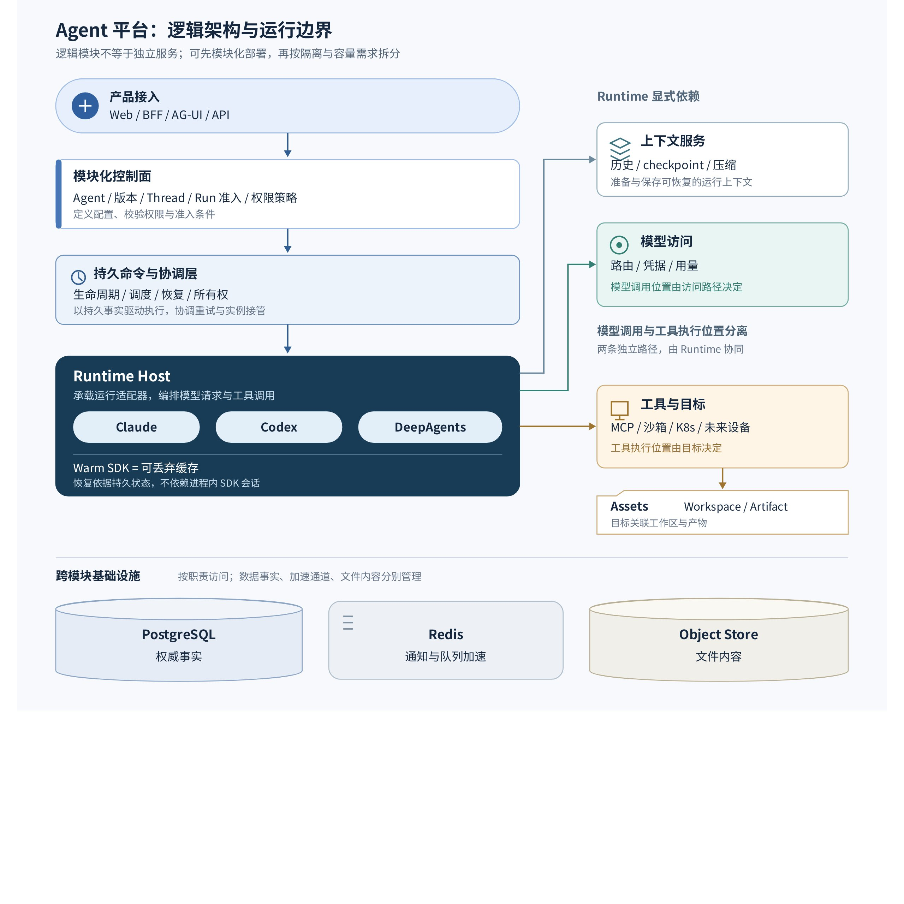

# KAI · WORK

面向智能体构建、任务执行与运行治理的工作平台。KAI 把对话、Agent Studio、模型与能力管理、知识库、长期记忆和产出物整合到一个工作台，由统一控制面管理运行状态、权限、审批和发布。

当前平台版本 **0.3.0** · [发布记录](https://github.com/PrayforH/KAI/releases) · [更新日志](CHANGELOG.md) · [Apache-2.0](LICENSE)

## 主要能力

- **任务工作台**：流式对话、执行轨迹、文件输入、图片与文档预览、可拖动的产出物面板，以及实时语音输入。
- **Agent Studio**：草稿、能力目录、模型绑定、预览测试、确定性 Bundle 和不可变版本；支持 DeepAgents 代码预览与项目导出。
- **多运行时**：Claude Agent SDK、Codex App Server 与可选 DeepAgents，共用会话、事件、审批、工作区和产出物契约。
- **知识与记忆**：知识库绑定、MCP 能力、PostgreSQL/pgvector 混合召回；可选任务后记忆提取，候选经确认后生效。
- **运行治理**：租户与团队权限、工具策略、预算与配额、任务取消、幂等提交、队列恢复、审计与可观测性。
- **发布链路**：静态门禁、运行验证、评测、签名镜像、SBOM、漏洞扫描、环境晋级与回滚。

## 项目架构



图引自 [Agent Studio 整体架构优化设计（2026-09-29）](https://my.feishu.cn/docx/ZSiFdITPkoWsDxxmreYcN2tRnme#doxcn8YsQFE1KDgxK47PvAxU39e)，展示模块边界和演进目标；逻辑模块可先模块化部署，再按隔离与容量需求拆分。持久命令的事务交接、完整恢复内核和领域 schema 迁移仍属于分阶段建设内容，当前实现说明见 [架构说明](docs/architecture.md)。

当前浏览器经同源 BFF 访问 API，服务凭据留在后端。控制面保存 Session、Run、Agent Version、权限和耐久事件；Worker 消费队列并调用运行时。模型和工具由已发布的 Agent 配置及租户能力目录解析，运行时输出统一投影为前端事件。Sandbox 提供文件与命令执行边界，产出物进入对象存储。

## 开发准备

需要 Python 3.12、uv、Node.js 22 和 Docker。Python 使用清华镜像，npm 使用 npmmirror。

```bash
UV_DEFAULT_INDEX=https://pypi.tuna.tsinghua.edu.cn/simple uv sync --group dev --extra deepagents
npm install --global npm@11.6.2 --registry=https://registry.npmmirror.com
cd web/harness-console
npm ci --registry=https://registry.npmmirror.com
cd ../..
```

创建并检查一个 Agent：

```bash
uv run harness agent init invoice-reviewer --template analyst --domain accounts-payable
uv run harness agent check agents/invoice-reviewer/agent.yaml --environment production
uv run harness agent pack agents/invoice-reviewer/agent.yaml --output dist/agents
```

配置好 PostgreSQL、Redis 与对象存储后，使用 `make dev-up` 启动本地 Fake Runtime 工作台，入口为 <http://127.0.0.1:3000>，API 文档为 <http://127.0.0.1:8000/docs>。真实模型、运行时与本地连接配置见 [本地开发](docs/local-development.md)。

## 部署

仓库提供 Docker Compose 与 Kubernetes/Helm 部署资产。应用层包括 Web、API 和 Worker，基础服务包括 PostgreSQL、Redis、S3 兼容存储；遥测 Collector 与外部 Sandbox 按需配置。

```bash
cp deploy/docker-compose/.env.docker.example deploy/docker-compose/.env.docker
# 按部署说明配置密钥、基础服务镜像和 Sandbox。
make docker-config
make docker-build
make docker-up
```

部署按域名、配置和目标 CPU 架构选择，不与 Git 分支或特定主机绑定。模型端点和密钥在“设置 → 模型管理”中维护。生产语音输入需要 HTTPS，并显式配置后端 ASR 服务。MinIO 上游已转为源码分发，部署需提供可用镜像或已有 S3 兼容存储；CI 从固定上游源码构建测试实例。

配置与操作见 [部署说明](docs/deployment.md)、[认证与权限](docs/authentication.md)和 [发布与晋级](docs/runbooks/release-promotion.md)。

## 验证与贡献

```bash
make verify
make agent-pack
make e2e
make web-test
make web-build
```

`verify` workflow 执行后端 lint、类型诊断基线、完整 Python 测试、迁移与运行验证，前端测试与生产构建，以及三个生产镜像和仓库的安全扫描。现有 Python 类型诊断逐项记录在 [质量基线](quality/README.md)；新增诊断仍会阻断 CI。

- `main`：稳定分支与默认入口，接收已验证的集成结果。
- `develop`：日常集成分支，功能和修复通过独立分支提交 PR。
- 功能分支：默认使用 `auto/` 前缀；通过 PR 合入 `develop`，再将通过验证的结果同步到 `main`。

受保护分支要求 `backend`、`web`、`container-security` 全部通过，与目标分支保持最新，且解决所有代码讨论。不强制人工审批人数，禁止直接推送、强推和删除受保护分支。分支命名用于代码协作，部署环境通过配置独立管理。

## 文档与代码入口

| 入口 | 内容 |
| --- | --- |
| [docs/architecture.md](docs/architecture.md) | 当前系统架构与执行链路 |
| [docs/agent-studio.md](docs/agent-studio.md) | 智能体构建与版本管理 |
| [docs/domain-agents.md](docs/domain-agents.md) | 领域 Agent、Skills、工具与 MCP |
| [docs/team-spaces.md](docs/team-spaces.md) | 团队空间与权限隔离 |
| [docs/external-agent-exposure.md](docs/external-agent-exposure.md) | 外部协议与 Agent 交付 |
| [src/harness](src/harness) | API、控制面、Worker 与运行时 |
| [web/harness-console](web/harness-console) | 主工作台与同源 BFF |
| [agents](agents) / [platform-skills](platform-skills) | Agent 定义与平台能力 |
| [deploy](deploy) / [.github/workflows](.github/workflows) | 部署资产与 CI/CD |

配额与计费、部分运行时能力和外部基础服务仍需按实际部署验证；各运行时的能力边界由目录和编译门禁检查。
