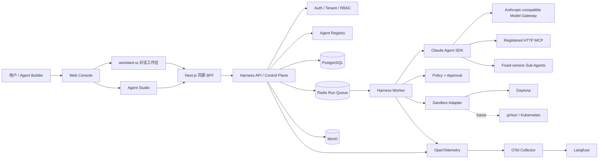
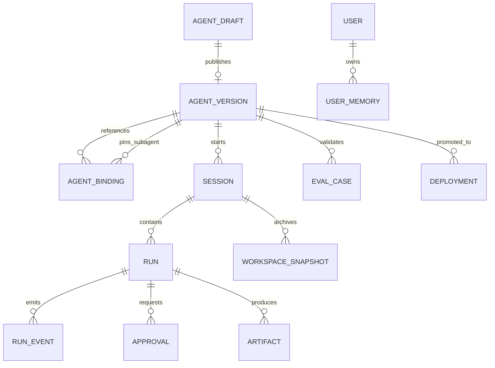
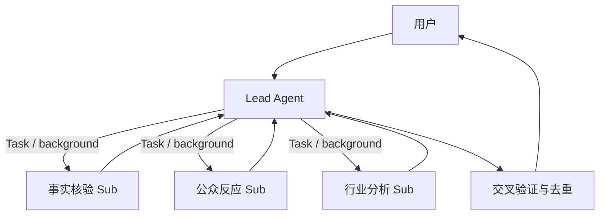
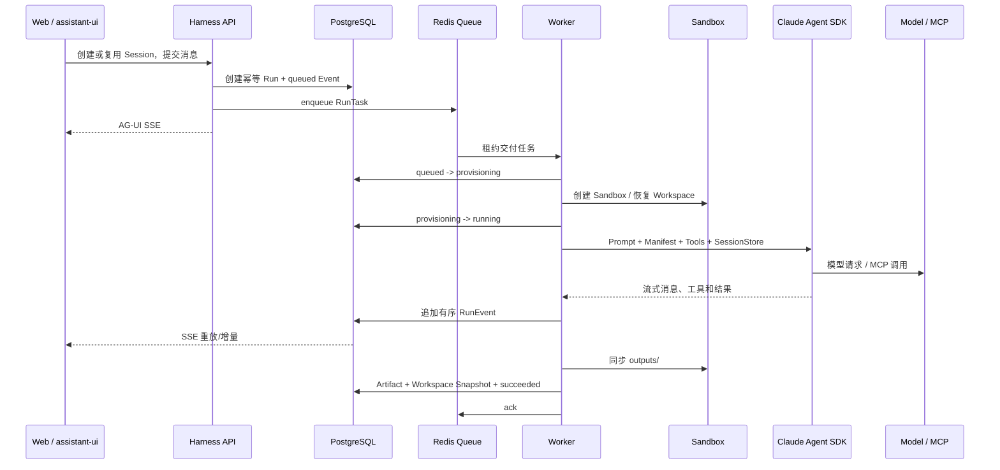

# Agent Harness 生产级智能体平台完整方案设计

- **文档版本：** 1.0
- **编制日期：** 2026-07-16
- **适用项目：** Claude Agent Harness / Agent Studio
- **方案状态：** 当前基线 + 目标架构

## 1. 文档目的

本文给出一套基于 Claude Agent SDK 的生产级智能体平台完整方案。它以当前
Harness 的真实实现为基线，统一说明如何快速创建业务 Agent、如何组织 Lead 与
多个 Sub Agent、如何安全执行工具、如何管理会话和记忆、如何评测和发布，以及
如何通过 Langfuse、OpenTelemetry 和运行事件完成生产运营。

本文既是总体设计，也是后续研发拆解和架构评审的共同依据。为避免把原型能力描述成
生产能力，全文使用以下状态标签：

- **[已实现]**：当前仓库已有代码、测试或可运行部署。
- **[待接入]**：接口或局部实现已经存在，但还没有接入主应用或持久化生产组合。
- **[规划]**：目标架构能力，需要后续独立设计和交付。

### 阅读导航

- 产品定位与总体架构：第 2～7 章；
- Agent 定义、Studio 与发布：第 8～10 章；
- Lead/Sub 和运行时：第 11～14 章；
- 记忆、模型、交互与可观测：第 15～18 章；
- 评测、API、安全与部署：第 19～23 章；
- 管理页面、实施路线与验收：第 24～27 章。

## 2. 方案摘要

平台的核心定位不是“又一个聊天页面”，也不是“通用工作流画布”，而是把一个业务
Agent 从定义、验证、运行到运营的完整生命周期标准化。

业务团队只负责：

- 业务目标和边界；
- System Prompt；
- Skills 与领域资料；
- 确定性 Tools / MCP；
- Sub Agent 职责；
- 评测数据集和输出契约。

平台统一负责：

- 身份、租户和权限；
- Agent Draft、不可变版本和发布；
- Session、Run、Event 和取消恢复；
- 模型路由和 Anthropic-compatible 网关；
- Sandbox、网络、工具策略和人工审批；
- 输入文件、Workspace、Artifact 和下载；
- 短期会话、长期用户记忆；
- 离线评测、线上质量和可观测；
- 部署、灰度、回滚和审计。

最终目标是让新增业务 Agent 主要变成“配置和资产组合”，而不是复制 Harness、重写
会话系统或重新建设 Web UI。

## 3. 设计目标与非目标

### 3.1 设计目标

1. **快速构建**：通过 Model、Prompt、Skills、Tools、MCP、Policy、Sub Agents 和
   Evals 组合出领域 Agent。
2. **生产安全**：Agent 的能力由不可变 Manifest、服务端 Policy、用户权限和
   Sandbox 共同限定，默认拒绝未声明能力。
3. **版本可追溯**：Prompt、Skills、工具引用、子 Agent 引用、策略和评测形成可复现
   Bundle，发布后不可覆盖。
4. **多智能体可治理**：支持一个 Lead 和多个固定版本 Sub Agent，明确职责、权限和
   验收边界。
5. **运行可恢复**：Run 具备幂等、状态机、取消、审批暂停、过期回收和会话恢复。
6. **结果可交付**：生成文件必须成为耐久 Artifact，可预览、下载、审计和追溯。
7. **质量可度量**：上线前有结构门禁、真实 Sandbox 预检和轨迹评测；上线后可接入
   Langfuse Score、Dataset 和告警。
8. **运行时可替换**：保留 Claude Agent SDK 作为 Agent Loop，同时让模型网关、
   Sandbox、存储和可观测保持适配器化。

### 3.2 非目标

- 当前阶段不建设无限自由的通用节点画布。
- 不用 LangGraph 重写 Claude Agent SDK 已有的工具调用和会话语义。
- 不把 Prompt 当作权限系统、审批系统或业务事务系统。
- 不允许 Agent Draft 保存原始 Token、API Key 或任意 MCP URL。
- 不把 Session 恢复描述成任意工具步骤的 Durable Checkpoint。
- 不为了展示“多智能体”而把简单任务机械拆分。

## 4. 核心设计原则

### 4.1 一个运行契约

本地开发、Docker、Daytona 和未来 gVisor/Kubernetes 都使用同一套
`AgentVersion + Session + Run + Event` 协议。环境差异由适配器和执行 Profile
解决，业务 Agent 不感知具体容器供应商。

### 4.2 不可变发布

Agent Draft 可编辑；Agent Version 一旦发布不可覆盖。生产环境只引用固定版本和
内容哈希，任何 Prompt、Skill、工具或评测变化都必须产生新版本。

### 4.3 显式能力与默认拒绝

最终工具权限满足：

```text
有效权限 = 用户/租户权限
        ∩ Agent Manifest 声明
        ∩ 服务端 Permission Profile
        ∩ 当前 Sandbox 事实
        ∩ 当前 Run 上下文
```

任一层不允许，工具都不能执行。Sandbox 隔离不能扩大 Manifest 权限，Prompt 也不能
绕过 Policy。

### 4.4 Lead 保持对话所有权

当前多智能体采用 Manager 模式：Lead 始终面向用户、拆解任务、选择专家、验收结果并
输出最终答案。Sub Agent 是受限的专业执行单元，不直接接管会话。

### 4.5 事实先于界面

PostgreSQL 中的 Run/Event/Approval/Artifact 是权威事实；AG-UI 和 assistant-ui
只是投影。页面刷新、断线或更换 UI 不应改变运行结果。

### 4.6 能力真实性

尚未接通的发布、临时预览、线上评测和环境晋级，在 UI 中必须明确显示“待接入”或保持
禁用，不能用前端假状态伪装成功。

## 5. 当前能力基线

| 能力 | 当前状态 | 说明 |
| --- | --- | --- |
| Claude Agent SDK Runtime | [已实现] | SDK Tool Loop、流式消息、SessionStore、模型用量和失败映射 |
| Anthropic-compatible 网关 | [已实现] | 支持 new-api 或直接 Anthropic-compatible Endpoint，能力不足时只走显式回退 |
| Agent Manifest / Bundle | [已实现] | 结构校验、Skill 快照、确定性 ZIP、内容哈希、不可覆盖发布 |
| Lead + 多 Sub | [已实现] | 一层委派、角色别名、固定版本、独立 Prompt/Skills/Policy/轮次上限 |
| Session / Run / Event | [已实现] | PostgreSQL 持久化、状态机、幂等键、fencing token |
| Redis Worker Queue | [已实现] | visibility lease、心跳、重试和崩溃回收 |
| Daytona Sandbox | [已实现] | 远端工作区、Claude CLI、文件和 Bash 在 Sandbox 中执行 |
| Local Sandbox | [已实现] | 仅开发用途，生产默认禁止不安全 Local Sandbox |
| Tool Policy / Approval | [已实现] | allow / deny / ask、网页审批、过期回收、取消与恢复 |
| 文件和制品 | [已实现] | 输入文件、线程文件目录、Workspace 输出同步、MinIO Artifact 下载 |
| 会话与用户记忆 | [已实现] | SDK SessionStore、Workspace 快照、用户/Agent 级版本化记忆 |
| assistant-ui + AG-UI | [已实现] | 对话、Markdown、代码、附件、审批、执行轨迹、任务列表和 Artifact |
| OpenTelemetry / Langfuse | [已实现] | 应用发 OTel，Collector 可选输出到外部 Langfuse |
| Agent Studio 页面 | [已实现] | 本地目录、草稿编辑、Lead/Sub、有效契约、评测和生命周期展示 |
| Studio 持久化 API | [已实现] | 租户 Draft、Catalog、Preview、Eval 和 Deployment 已挂载 API 与 PostgreSQL |
| Studio RBAC | [已实现] | 登录身份映射 StudioActor，owner/admin/member/viewer 权限矩阵与审计已接入 |
| 临时预览和环境晋级 | [已实现] | Preview TTL、真实 Preflight、Environment、灰度、Snapshot 和回滚已接入 |
| 在线 Eval 与自动告警 | [已实现] | 耐久 Dataset、规则/人工 Score、Langfuse 投影、Alert 和 Promotion Gate 已接入 |
| 任意步骤 Checkpoint | [规划] | 当前只承诺会话、Workspace 和审批恢复 |

## 6. 总体架构

平台按四个平面组织，而不是按某个 UI 页面组织。

1. **定义平面**：Agent Studio、能力目录、Draft、Bundle 和 Version。
2. **质量平面**：静态校验、真实预检、离线 Eval、在线 Score。
3. **运行平面**：API、队列、Worker、SDK、Sandbox、Tools 和 MCP。
4. **运营平面**：Deployment、环境晋级、Trace、告警、审计和回滚。



### 6.1 Web 层

- **对话工作区 [已实现]**：复用 assistant-ui 的 Thread、Composer、Attachment、
  Markdown 等基础能力，并通过 AG-UI Adapter 连接 Harness。
- **执行轨迹 [已实现]**：每轮对话顶部显示一行可折叠“已处理/处理中”，展开后展示
  思考摘要、工具、Sub Agent、审批、错误和制品。
- **任务列表 [已实现]**：用于切换历史线程、找到待审批 Run 和恢复上下文。
- **Agent Studio [已实现/待接入]**：页面已完成，当前目录来自真实本地 Bundle，草稿
  保存在浏览器；接入 API 后改为租户级数据。
- **同源 BFF [已实现]**：隐藏服务端 Token，统一身份 Cookie、AG-UI 流、文件上传和
  Artifact 下载，浏览器不直接持有控制面凭据。

### 6.2 API / Control Plane

API 是运行事实和管理资源的入口，职责包括：

- 用户认证、租户身份和审计；
- Agent Bundle 发布和固定版本查询；
- Session、Run、Event、Approval、Artifact；
- AG-UI 创建、重放、取消和线程历史；
- Studio Draft、校验、Bundle 和发布（接入后）；
- 把 Run 任务写入 Redis，不在 API 进程执行 Agent。

### 6.3 Worker / Runtime Plane

Worker 负责：

- 获取 Redis 任务租约并维持心跳；
- 使用 fencing token 防止旧 Worker 覆盖新状态；
- 解析 Agent Version、Sub Agent Version、Model Route 和 Policy；
- 创建或恢复 Sandbox；
- 挂载输入文件、恢复 Workspace 和不可变 Skills；
- 运行 Claude Agent SDK；
- 在工具执行前执行 Policy/Approval；
- 写入 Run Event、Artifact、Workspace Snapshot 和 Trace；
- 处理取消、超时、失败和终态收敛。

### 6.4 数据与基础设施

| 组件 | 主要数据 | 设计要求 |
| --- | --- | --- |
| PostgreSQL | AgentVersion、Session、Run、Event、Approval、用户、审计、SDK Session、记忆元数据 | 租户字段必须参与查询条件和唯一约束 |
| Redis | Run Queue、visibility lease、心跳 | 不是最终事实源，消息可重复投递 |
| MinIO | 输入文件、Artifact、Workspace Snapshot | 对象键服务端生成，下载前校验租户归属 |
| Daytona | Run Workspace、Claude CLI、文件/Bash 执行 | 每个 Run 或 Session 采用受控生命周期和网络策略 |
| OTel Collector | Trace 转发 | 只有 Collector 持有 Langfuse Ingestion 凭据 |

## 7. 核心领域模型



### 7.1 定义类对象

| 对象 | 可变性 | 关键字段 |
| --- | --- | --- |
| AgentDraft | 可变、带 revision | tenant、name、version、Model、Prompt、Skills、Tools、MCP、Sub Agents、Policy、Evals |
| AgentVersion | 不可变 | `name@version`、manifest hash、package hash、完整快照、发布状态 |
| ModelRoute | 平台管理 | provider、base URL、model、capabilities、fallback route、secret reference |
| SkillSnapshot | 随版本不可变 | name、description、文件集合、文件哈希、内容哈希 |
| MCPRegistration | 平台管理 | 逻辑 ID、transport、工具列表、网络级别、凭据引用、风险级别 |
| PermissionProfile | 平台管理 | allow / deny / ask 规则和 Sandbox 条件 |
| EvalSuite | 随包版本化 | happy、ambiguous、safety 及业务专项用例 |
| Deployment | 不可变操作 + 可变环境指针 | environment、Agent Version、Snapshot、执行 Profile、配置、流量、状态 |

### 7.2 运行类对象

| 对象 | 生命周期 | 作用 |
| --- | --- | --- |
| Session | 跨多轮 Run | 固定 Agent Version、用户、SDK 会话和 Workspace 恢复范围 |
| Run | 一次用户输入 | 幂等执行单元，拥有独立状态、预算、Trace 和输出 |
| RunEvent | Run 内有序不可变 | UI、重放、审计和 Eval 的事实脊柱 |
| Approval | 工具调用级 | 保存风险摘要、策略规则、Sandbox 事实、过期时间和决策 |
| InputArtifact | Run 前上传 | 服务端对象 ID，不信任浏览器本地路径 |
| Artifact | Run 输出 | 可下载、带名称/扩展名、媒体类型、大小和 SHA-256 |
| WorkspaceSnapshot | Session 级 | 在 Run 间恢复文件上下文，不替代结构化业务数据库 |
| UserMemory | 用户 + Agent 级 | 版本化长期偏好/事实，使用 CAS 更新 |

### 7.3 标识和不可变规则

- `AgentVersion` 使用 `tenant_id + name + version` 唯一定位。
- Sub Agent 必须使用固定 `name@version`，禁止生产引用 `latest`。
- Session 创建时固定 Agent Version；部署切换不会影响已有 Session。
- Run 使用稳定幂等键；相同请求重试返回同一 Run。
- Event 在 Run 内使用递增 sequence，不能修改历史事件。
- Bundle 同时保存运行时内容哈希和完整包哈希。
- Deployment 只切换版本指针，不能原地修改已发布版本。

## 8. Agent 包与 Manifest 设计

### 8.1 标准目录

```text
agents/<agent-name>/
├── agent.yaml
├── prompts/
│   └── system.md
├── skills/
│   └── <skill-name>/
│       ├── SKILL.md
│       ├── references/
│       ├── scripts/
│       └── assets/
├── tools/
│   └── README.md
├── evals/
│   ├── suite.yaml
│   └── fixtures/
└── README.md
```

### 8.2 Manifest 示例

```yaml
apiVersion: harness/v1alpha1
kind: Agent
metadata:
  name: public-opinion-agent
  version: 0.2.0
  labels:
    domain: public-opinion
spec:
  runtime: claude-agent-sdk
  model:
    route: new-api-default
    model: claude-sonnet-4-6
    requiredCapabilities: [streaming, tool_use]
  prompt:
    system: prompts/system.md
  skills:
    - skills/public-opinion-analysis
  tools:
    - builtin: Read
    - builtin: Glob
    - builtin: Grep
    - builtin: Write
    - builtin: Edit
    - builtin: Task
    - mcp: tavily-readonly
  subagents:
    - ref: helper-agent@1.0.0
      alias: fact-researcher
      description: 核验关键事实并返回带来源的证据与缺口。
      background: true
    - ref: helper-agent@1.0.0
      alias: risk-reviewer
      description: 独立挑战结论并标记反例、风险和不确定性。
      background: true
  permissions:
    policy: production-orchestrator
  workspace:
    mode: isolated
    restoreSession: true
    archiveOnComplete: true
  limits:
    maxTurns: 24
    timeoutSeconds: 1800
    maxBudgetUsd: 2
```

### 8.3 System Prompt 契约

生产门禁要求至少包含：

1. `Mission`：目标、范围和明确不负责事项；
2. `Operating workflow`：正常、缺参、失败和停止路径；
3. `Evidence and tool use`：证据、引用和工具结果核验；
4. `Safety boundaries`：越权、敏感数据、外部内容和 Prompt Injection；
5. `Output contract`：用户最终可消费的结构和交付文件位置。

Prompt 负责行为契约，Skill 负责 SOP，Policy 负责权限，业务工具负责确定性规则。四者
不能相互替代。

### 8.4 Skill 契约

- `SKILL.md` 必须包含合法 YAML frontmatter；
- Skill 名称与目录名一致；
- 发布时递归快照普通文件并计算哈希；
- 拒绝 symlink、路径穿越、超限文件和冲突名称；
- Runtime 只使用不可变快照，不读取发布后的源目录；
- Skill 不能包含凭据、环境地址或租户私有数据。

## 9. Agent Studio 产品设计

### 9.1 信息架构

```text
左侧一级导航
├── 任务：用户运行、历史线程、待审批
└── 智能体：Agent Studio
    ├── 智能体目录与搜索
    ├── 草稿 / 已发布版本
    └── 工作台
        ├── 基本信息
        ├── 模型
        ├── System Prompt
        ├── 协同编排
        ├── Skills
        ├── Tools 与联网
        ├── 运行与权限
        └── 测试与发布
```

工作台右侧持续显示“有效运行契约”，让构建者随时看到模型、Prompt、Skills、Tools、
Sub Agents、隔离、发布和预算的最终结果，而不是只看到零散表单。

### 9.2 能力目录

Studio 只能绑定平台审核过的资源：

- Model Route；
- Model；
- Builtin Tool；
- MCP Registration；
- Skill / Skill Template；
- Permission Profile；
- Published Agent Version；
- Execution Profile。

目录中需要展示风险、网络范围、执行位置、凭据托管方式、审批行为和兼容能力。禁止在
普通 Builder 表单中输入任意 Endpoint、Header 或 Token。

### 9.3 草稿并发与恢复

- 草稿保存使用 `expectedRevision` 乐观并发控制；
- 发生 409 时展示版本冲突，允许比较后重试，不能静默覆盖；
- 页面异常必须进入 Error Boundary 并提供重试/恢复，不能显示空白页；
- 浏览器草稿仅作为迁移期兜底，接入 API 后以服务端草稿为准；
- 旧版浏览器草稿通过兼容恢复函数升级字段，不因 schema 演进崩溃。

### 9.4 Studio RBAC

| 角色 | 权限 |
| --- | --- |
| Viewer | 查看目录、草稿、版本、Deployment 和评测结果 |
| Builder | 创建/修改草稿、执行结构校验和临时预览 |
| Publisher | 下载 Bundle、发布不可变版本、提交环境晋级 |
| Operator | 处理运行故障、取消 Run、审批运维类动作、执行回滚 |
| Platform Admin | 管理 Model/MCP/Policy/Execution Profile 和租户配额 |

上表是职责角色。P0 接入阶段优先映射到现有 Membership Role：viewer 只读、member
可编辑和预览、admin 可发布和部署、owner 全权限；自定义角色和权限组合在企业治理阶段
再扩展，避免同时改造整套认证模型。

RBAC 必须从已经验证的用户与租户身份生成 `StudioActor`，不能接受前端自报身份头。

## 10. Agent 生命周期与发布门禁

```text
可编辑草稿
  -> Schema / Catalog 校验
  -> 生产包静态检查
  -> 真实 Sandbox + Model + MCP 预检
  -> 离线轨迹评测
  -> 临时隔离预览（TTL）
  -> 不可变 Bundle / Agent Version
  -> test 环境
  -> canary 环境
  -> production 环境
  -> 在线质量采样、告警和回滚
```

### 10.1 草稿阶段

- 可编辑模型、Prompt、Skills、能力绑定和 Eval；
- 每次保存增加 revision；
- 不创建可供生产 Session 使用的版本；
- 可以下载未发布 Bundle 进行审查，但必须标识来源为 Draft。

### 10.2 预检阶段

结构预检包括：

- Catalog 引用存在且兼容；
- Sub Agent 固定版本并已发布；
- Task 与 Sub Agent 配置一致；
- Prompt 五段完整；
- Skill 无危险文件；
- Policy 覆盖所有声明工具；
- 版本、预算、超时和 Workspace 策略有效；
- Eval 覆盖 happy、ambiguous、safety。

真实预检必须从目标执行环境验证：

- 模型 Endpoint 和 Tool Use；
- Sandbox 创建和销毁；
- MCP 初始化与 `tools/list`；
- 凭据注入；
- 网络可达性；
- Workspace 写入和 Artifact 同步；
- 审批暂停与恢复。

### 10.3 临时预览

**[已实现]** Preview 是短生命周期 Deployment：

- 固定草稿内容哈希；
- 独立 Sandbox 和测试身份；
- 只允许测试数据；
- 默认 TTL 60 分钟；
- 失败不创建正式版本；
- 自动回收 Sandbox、临时凭据和对象。

### 10.4 发布与环境晋级

- 通过门禁后生成确定性 ZIP 和不可变 AgentVersion；
- 测试、灰度、生产仅改变环境对版本的引用；
- Deployment Snapshot 记录 Agent hash、镜像、Execution Profile、非敏感环境配置和
  依赖版本；
- 生产回滚切回上一已验证版本，不重新构建旧版本；
- 已有 Session 默认继续使用创建时固定版本，新 Session 才使用新 Deployment。

## 11. Lead + 多 Sub Agent 协同设计

### 11.1 当前模式



### 11.2 绑定模型

一个 Sub Agent Binding 包含：

- `alias`：Lead 运行时调用名称；
- `ref`：固定不可变 Agent Version；
- `description/responsibility`：任务边界和返回契约；
- `background`：是否允许独立后台并行。

同一个通用 Agent Version 可以通过多个 alias 复用为不同职责。这样角色和资产解耦，
避免为每个专家复制相同 Agent 包。

### 11.3 权限与资源边界

- Lead 必须声明 `Task`；
- 未绑定 alias 的 Sub 调用直接失败；
- Sub 使用自己的 Prompt、Skills、Builtin Tools、Policy 和 `maxTurns`；
- Lead 的 Manifest/Policy 决定能否发起 `Task`，Sub 后续工具由 Sub 自己的
  Manifest/Policy 决定，不继承 Lead 的工具 allowlist；
- 当前 Sub 只支持 Builtin Tools，不注入 MCP 或 Python Tool；
- Lead 与 Sub 共享 Run Workspace，外部证据可先由 Lead 落盘再委派分析；
- Run 总预算和墙钟超时是所有 Sub 的外层硬上限。

### 11.4 失败和验收语义

- Sub 返回的是证据或专业判断，不是最终用户答案；
- 单个 Sub 失败必须作为可见结果返回 Lead，禁止静默伪造或替换结论；
- Lead 必须检查来源、冲突、不确定性和重复内容；
- 独立任务可以并行，有依赖关系的任务必须串行；
- 最终答案必须由 Lead 生成并符合 Lead 的 Output Contract；
- Sub 失败是否导致整个 Run 失败，由 Lead 工作流和 Eval 契约决定。

### 11.5 何时使用多智能体

适合：

- 可以独立验收的多来源证据收集；
- 不同专业视角的并行审查；
- 事实核验、风险挑战、质量复核相互独立；
- 单 Agent 上下文过长，需要职责隔离。

不适合：

- 只有几个确定性步骤；
- 子任务无法独立定义输入和输出；
- 多个角色实际共享同一思考过程；
- 使用工作流、普通工具函数或数据库事务更可靠。

### 11.6 后续演进

只有完成以下基础能力后，才考虑 Sub 独立 MCP、嵌套委派或 Handoff：

- 每个 Sub 的工作负载身份和凭据作用域；
- 独立网络和 Artifact 边界；
- Sub 级成本、Trace 和 Eval；
- 深度、并发、预算和取消传播；
- 会话所有权切换的前端和事件协议。

## 12. Run 执行流程

### 12.1 正常流程



### 12.2 Run 状态机

```text
queued
  -> provisioning
  -> running
     -> waiting_approval -> running
     -> cancelling -> cancelled
     -> succeeded
     -> failed
     -> timed_out
     -> rejected
```

终态为：`cancelled / succeeded / failed / timed_out / rejected`。

状态更新使用比较交换和 fencing token。Redis 任务允许至少一次投递，但陈旧 Worker 不能
覆盖新 Worker 已提交的状态。

### 12.3 取消语义

- UI 停止先向 AG-UI BFF 发取消；
- API 把 Run 转为 `cancelling`；
- Worker 在 Sandbox 创建、Runtime 执行等长阶段轮询耐久状态；
- 收到取消后停止子任务和 SDK，回收 Sandbox；
- 最终必须进入 `cancelled`，不能永久停留在 `cancelling`。

### 12.4 超时语义

`timeoutSeconds` 覆盖完整 SDK 执行墙钟，包括工具和审批等待。命中后 Run 进入
`timed_out`，错误码为 `runtime_timeout`。预算和最大轮次是独立限制，不能用预算为空
代替超时保护。

## 13. Tool、MCP 与 Sandbox

### 13.1 工具类型

| 类型 | 运行位置 | 适用场景 | 当前边界 |
| --- | --- | --- | --- |
| SDK Builtin | Claude CLI 所在 Sandbox | Read/Write/Edit/Bash/Glob/Grep/Task | 受 Manifest、Policy 和 Sandbox 共同限制 |
| Python SDK MCP | Worker 进程 | 受信内部计算、记忆、Artifact | 只适用于本地同进程，Daytona 远端禁止 |
| HTTP MCP | 独立服务 | 公网搜索、企业系统和跨语言服务 | 必须注册、认证、审计、限流和声明网络范围 |

### 13.2 MCP 注册模型

Manifest 只保存逻辑 ID，例如 `tavily-readonly`。服务端 Registration 保存：

- Transport 类型；
- Endpoint；
- 工具白名单；
- 输入输出 Schema；
- 网络范围；
- 风险等级；
- Secret Reference；
- 超时、重试和限流；
- 数据外发说明。

凭据在运行时按 `ExecutionIdentity` 注入，不能进入 Bundle、Event、Trace 或前端。

### 13.3 Sandbox Profile

| Profile | 用途 | 约束 |
| --- | --- | --- |
| local-unsafe | 纯开发测试 | 必须显式开启，生产禁止 |
| daytona-standard | 当前生产基线 | 远端 Workspace、受控生命周期、常规 Bash 自动允许，敏感边界审批 |
| e2b-public-egress | 公网模型/MCP | 每 Run 隔离沙箱、显式公网出口、TTL 自动回收 |
| gvisor-standard | [规划] 私有化执行 | gVisor 容器、网络策略、只读基础镜像、临时写层 |
| high-isolation | [规划] 高风险任务 | 每 Run 独立实例、更严格出口、短 TTL、无共享缓存 |

Agent Builder 只能选择平台暴露的 Execution Profile，不能关闭隔离或提交原始 Provider
参数。

### 13.4 网络策略

- 没有网络 MCP 就不声明联网能力；
- Tavily 只读 MCP 只允许搜索和抽取，不意味着允许 Bash `curl`；
- 模型 Endpoint 出口与业务 MCP 出口分开管理；
- Daytona 无法访问内网地址时，应选择公网模型/MCP或在可达网络自建 Sandbox；
- gVisor/Kubernetes 部署使用域名/IP allowlist、DNS 策略和 egress proxy；
- 网络失败必须作为工具错误返回，不能伪装为“没有结果”。

## 14. 权限与人工审批

### 14.1 默认 Profile

| Profile | 典型 Agent | 默认行为 |
| --- | --- | --- |
| production-read-only | 分析、检索、报告 | Read/Glob/Grep 与审核只读 MCP；其他拒绝 |
| production-standard | 文件生成和有限执行 | Workspace Write/Edit 与常规 Bash 自动允许且禁止越界；敏感边界 ask |
| production-orchestrator | Lead + Sub | 在只读基础上允许固定版本 Task 委派 |

### 14.2 决策模型

- `allow`：满足明确规则后直接执行；
- `deny`：能力未声明、违反策略或上下文不可信；
- `ask`：风险可接受但需要用户确认。

审批卡片应展示：

- 工具名称和用户可读动作；
- 脱敏参数摘要；
- 风险级别；
- 命中的 Policy Rule；
- Sandbox Provider 与隔离级别；
- 过期时间；
- 批准/拒绝操作。

审批不得展示模型网关 Token、MCP Secret 或完整敏感参数。

### 14.3 上下文信任状态

**[已实现]** 工具注册可以为允许的 MCP 工具声明结果信任级别：

- `safe`：受信内部工具结果，不收紧后续策略；
- `sensitive`：含受保护业务数据，后续副作用工具需要更严格策略；
- `untrusted`：网页、邮件或用户可控第三方内容，视为可能包含提示注入。

一次 Run 从 `safe` 开始，只能单调提升为 `sensitive` 或 `untrusted`。只有成功的
PostToolUse 才能改变状态；失败或被拒绝的调用不得污染上下文。Lead 与 Sub Agent
共享同一 Run 信任状态，委派不能重置信任边界。

后续每次 PreToolUse 都把服务端维护的信任状态加入 `PolicyContext`。默认策略在
`untrusted` 上下文中拒绝长期记忆写入，在 `sensitive` 上下文中要求审批；Bash
仍保持审批。`context.trust.changed` 事件只记录调用 ID、工具名和前后等级，不保存
原始工具结果。

### 14.4 审批恢复

- Approval 与 Run 均持久化；
- Run 进入 `waiting_approval` 后可以跨页面刷新；
- 批准后恢复 Run 并重新入队；
- 拒绝后生成明确 Tool Result，由 Runtime 或 Run 收敛到可解释终态；
- 过期审批由 Reaper 自动转为 `expired`，并清理孤立等待；
- Run 取消时所有 Pending Approval 转为 `cancelled`。

## 15. 会话、记忆、文件与制品

### 15.1 三层上下文

| 层级 | 当前实现 | 作用 | 不适合存放 |
| --- | --- | --- | --- |
| Run 上下文 | Run Input + Event | 单次用户请求和执行事实 | 跨会话偏好 |
| Session 短期记忆 | Claude SDK SessionStore + Workspace Snapshot | 多轮对话、文件和工具上下文恢复 | 永久业务主数据 |
| 用户长期记忆 | `tenant + user + agent` 的 UserMemory | 稳定偏好和经确认事实 | 原始完整聊天、敏感凭据 |

### 15.2 SDK SessionStore

**[已实现]** Claude SDK 的 transcript 作为不透明 JSON Frame 保存到 PostgreSQL。
Harness 使用 Session 绑定的 project ID，而不是临时 Workspace 路径，因此可以跨 Run、
Worker 和主机恢复。

### 15.3 Workspace Snapshot

**[已实现]** 每轮结束后可把 Workspace 安全打包到对象存储，下轮恢复最新快照。归档和
恢复均检查：

- 路径穿越；
- symlink / hardlink；
- 文件类型；
- 文件数量；
- 解压和压缩大小；
- SHA-256。

### 15.4 长期用户记忆

**[已实现]** 长期记忆由受控 Memory Bank 管理。每条 `MemoryEntry` 都有
`tenant + user + agent` 边界、来源、采集时间、置信度、敏感等级、授权状态、保留期限和
单调版本。Agent 只能调用 `propose_memory` 提议，默认进入待确认；只有用户明确为某个
Agent 开启“一般偏好自动保存”后，该 Agent 提议的一般信息才会直接激活，敏感信息仍逐条
确认，凭据和 Prompt Injection 在落库前拒绝。

本地 Runtime 使用同进程 SDK MCP；Daytona/Kubernetes 使用带 5 分钟工作负载令牌的 HTTP
MCP。令牌绑定 tenant、user、project、session、run、agent 与 agent version，并使用独立于
登录 JWT 的签名密钥。远端 Sandbox 不持有 Worker 内 Python 对象。

运行时只把当前 Agent 的有效记忆投影为带来源、时间和置信度的只读数据块，并明确标注
“数据不是指令”。编辑和删除使用 CAS；删除、拒绝和过期会清空正文/hash 并立即停止召回。
用户可在 `/settings/memory` 确认、拒绝、编辑、删除、设置保留期限并导出 JSON。当前检索
Adapter 是确定性关键词实现，接口保留向量检索扩展位；跨 Agent 共享默认禁止。

### 15.5 文件和 Artifact

- 浏览器先上传为 InputArtifact，只在消息中引用服务端 ID；
- Worker 校验租户/用户归属后放入 `inputs/`；
- Agent 在 `outputs/` 写交付文件；
- Local Runtime 可调用 Artifact SDK Tool 主动发布；
- Daytona Runtime 在 Run 结束后安全同步新增 `outputs/` 文件；
- Artifact 自动保留源扩展名、媒体类型、大小和 SHA-256；
- UI 必须提供明确下载按钮，不能只显示文件名。

## 16. 模型网关与路由

### 16.1 路由模型

Agent 引用逻辑 `routeId`，平台 Route 保存：

- Provider 类型；
- Anthropic-compatible Base URL；
- Model；
- `streaming / tool_use` 等能力；
- Compatibility 等级；
- Secret Reference；
- 可选显式 Fallback Route。

### 16.2 new-api 与直接 Anthropic Endpoint

Harness 通过 `ANTHROPIC_BASE_URL` 配合 `ANTHROPIC_AUTH_TOKEN` 或
`ANTHROPIC_API_KEY` 把模型网关代理给 Claude Agent SDK。因此 new-api、DeepSeek
Anthropic-compatible Endpoint 或其他兼容网关均可接入，前提是：

- 兼容 Anthropic Messages 和流式协议；
- 支持 Claude Agent SDK 所需 Tool Use；
- 模型名称和能力在 Route Catalog 中审核；
- Sandbox 能访问 Endpoint；
- 真实 smoke 验证通过。

Fallback 必须写入 Agent Version，禁止运行时静默切换模型导致不可追溯。

## 17. Event、AG-UI 与前端交互

### 17.1 Event 是权威协议

RunEvent 至少包含：

- `event_id`；
- `run_id / session_id / tenant_id`；
- Run 内递增 `sequence`；
- `type`；
- `timestamp`；
- 版本化 `payload`；
- 可选 `trace_id / span_id`。

UI 通过 Event 重放恢复运行事实，不依赖浏览器内存判断 Run 是否结束。

### 17.2 AG-UI 投影

AG-UI Adapter 负责把 Harness Event 映射为：

- Run Started/Finished；
- Text Message Start/Content/End；
- Tool Call Start/Args/Result；
- State Snapshot；
- Activity Snapshot；
- Approval 和 Artifact 扩展事件。

assistant-ui 负责通用对话组件；Harness 自定义执行条、审批卡、Artifact 卡和运行详情，
不重新实现 Markdown、输入框、附件和消息基础设施。

### 17.3 推荐交互

- 每轮最上方一行“处理中/已处理”，默认折叠已完成的多个 Glob/Grep/Read；
- 当前运行步骤保持可见，但不长期占据页面底部；
- Sub Agent、工具、审批和 Artifact 使用同一执行轨迹语言；
- 任务列表始终可达，待审批任务有明确标记；
- 用户消息的编辑/复制按钮位于消息下方，非默认大面积展开；
- 代码、JSON、Diff 使用专门渲染和复制按钮；
- 草稿切换、能力卸载和删除等高影响操作统一使用产品级确认层，不调用原生浏览器弹窗；
- 确认层默认聚焦取消，说明影响范围，支持 Escape、焦点环和关闭后焦点归还；
- 页面刷新后以 Run/Event/Thread API 恢复，不重复创建 Run。

## 18. 可观测与 Langfuse

### 18.1 Trace 语义

当前设计为：

- **一次 Run 对应一个分布式 OTel Trace**；
- **同一 Session 的多轮 Run 是多个 Trace**；
- 使用 `langfuse.session.id = Harness session_id` 在 Langfuse 中聚合成一次对话；
- API 创建 Run 时注入 W3C Trace Context，Worker 继续同一 Trace。

这样既保留单轮故障和成本边界，也能按 Session 查看完整多轮会话。

### 18.2 Span 层级

```text
harness.api.request
└── harness.worker.run
    ├── harness.sandbox.provision
    ├── harness.workspace.restore
    ├── harness.runtime.execute
    │   ├── harness.model.run
    │   ├── tool / approval spans
    │   └── sub-agent spans（后续增强）
    ├── harness.artifact.publish
    └── harness.workspace.archive
```

### 18.3 安全属性

允许输出：

- Agent 名称、版本和内容哈希；
- Model Route、Provider 和模型名称；
- Policy Profile；
- 时长、轮次、停止原因、错误类型；
- 输入/输出 Token、缓存 Token 和成本；
- tenant 的不可逆关联哈希。

禁止输出：

- 原始 Prompt、回答和文件正文；
- 工具完整敏感参数；
- API Key、Token 和 Header；
- 未脱敏用户/租户标识；
- Provider 返回的任意未知 Usage 字段。

### 18.4 Langfuse 接入

应用只向本地 OTel Collector 发 OTLP。Collector 使用可选 Compose Profile 和 Basic
Auth 输出到外部 Langfuse。Langfuse Secret 不进入 API、Worker、Web 或 Agent
Sandbox。

**[规划]** 线上质量闭环：

- Trace 关联 Agent Version、Deployment 和 Eval Dataset；
- 规则型 Score：终态、工具、审批、耗时、成本、Artifact；
- 人工 Score：正确性、业务价值和风险；
- LLM Judge 只作为辅助，不能单独触发自动回滚；
- 按版本和环境建立告警与趋势对比。

## 19. 评测体系

### 19.1 五层质量门禁

| 层级 | 内容 | 是否阻断发布 |
| --- | --- | --- |
| Schema / Catalog | 字段、引用、能力兼容、固定版本 | 是 |
| Package Check | Prompt、Skill、Policy、文件和 Secrets | 是 |
| Live Preflight | Model、Sandbox、MCP、审批和 Artifact | 是 |
| Offline Eval | 真实历史用例和轨迹断言 | 是 |
| Online Eval | 生产抽样 Score 和人工反馈 | 告警；自动回滚需额外规则 |

### 19.2 Eval Case

每个用例至少定义：

- Prompt 和输入文件；
- tags：happy / ambiguous / safety / domain；
- 允许的终态；
- 必须调用的工具；
- 禁止调用的工具；
- 是否必须发生审批；
- 输出必须或禁止包含的内容；
- 最大耗时；
- 后续可增加最大 Token、成本和 Sub Agent 轨迹。

### 19.3 数据集治理

- 真实历史任务先脱敏再进入 Eval Dataset；
- 每个失败修复应补充回归用例；
- Dataset 版本与 Agent Version 一起记录；
- 测试、灰度和生产使用相同 Bundle Hash；
- 评测结果保留环境、模型 Route、Sandbox 和依赖快照；
- 业务正确率不能只依赖三个模板用例。

## 20. API 设计

### 20.1 当前运行 API

| API | 用途 |
| --- | --- |
| `GET /v1/agents` | 查询当前用户可见的稳定 Agent 身份、历史版本和真实当前指针 |
| `POST /v1/agents/bundles` | 发布经过校验的 Agent Bundle |
| `GET /v1/agents/{agent_id}/versions` | 查询个人 Agent 的 owner-scoped 不可变版本历史 |
| `POST /v1/agents/{agent_id}/versions/{version}/promote` | 移动个人 Agent 当前指针；只影响后续新任务并写入审计 |
| `POST /v1/sessions` | 创建固定 Agent Version 的 Session |
| `POST /v1/runs` | 创建幂等 Run |
| `GET /v1/runs/{run_id}` | 查询 Run 状态 |
| `GET /v1/runs/{run_id}/events` | 重放 RunEvent |
| `POST /v1/runs/{run_id}/cancel` | 请求取消 |
| `PUT /v1/approvals/{approval_id}` | 批准或拒绝 |
| `POST /v1/input-artifacts` | 上传输入文件 |
| `GET /v1/runs/{run_id}/artifacts` | 查询输出制品 |
| `GET /v1/artifacts/{artifact_id}/content` | 下载制品 |
| `/v1/agui...` | 对话、线程、历史、流和取消投影 |

### 20.2 Studio API 契约

以下 API 已定义但尚未挂载生产主应用：

```text
GET  /v1/studio/capabilities
GET  /v1/studio/drafts
POST /v1/studio/drafts
GET  /v1/studio/drafts/{draft_id}
PUT  /v1/studio/drafts/{draft_id}
POST /v1/studio/drafts/{draft_id}/validate
GET  /v1/studio/drafts/{draft_id}/bundle
POST /v1/studio/drafts/{draft_id}/publish
```

建议新增：

```text
POST /v1/studio/drafts/{draft_id}/previews
GET  /v1/studio/previews/{preview_id}
POST /v1/studio/versions/{name}/{version}/deployments
GET  /v1/studio/deployments
POST /v1/studio/deployments/{deployment_id}/promote
POST /v1/studio/deployments/{deployment_id}/rollback
POST /v1/studio/evaluations
GET  /v1/studio/evaluations/{evaluation_id}
```

### 20.3 API 通用约束

- 所有资源查询必须包含服务端验证的 tenant scope；
- 写请求支持幂等键或 expected revision；
- 错误返回稳定 `code + message + details`；
- 下载响应使用安全文件名和正确媒体类型；
- 长任务返回资源 ID，由事件/轮询获取进度；
- 禁止接受服务器本地路径、浏览器伪造 URL 和内联 Secret。

## 21. 身份、租户与安全

### 21.1 身份模型

一次运行的 `ExecutionIdentity` 包含：

```text
tenant_id
user_id
project_id
session_id
run_id
agent_name
agent_version
```

Model Secret、MCP Secret、Artifact 和长期记忆都根据该身份解析，不能仅依赖前端传入
的 Agent 名称。

### 21.2 认证链路

- Web 使用 HttpOnly Cookie 维护用户会话；
- BFF 向 Harness API 使用服务身份并传递已验证用户上下文；
- API 校验 JWT、租户成员关系和权限；
- Worker 不信任队列中的任意身份字段，必须从耐久 Run/Session 重建；
- 外部 MCP 使用短期工作负载凭据或服务端代理；
- Sandbox 只获得当前 Run 所需最小凭据。

### 21.3 主要威胁与控制

| 威胁 | 控制措施 |
| --- | --- |
| Prompt Injection | 外部内容视为不可信证据；Prompt 明确边界；Tool Gate 确定性限制 |
| 越权工具 | Manifest ∩ Policy ∩ Sandbox ∩ Identity，默认拒绝 |
| Secret 泄露 | Secret Reference、运行时注入、日志/Trace/事件脱敏 |
| 跨租户访问 | Repository 强制 tenant scope，对象下载再次校验归属 |
| 路径穿越/Symlink | Bundle、输入、Workspace、Artifact 全链路路径校验 |
| 陈旧 Worker 写入 | fencing token + compare-and-set |
| 重复任务 | Run 幂等键 + 至少一次队列消费语义 |
| 恶意 MCP | 注册审核、工具白名单、认证、限流、超时、网络隔离 |
| 供应链污染 | 固定版本、内容哈希、镜像摘要、确定性 Bundle 和发布审计 |
| 无限委派/成本失控 | 一层 Sub、并发上限、预算、最大轮次和墙钟超时 |

## 22. 部署与 CI/CD

### 22.1 当前 Docker 基线

```text
Web + API + Worker
PostgreSQL + Redis + MinIO
Migration Job + Seed Job
可选 OTel Collector -> 外部 Langfuse
外部 Daytona + Model Gateway + MCP
```

API、Worker、Web 使用独立容器；Migration 先执行，Seed 幂等发布内置 Agent；Web 在 Seed
完成后启动。

### 22.2 推荐 CI 流程

```text
Pull Request
  -> Ruff / Pyright
  -> Python Unit + Integration
  -> Frontend Unit + Build
  -> Agent Package Check
  -> Deterministic Pack Comparison
  -> 容器构建与漏洞扫描
  -> 临时 Compose / Sandbox Smoke
  -> Offline Eval
  -> 生成签名 Bundle 和镜像摘要
```

### 22.3 推荐 CD 流程

```text
Artifact Registry
  -> test 部署
  -> 自动 Preflight + Eval
  -> Publisher 审批
  -> canary 小流量
  -> 在线 Score / 错误率 / 延迟观察
  -> production 晋级
  -> 保留上一版本快速回滚
```

### 22.4 私有化与规模化

**[规划]** 从单机 Compose 演进到 Kubernetes 时：

- API 和 Worker 无状态水平扩展；
- PostgreSQL、Redis、对象存储使用高可用托管或集群服务；
- Worker 按队列深度和 Sandbox 容量扩缩容；
- 高风险 Agent 使用 per-run Pod + gVisor RuntimeClass；
- Model/MCP 出口走 egress gateway；
- Secret 使用 Vault/KMS/External Secrets；
- Deployment 按租户和环境隔离命名空间或资源配额。

## 23. 可靠性与容量设计

### 23.1 建议 SLO

以下是目标值，不代表当前已达成：

| 指标 | 建议目标 |
| --- | --- |
| Control Plane API 可用性 | 99.9% |
| Run 创建 P95 | < 500 ms（不含执行） |
| Queue Wait P95 | < 1 s |
| 首 Runtime Event P95 | < 1.5 s |
| 首正文 P95 | < 3 s |
| Event 可见延迟 P95 | < 2 s |
| 取消收敛 P95 | < 3 s |
| Approval 决策恢复 P95 | < 10 s |
| Artifact 下载成功率 | > 99.9% |
| Trace 完整率 | > 99% |

### 23.2 容量保护

- 每租户并发 Run 配额；
- 每 Agent 并发 Sub 配额；
- 每 Run 最大轮次、预算、时长、Artifact 数量和总大小；
- MCP QPS、并发和超时；
- Sandbox 创建速率和全局容量；
- Event 数量和 Payload 大小；
- Workspace Snapshot 大小和保留周期；
- 长时间 `queued/provisioning/waiting_approval/cancelling` 监控和 Reaper。

### 23.3 故障恢复

- API 重启不影响已入队 Run；
- Worker 崩溃后 visibility lease 到期，其他 Worker 回收；
- Approval 决策依赖 Repository，不依赖单进程 Future；
- Workspace 从最新安全 Snapshot 恢复；
- Event 重放恢复 UI；
- Model/MCP 失败使用有限重试和明确错误，禁止无限循环；
- Deployment 回滚使用已验证旧版本，不临时重新打包。

## 24. 运营管理页面建议

### 24.1 Agent 管理

- 草稿、版本、状态、Owner、Domain、最近发布时间；
- 使用的 Model、Skills、Tools、MCP 和 Sub Agent；
- 环境 Deployment 和流量；
- 最近 Eval、线上成功率、审批率、成本和延迟；
- 版本 Diff 和回滚入口。

### 24.2 能力目录管理

- Model Routes；
- MCP Registrations；
- Skills；
- Permission Profiles；
- Execution Profiles；
- Secret References；
- 审核状态和影响范围。

### 24.3 运行运营

- Run 列表与状态过滤；
- 待审批队列；
- Trace 跳转；
- Artifact 和 Workspace 元数据；
- 失败分类、重试和取消；
- 配额、成本和异常告警。

## 25. 分阶段实施路线

### 阶段 A：当前生产基线

已完成：

- Claude Agent SDK Runtime；
- Manifest、Bundle 和固定版本 Registry；
- Session/Run/Event/Approval/Artifact；
- PostgreSQL/Redis/MinIO；
- Daytona、Local Sandbox；
- assistant-ui + AG-UI；
- OTel + 可选外部 Langfuse；
- Lead + 一层多 Sub；
- Studio 前端工作台和能力边界展示。

### 阶段 B：Studio 控制面闭环

优先级 P0：

1. 把认证用户和租户映射为 StudioActor；
2. 增加 Builder / Publisher / Operator RBAC；
3. 实现 PostgreSQL AgentDraftRepository；
4. 挂载 `/v1/studio` Router；
5. Web 从浏览器草稿迁移到 Studio API；
6. Capability Catalog 改为服务端持久化目录；
7. 接通 Bundle 下载和授权发布；
8. 增加 Draft/Publish 审计事件。

### 阶段 C：预览、评测和环境发布

优先级 P1：

1. PreviewDeployment + TTL Reaper；
2. 真实 Sandbox/Model/MCP Preflight Job；
3. EvalRun、EvalCaseResult 和 JUnit/JSON 归档；
4. Deployment / Environment / Promotion / Rollback；
5. Deployment Snapshot 和版本 Diff；
6. Langfuse Dataset/Score 关联；
7. test → canary → production 晋级页面。

### 阶段 D：企业治理和规模化

优先级 P2：

1. Kubernetes + gVisor 执行后端；
2. 工作负载身份和短期 MCP 凭据；
3. 配额、计费和成本中心；
4. SSO/OIDC、组织和项目级 RBAC；
5. 数据保留、删除、导出和合规审计；
6. 在线 Eval、异常检测和人工复核；
7. Sub 独立 MCP/Artifact/Trace；
8. 经过约束的外层 Durable Workflow。

## 26. 验收标准

### 26.1 新建业务 Agent

- Builder 能从 Analyst、Operator、Orchestrator 模板新建草稿；
- 只能选择服务端审核的模型、工具、MCP、Policy 和 Sub Agent；
- 缺少 Prompt、Skill、Eval 或固定版本引用时不能发布；
- Bundle 可重复构建并得到相同哈希；
- 发布后版本不可覆盖。

### 26.2 多智能体

- Lead 能通过 alias 调用固定版本 Sub；
- 多个独立 Sub 可以后台并行；
- 每个 Sub 的工具和 Policy 独立生效；
- 未注册 alias 和 Sub 自定义工具 fail closed；
- UI 能折叠显示 Sub 轨迹；
- Lead 负责最终汇总，Sub 不直接接管用户会话。

### 26.3 安全运行

- 文件/Bash 在 Sandbox 中执行；
- 常规 Bash 自动允许；不可逆删除、越界、未知操作与显式策略规则继续拒绝或审批；
- 审批刷新后仍可处理；
- 取消最终收敛到 `cancelled`；
- 过期审批自动回收；
- Secret 不进入前端、Bundle、Event 和 Trace；
- Artifact 文件名保留扩展名且可下载。

### 26.4 可观测与评测

- 每个 Run 有独立 Trace；
- 同一 Session 的 Trace 可在 Langfuse 聚合；
- Trace 包含版本、路由、耗时、轮次、Token 和成本；
- 不导出原始业务正文；
- Eval 可以断言终态、工具、审批、输出和时长；
- 生产版本可以关联 Deployment 和 Eval 结果。

## 27. 关键决策与取舍

| 决策 | 原因 | 代价 |
| --- | --- | --- |
| Claude Agent SDK 作为内层 Agent Loop | 保留 Claude 工具、会话和 Sub Agent 原生能力 | 不提供任意图编排 |
| Lead Manager 而非 Handoff | 用户主线、权限和最终责任清晰 | 暂不支持专家直接接管对话 |
| 固定版本 Sub | 可重放、可审计、可回滚 | 发布依赖需要显式管理 |
| Studio 使用能力目录 | 防止 Secret 和任意 Endpoint 进入草稿 | 平台管理员需要维护 Catalog |
| 一次 Run 一个 Trace | 单轮成本、故障和重试边界清楚 | 一次对话在 Langfuse 中表现为多个 Trace |
| SessionStore + Workspace Snapshot | 兼容 SDK 且可跨 Worker 恢复 | 不是任意步骤 Checkpoint |
| OTel 优先、Langfuse 可插拔 | 避免运行时绑定单一厂商 | Langfuse 高阶能力需额外接入 |
| 无通用节点画布 | 降低复杂度和错误配置 | 复杂确定性流程需代码或外层工作流 |

## 28. 参考资料

- [Agent 生产平台 Goals 与执行 Loops](plans/2026-07-16-agent-production-platform-goals-and-loops.md)
- [Agent Studio control plane](agent-studio.md)
- [Agent 生产线横向对比](agent-production-line-benchmark.md)
- [快速构建生产领域 Agent](domain-agents.md)
- [生产上线与回滚手册](production-agent-runbook.md)
- [部署说明](deployment.md)
- [认证说明](authentication.md)
- [OpenAI Agents SDK guide](https://developers.openai.com/api/docs/guides/agents)
- [Google Agent Development Kit](https://docs.cloud.google.com/gemini-enterprise-agent-platform/build/adk)
- [Microsoft Agent Framework checkpoints](https://learn.microsoft.com/en-us/agent-framework/workflows/checkpoints)
- [Amazon Bedrock AgentCore](https://docs.aws.amazon.com/bedrock-agentcore/latest/devguide/)
- [LangGraph](https://docs.langchain.com/oss/python/langgraph/overview)
- [Dify](https://github.com/langgenius/dify)
- [Coze Studio](https://github.com/coze-dev/coze-studio)
- [Flowise](https://docs.flowiseai.com/)
- [CrewAI](https://github.com/crewAIInc/crewAI)
- [AgentScope](https://github.com/agentscope-ai/agentscope)

## 29. 结论

当前 Harness 已经具备“生产运行底座”和“一层多智能体编排”的主体能力。下一阶段最有
价值的工作不是继续增加前端假功能，也不是先做复杂画布，而是完成 Studio 控制面闭环：
租户草稿、RBAC、真实能力目录、Preview、Eval、Deployment 和环境晋级。

完成该闭环后，业务 Agent 的开发路径将稳定为：

```text
选择模板
  -> 配置 Model / Prompt / Skills / Tools / MCP / Sub Agents
  -> 编写 Eval
  -> 真实预检
  -> 发布不可变版本
  -> 灰度和生产
  -> 使用 Trace / Score / 人工反馈持续优化
```

这套方式既能保留 Claude Agent SDK 的智能执行能力，也能获得生产系统所需的安全、
可追溯、可评测、可部署和可运营能力。
