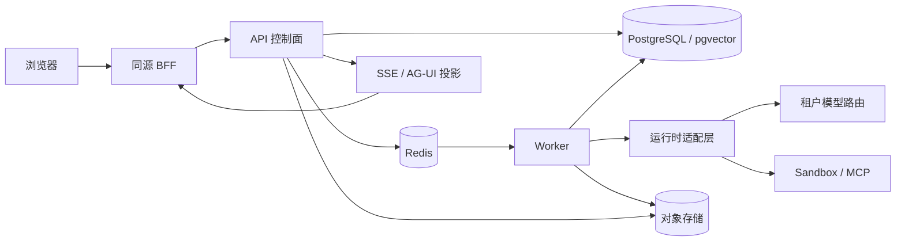
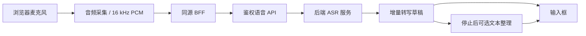

# KAI 系统架构

本文描述当前代码中的系统边界。部署地址、模型网关、ASR 服务和存储凭据由配置提供，不使用主机编号代表产品环境。历史设计与部署记录用于追溯，当前组件以代码和能力契约为准。

## 总体设计与演进目标

来源：[Agent Studio 整体架构优化设计：模块边界、可恢复执行与分阶段演进（2026-09-29）](https://my.feishu.cn/docx/ZSiFdITPkoWsDxxmreYcN2tRnme#doxcn8YsQFE1KDgxK47PvAxU39e)，第 3 章“目标逻辑架构与依赖规则”。图为飞书画板原始导出，随仓库保存；文档修订号 24，导出日期 2026-10-10。

图中控制面、执行协调层、Runtime Host 与能力服务是逻辑边界，可先在模块化单体中落实，再按负载和隔离需求拆分运行角色。Claude、Codex 和 DeepAgents 共用平台契约，上下文、模型访问、工具和工作区由显式接口交付；Warm SDK 作为可丢弃缓存，持久状态承担恢复依据。

该图描述目标设计。当前已有多 Runtime、Run 状态与 fencing、耐久事件、工作区快照和 SDK 缓存等基础；状态、事件与待投递命令的统一事务交接、完整恢复契约，以及单库五个领域 schema 的迁移仍需按阶段推进。当前 `storage/outbox.py` 提供记录构造，尚未接入可靠发布链路；ORM 表也尚未按五个领域 schema 划分。以下组件图与执行链路说明当前实现。

## 组件与职责

| 组件 | 职责 | 代码入口 |
| --- | --- | --- |
| Web 工作台 | 对话、Agent Studio、输入与产出物、设置、执行轨迹 | `web/harness-console/src` |
| 同源 BFF | 浏览器请求代理、服务端身份与凭据注入 | `web/harness-console/src/app/api` |
| FastAPI 控制面 | 认证、租户、版本、Session/Run、审批、事件、文件与能力目录 | `src/harness/api`、`src/harness/composition.py` |
| Worker | 消费任务、运行执行、租约续期、恢复与产出物收集 | `src/harness/worker` |
| 运行时适配层 | 解析已发布配置、模型路由和工具，并统一运行时事件 | `src/harness/runtime` |
| PostgreSQL / pgvector | 业务状态、权限、耐久事件、知识与记忆索引 | `src/harness/storage`、`migrations` |
| Redis | Run 及后台任务队列、租约与调度 | `src/harness/storage/redis.py` |
| S3 兼容存储 | 输入文件与不可变产出物 | `src/harness/storage`、`src/harness/application/artifacts.py` |
| Sandbox 与 MCP | 隔离执行、工作区同步、受控外部能力 | `src/harness/sandbox`、`src/harness/execution` |
| 质量与生命周期服务 | 评测、质量同步、清理与恢复 | `src/harness/evals`、`src/harness/quality`、`src/harness/lifecycle` |

## 任务执行链路

1. 浏览器上传输入文件，获得服务端文件 ID。提交任务时携带 Agent、模型和输入引用。
2. 控制面验证身份、权限、能力与配额，创建 Session/Run 和不可变配置快照，并投递队列。
3. Worker 获取带租约的任务，恢复运行上下文，准备工作区和只读输入，按快照选择运行时。
4. 运行时通过租户模型路由调用模型；工具受 Manifest、能力目录和策略共同约束。
5. 需要判断的工具操作进入审批。执行事件持久化后投影到前端，取消和恢复由控制面管理。
6. 完成后收集工作区产出物，写入对象存储并记录哈希与归属，再更新终态及质量任务。

Run 状态机、幂等键、fencing token 和可见性租约用于防止重复执行与陈旧 Worker 写回。AG-UI 是前端投影协议，耐久状态与事件仍由 Harness 持有。

## 三种执行内核

| 运行时 | 标识 | 使用边界 |
| --- | --- | --- |
| Claude Agent SDK | `claude-agent-sdk` | SDK / CLI 的 Agent Loop、工具、Skills、子 Agent、Hooks 与恢复 |
| Codex App Server | `codex-app-server` | 通过 App Server 连接 Codex 执行内核，适配会话、工具与事件 |
| DeepAgents | `deepagents` | 可选依赖；草稿生成计划用于代码预览、导出及平台运行 |

`HARNESS_RUNTIME=fake` 用于无模型的本地验证；`claude-sdk` 为 Claude 单内核模式；`multi` 通过已安装运行时注册表装配多个内核。DeepAgents 需要安装 `deepagents` extra，运行时能力并不完全相同，目录与编译门禁决定各自可用的工具、模型协议和平台能力。

## 模型、工具与隔离

模型端点、协议、名称和加密凭据由租户模型管理维护，已发布 Agent 绑定可审计的路由。可使用兼容的自建网关，也可配置外部提供方；浏览器不持有服务密钥。

Agent Manifest 是工具能力上限。MCP 从服务端能力目录按逻辑引用解析，策略根据权限、上下文信任与可信隔离信息执行 allow / deny / ask。外部内容可能将上下文标记为不可信，该信任边界会影响后续敏感工具和记忆写入。

Sandbox 支持不同部署提供方，包括 Daytona、E2B、Kubernetes/gVisor 与显式本地模式。`remote_cli` 在远端执行 CLI；适用的 `worker_cli_deferred` 模式将模型进程留在 Worker，首次文件或命令操作时再创建隔离沙箱。具体限制以部署门禁和运行时契约为准。

## 语音输入

实时模式为每个会话创建独立的上游连接与事件队列，并按租户和用户验证归属。当前单 API 进程最多可配置 32 个活动会话，这属于接入层上限，模型服务吞吐仍需单独规划。会话状态保存在进程内，多实例部署需要保证同一语音会话的请求落到同一实例。

ASR 适配器支持 FunASR 实时服务、模型网关，以及按片段调用的 Qwen3-ASR / SenseVoice。流式草稿直接写入输入框；停止后可通过文本模型整理标点、重复和口头语，整理阶段不重新识别音频。语音默认关闭，启用时必须显式配置服务地址、凭据和模型路由；浏览器麦克风在生产域名下需要 HTTPS。

实现入口：`src/harness/dictation`、`src/harness/api/routes/dictation.py`、`web/harness-console/src/components/use-dictation-composer.ts`。

## 记忆与知识

知识库与长期记忆独立管理。知识库绑定为任务提供检索能力；长期记忆按归属与作用域保存偏好、事实、实体和决策，使用关键词与向量混合召回。

任务后自动提取是可选配置，默认关闭。启用后从原始用户输入提取候选，经过安全校验、去重和确认后参与召回；默认待确认候选不会作为已生效记忆。模型输出、网页与工具结果不能直接覆盖用户偏好。记忆的修改、纠正和删除通过版本与权限检查维护。

## 部署、验证与发布

应用、基础服务与外部能力通过配置连接。Web/API/Worker 可独立运行；多 Worker 共享 PostgreSQL、Redis 和对象存储。生产应使用 TLS、持久化基础服务和适当的 Sandbox，按目标 CPU 架构构建镜像。OpenTelemetry 与外部质量后端按需启用。

`verify` 是 PR 和集成分支的质量入口：

- 后端 lint、逐项类型诊断基线、包确定性、完整测试、迁移回退及运行验证。
- 前端依赖安装、测试与 Next.js 生产构建。
- API、Web、Sandbox 镜像构建、来源签名验证、HIGH/CRITICAL 漏洞及仓库 secret/misconfig 扫描。

`release` 复用验证流程，再构建并签名镜像、SBOM 和发布 manifest；`promote` 验证发布证据，按环境执行晋级。已有类型诊断属于显式技术债，基线不允许新增错误抵消已修复错误。

部署操作见 [deployment.md](deployment.md)，发布操作见 [runbooks/release-promotion.md](runbooks/release-promotion.md)，质量基线见 [../quality/README.md](../quality/README.md)。
