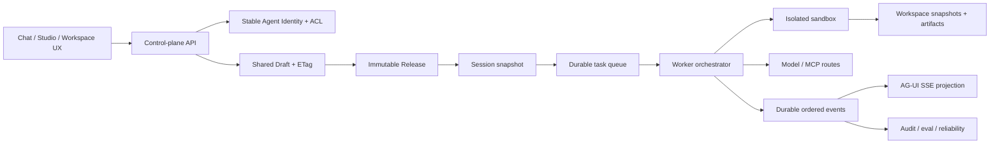

# Agent Studio 对标结论、P0 设计与性能验证

日期：2026-08-09
代码基线：`develop@797d733`，已快进合入 `feat/workspace-agent-model` 7 个提交，并叠加本轮 P0 性能与部署修正。

## 1. 结论

Agent Studio 不应复制一个更轻的 Dify、Coze Studio 或 Cherry Studio。现有项目最有价值的差异化是：把 Agent 定义、隔离执行、审批、审计、制品、工作区恢复、可靠性和多租户权限收敛为一个可运营的企业 Agent 控制面。产品层需要吸收头部项目的易用性，执行层继续保持 fail-closed、可追踪和可恢复。

本轮 P0 的主线是“身份与发布正确性优先，性能优化不牺牲控制语义”：

1. 合入工作区 Agent 模型，以稳定 `agent_id` 解耦身份与版本，补齐 Release、ACL、共享草稿 ETag、用户组、连接模式和所有权转移。
2. 优化问答关键路径：标题生成移出响应头关键路径，事件序号查询由读取并反序列化完整历史改为 O(1)/`MAX(sequence)`，正常工具结果不再回扫完整事件历史。
3. 增加黑盒问答延迟基准，区分平台固定开销、模型 TTFT 和全程耗时。
4. 修复 Docker 构建对 Debian 镜像源的非必要依赖，并修正 174 部署脚本的一次性迁移状态检查与回滚标签语义。

## 2. 2026-08-09 高 Star 项目对标

Star 仅反映生态与产品验证程度，不直接代表架构适配性。数据来自各项目 GitHub 官方仓库当天页面。

| 项目 | GitHub Star | 产品强项 | 应吸收 | 不应照搬 |
| --- | ---: | --- | --- | --- |
| Dify | 151.8k | 协作工作区、可视化 Workflow/RAG、Prompt IDE、插件与 LLMOps、部署路径成熟 | 草稿/发布分离、应用稳定 ID、工作区协作、评测与运维闭环 | 以低代码画布作为唯一抽象；其附加许可也需单独评估 |
| Open WebUI | 140k | 自托管聊天体验、Ollama/OpenAI 兼容、RAG、模型与用户管理 | 首屏速度、对话与模型切换、低运维安装体验 | 把聊天 UI 当作 AgentOps 控制面 |
| LobeHub | 81.4k | “Chief Agent Operator”式 Agent 团队运营、调度与报告体验 | Agent 团队视图、状态可见性、运营仪表盘 | 用前端编排替代耐久状态机与审计事实 |
| Flowise | 55.2k | 低门槛可视化 Agent/Workflow、节点生态、自托管 | 连接器发现、模板与快速试跑、可解释图结构 | 让节点图侵入运行时核心协议 |
| Cherry Studio | 50.1k | 跨平台桌面体验、多模型并行、300+ 助手、文档/图片/PDF、WebDAV、搜索、MCP | 多模型对照、助手/话题管理、附件体验、搜索与即时可用性 | 把本地客户端状态作为企业权威数据；社区版与企业控制面边界不同 |
| Coze Studio | 21.4k | Agent/App/Workflow 一体化可视开发，模型、插件、知识库、数据库、API/SDK | 资源目录、发布体验、画布调试、模板化入门 | 复制完整微服务形态；需按本项目规模保留模块化单体边界 |

官方来源：

- https://github.com/langgenius/dify
- https://github.com/open-webui/open-webui
- https://github.com/lobehub/lobehub
- https://github.com/FlowiseAI/Flowise
- https://github.com/CherryHQ/cherry-studio
- https://github.com/coze-dev/coze-studio

### 2.1 Cherry Studio 的具体启示

Cherry Studio 最值得借鉴的不是运行时，而是“高频使用面的完成度”：模型统一入口、同一问题多模型并行、助手与话题管理、Office/PDF 等附件、全局搜索、MCP 接入、跨平台即装即用。Agent Studio 当前后端能力强于产品可感知度，后续应把已有的运行时间线、制品、工作区、审批和模型路由变成更直接的用户反馈。

建议 P1 产品化：

- 在同一任务上提供受控的多模型对照运行，并保留输入、配置、成本与结果的可比事实。
- 将 Agent、任务、文件、运行事件统一纳入可权限过滤的搜索。
- 强化附件预处理状态、来源、衍生文件和最终制品之间的可视化血缘。
- 提供模板/示例 Agent 的一键试跑，但发布与企业共享仍走 Release/ACL 门禁。

### 2.2 Dify、Coze、Flowise 的共同启示

三者共同证明了稳定应用身份、可变草稿、不可变发布版本、可视调试和资源目录的重要性。工作区分支正好修复了本项目此前以 `owner + name@version` 隐含 Agent 身份的问题，因此应合入，而不是另起一套“工作区快捷方式”。

## 3. 目标架构

边界原则：

- Control plane 负责身份、权限、草稿、发布、Session 快照和审计，不执行用户代码。
- Worker 只消费固定的 Session/Release 快照；运行中不追随可变草稿。
- Durable events 是运行事实源，SSE 是投影，不反向成为事实源。
- caller-owned 与 service-owned 凭据必须 fail-closed，后者不得回退到调用者个人凭据。
- 工作区恢复和制品发布属于运行完成条件的一部分，但失败应保留可恢复诊断，不能吞掉已经产生的模型回答。

## 4. 工作区分支评审与合入决定

### 4.1 决定

`feat/workspace-agent-model` 与目标架构高度一致，且相对 `develop` 为无分叉的 7 个提交，因此已快进合入。

### 4.2 合入内容

- 前端统一 `agentIdentity()`，修复同名、同版本、不同 owner/space 的去重和 React key 串扰。
- 新增工作区拥有的稳定 Agent 身份、不可变 Release、当前版本指针和 Agent ACL。
- 共享草稿支持 `ETag: "rev-N"` 与 `If-Match`，保留 `expectedRevision` CAS。
- 支持用户组授权、Release promote/rollback、发布审计、个人 Agent 转移/上缴工作区。
- caller-owned/service-owned 连接模式贯穿 Release、Session 和 ExecutionIdentity；service-owned 只读取空间凭据。
- 前端空间页增加 Release、promote 和 ACL 操作。

### 4.3 验证事实与风险

- 分支新增/变更的后端用例：53/53 通过。
- 前端：47 个测试文件、301/301 通过。
- Ruff：通过。
- 全仓 Pyright 在 `develop` 和该分支都存在 300+ 历史严格类型错误，不能把“测试通过”描述为“质量门禁全绿”。本次合入触及的 Agent catalog、workspace API、schema 与 MCP credential store 已单独收紧到 Pyright 0 错误：消除了可空 Agent 访问、未定型列表、`ConnectionMode`/Literal 边界和跨模块私有函数引用。
- 全量 Pytest 默认环境结果为 959 passed / 8 failed / 4 skipped：其中配额门禁默认关闭造成 3 个断言失效，PostgreSQL fixture 与重连 URL 指向不同数据库造成 5 个持久化断言失效。改为隔离 `harness_test`、使用真实 Docker 凭据并显式启用测试配额后，结果为 966 passed / 1 failed / 4 skipped；唯一剩余用例仍按旧“租户内任意用户可检索”语义访问个人 Knowledge Source，与当前 fail-closed personal ACL 不一致。应修正测试为 owner/显式授权，不应为过测试放宽隔离。

## 5. P0 性能设计与实现

### 5.1 指标定义

新增 `scripts/benchmark_chat_latency.py`，对 `/v1/agui` 做真实 HTTP/SSE 黑盒测量：

- `response_headers_ms`：请求发出到收到响应头，覆盖鉴权、Agent/Session 解析、Run 创建等控制面固定开销。
- `first_event_ms`：收到第一条 SSE data。
- `run_started_ms`：收到 AG-UI `RUN_STARTED`。
- `first_text_ms`：收到首个非空 `TEXT_MESSAGE_CONTENT`，即用户感知 TTFT。
- `total_ms`：收到成功终态并关闭流。
- 每轮记录内部 `X-Harness-Run-ID`、事件数和文本字符数，支持 warmup、重复次数和线程复用模式。

### 5.2 关键路径修正

**标题异步化。** 原实现创建 Run 后同步提交 fallback 标题，再返回 StreamingResponse；标题不是运行正确性的前置条件。现在先创建 Run 并返回流，后台按顺序写 fallback 标题、再生成模型标题，避免同时间戳下 fallback 覆盖 model 的竞态。

**事件序号 O(1)/聚合查询。** 原 `EventService.append()` 每追加一条事件都 `list_after(..., 0)`，读取并反序列化该 Run 的全部历史来计算序号，长流为 O(n²)。现在仓储提供 `latest_sequence()`：内存实现 O(1)，PostgreSQL 使用 `MAX(sequence)`；唯一约束冲突仍重试，顺序与并发语义不变。

**工具结果避免历史回扫。** Worker 在本轮内缓存 `tool_call_id -> (输入内容脱敏, 内部资产脱敏)` 判定。正常 request/result 配对直接读取缓存；只有恢复执行、未见 request 的结果才回扫耐久事件，保持恢复兼容。

**明确未采用的优化。** 曾尝试把每事件 Run 状态读取改为 250ms 降频，但取消边界测试证明可能在取消后多落盘一个 token，已撤回。后续要降低该 QPS，必须先增加 Redis/队列级取消通知，不能用轮询降频破坏 fail-closed 取消语义。

### 5.3 本地 Docker 实测

环境：Apple Silicon 本机 Docker，PostgreSQL/Redis/MinIO/API/Web 使用隔离端口；Worker 使用 local sandbox，关闭未启动 Collector 时的 OTel exporter；模型端点与模型保持一致。Prompt 为 `Reply with exactly: OK`，每组 warmup 1 次、记录 5 次冷线程。

| 指标 | 优化前 p50 | 优化后 p50 | 变化 |
| --- | ---: | ---: | ---: |
| 响应头 | 33.91 ms | 25.35 ms | -25.2% |
| 首事件 / RUN_STARTED | 34.13 ms | 25.53 ms | -25.2% |
| 首文本 TTFT | 2135.87 ms | 2337.96 ms | +9.5% |
| 全程 | 4143.55 ms | 3881.96 ms | -6.3% |

均值补充：TTFT 由 2366.24ms 降至 2164.08ms（-8.5%），全程由 4354.39ms 降至 3784.91ms（-13.1%）。5 次样本下 p50 与均值方向不一致，说明模型网络与推理波动远大于平台的 8–9ms 固定开销变化；平台优化结论应以响应头/首事件为主，模型 TTFT 需要 30+ 次与固定上游桩双轨验证。

合入完整工作区代码并重建到 `0024` 后又做了 1 次 warmup + 3 次发布态冒烟：响应头 p50 38.72ms、TTFT p50 3073.50ms、全程 p50 4176.15ms。控制面仍低于本机 50ms 目标；模型段再次表现出跨批次波动，不能用 3/5 次真实模型样本证明微秒级回归。

### 5.4 Docker 可复现性

API runtime 镜像原本每次重建都执行 `apt-get update && apt-get install ca-certificates curl`。固定的 Python slim 基础镜像已包含 CA，运行时健康检查使用 `urllib`，API/Worker 也不依赖 curl。删除这一步后，本机从 Debian 源卡住超过 3 分钟变为约 25 秒完成镜像，且避免外部 apt mirror 成为发布单点。

## 6. P0 验收门禁

| 门禁 | 当前结果 | P0 要求 |
| --- | --- | --- |
| Ruff | 通过 | 必须通过 |
| P0/工作区定向后端回归 | 合并态 103/103；补充 workspace/MCP 21/21 | 必须通过 |
| 前端测试 | 301/301 | 必须通过 |
| Docker build/up/health | 本地通过 | 必须通过 |
| 冷线程响应头 p50 | 优化样本 25.35ms；完整合并态冒烟 38.72ms | 本机目标 < 50ms |
| TTFT | 模型主导，p50 2.34s | 记录平台/模型分段，不设虚假平台 SLA |
| 全仓 Pyright | 历史失败 | 建立基线清单，禁止新增；P1 清零 |
| 全量 Pytest | 正确隔离环境 966 passed / 1 failed / 4 skipped | 修正旧 Knowledge ACL 期望后恢复强门禁 |

## 7. 174 发布方案

发布必须使用 amd64 镜像，数据库迁移串行，Worker 扩为 3 个实例；不在服务器上临时构建未标记代码。

顺序：

1. 本地/CI 完成 Ruff、定向后端、前端、Docker smoke 和 amd64 镜像构建。
2. 推送 API/Web 同一不可变 tag 到 Harbor，并记录 digest。
3. 174 只读预检：磁盘、内存、当前 tag、compose config、数据库 revision、容器健康、回滚 tag。
4. 备份 `.env.docker`，拉取新镜像，单独运行 migrate；必须确认一次性容器 `exited/0`。
5. `up --no-build --wait --scale worker=3`，依次验证 health、登录、Agent 列表、工作区 Release/ACL、跨用户 404、Echo 问答、取消、3 Worker 竞争消费。
6. 在 174 重跑 10 次延迟基准并保存 JSON；与本地按响应头、TTFT、全程分段比较。
7. 失败时恢复旧镜像 tag；数据库迁移 0023/0024 保持兼容窗口，不在事故窗口做破坏性 downgrade。

`scripts/deploy_174.sh` 已修复两个发布风险：不再调用不存在的 `docker compose inspect`，而是对 migrate 容器做 `docker inspect`；显式回滚 tag 不再被 `.old-tag` 静默覆盖，自动回滚需传 `auto`。

### 7.1 2026-08-09 实际发布结果

- 只读预检确认主机为 amd64、Docker 26.1.4 / Compose 2.27.1，根盘剩余 403GB，可用内存 209GB；真实部署目录为 `/data/agent-studio/docker-compose`，API/Web 端口为 8800/3301。
- 已修正部署脚本对目录、`.env.production`、`harbor.shdata.com:5000` 和健康端口的陈旧假设；profile-gated `quality-sync` 在已启用时也随 API 镜像升级。
- 发布标签 `p0-20260809-797d733`。API manifest digest `sha256:13914def9bccc75e39cfdaece8c19c7a2adb4c2a5a5a24286c2ad8b836a2a0dc`，Web manifest digest `sha256:185e26132e049eb01ac394adc494f8280d6edc9f8561d63c377eca9f1cdc35fe`。
- migrate 退出码为 0，数据库保持 `0024`；API、3 Worker、Web、quality-sync、PostgreSQL、Redis、MinIO 全部健康。回滚标签为 `resume-20260806-0fea52e-2d30488`。
- OpenAPI 检出 16 条 workspace、4 条 group 路由和 Agent transfer；真实 API smoke 完成 workspace create/read、跨用户 404，以及 group create/member/read/delete。
- 10 次真实问答（warmup 2）结果：响应头 p50/p95 78.19/117.14ms，首事件 78.65/117.66ms，TTFT 3382.19/3603.20ms，全程 4383.91/7473.01ms。远端控制面比本机多约 40–55ms，应继续按 DB/队列/网络分段；TTFT 仍由上游模型主导。
- 发布后 API、3 Worker、quality-sync、Web 最近 10 分钟均无 `ERROR`、`Traceback` 或 `CRITICAL` 日志。完整远端样本保存于 `docs/results/benchmark-174-p0-20260809.json`。

## 8. P1/P2 建议

P1：

- 以 Redis control channel/取消 token 替代每事件数据库状态读取，在保留严格取消边界后降低长回答 DB QPS。
- SSE 从固定 20ms PostgreSQL polling 演进为 Redis event wake-up + PostgreSQL durable replay，兼顾低延迟和恢复。
- CI 每 job 独立 PostgreSQL database/schema，清理 Pyright 与 9 个已知测试失败。
- 增加固定流式 provider stub 的平台基准与真实模型 30+ 次统计，输出 p50/p95/p99 和置信区间。
- 统一 Agent/任务/文件/事件的权限过滤搜索；增加多模型对照运行。

P2：

- Eval dataset、回归基线、发布门禁、canary/rollback 自动化。
- Agent 团队运营视图、成本/质量/工具成功率仪表盘。
- Workflow 画布只作为可视 DSL，编译到现有不可变 Release 与耐久执行协议。
