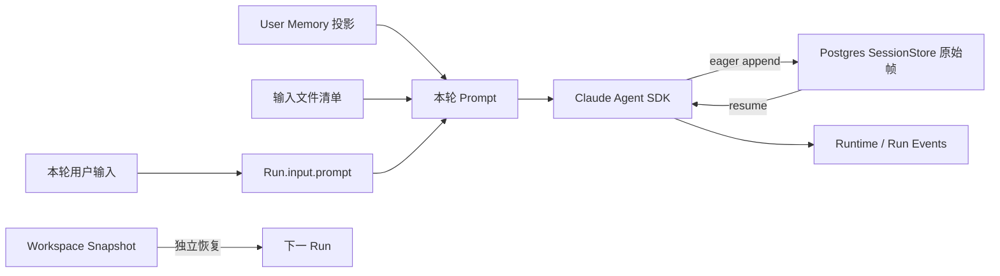
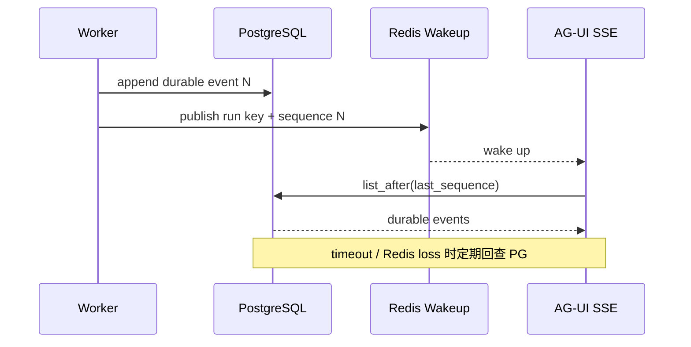

# Agent Studio P1：上下文工程、事件唤醒与可靠性设计

日期：2026-08-09
状态：P1 进行中；P1.0～P1.35、P1.37～P1.46 已完成实现、本地门禁与 174 灰度验证，P1.36 已完成产品手册同步；当前 174 为 gray42，dirty 可追踪候选不等同于正式签名 Release。
前置基线：`docs/plans/2026-08-09-agent-studio-p0-evolution-and-performance.md`

## 1. 结论

P1 不把“压缩上下文”实现成简单截断消息，也不直接改写 Claude Agent SDK 的不透明 transcript。当前 SDK 0.2.128 已提供自动压缩、`PreCompact` hook、压缩摘要帧和精确上下文用量接口；平台应负责预算、可信度、审计、恢复和产品反馈，摘要帧格式继续由 SDK 负责。

上下文采用四层模型：

1. L0 原始事实层：PostgreSQL 中不可变的 SDK transcript 帧、Run Event、Artifact 和 Workspace Snapshot。
2. L1 活跃窗口层：SDK 当前上下文，使用原生 auto-compact；只允许通过 SDK 支持的会话能力演进。
3. L2 Session Digest 层：平台拥有的结构化、可校验摘要，用于跨模型恢复、应急重建、搜索与人工审阅，不直接冒充 system instruction。
4. L3 User Memory 层：跨 Session 的稳定偏好和事实，继续走现有 Memory 提议、审核、ACL 和投影链路。

P1 的另一条性能主线是通知化：PostgreSQL 继续作为 Run 和 Event 的事实源，Redis 只提供取消和新事件的低延迟唤醒。任何 Redis 丢失、重启或乱序都不能造成事件丢失或越过取消边界。

## 2. 当前事实与问题

### 2.1 当前上下文链路



- 多轮模型上下文来自 `PostgresSessionStore` 和 `resume=claude_session_id`，不是 `conversation_prompts`。
- `conversation_prompts` 是 AG-UI 历史/标题元数据副本；它可能随轮数增长，但裁剪它不会减少模型上下文。
- SessionStore 当前完整加载指定会话的所有不透明 JSON 帧，SDK 自己识别 compact boundary 和 `isCompactSummary`。
- SDK 已自动压缩，但平台此前没有压缩前治理事件、预算水位、完成校验、Session 级信任水位和恢复审计。
- 工具结果可把当前 Run 的信任等级从 `safe` 单调提升到 `sensitive` 或 `untrusted`；该水位当前只在单次 Run 的 ToolGate 闭包内存在，跨 Run 恢复后会重新从 `safe` 开始。

### 2.2 当前事件与取消链路

- Event 写入 PostgreSQL 后发布到 Redis sorted set，但 AG-UI SSE 每 20ms 查询一次 PostgreSQL，Redis 尚未承担唤醒。
- Worker 在长阶段按取消周期查询 Run；运行时每收到一个 SDK event 再查一次 Run，以保证取消后不继续落盘 token。
- 直接降低轮询频率会破坏严格取消语义；P0 已通过边界用例证明这一点。

## 3. 上下文预算模型

### 3.1 精确指标优先

P1 使用 SDK `get_context_usage()` 返回的 `totalTokens`、`maxTokens`、`rawMaxTokens`、`percentage`、`autoCompactThreshold` 和分类明细作为权威窗口指标。持久化 transcript 的条数或 JSON 字节数只用于存储容量观测，不能冒充模型 token 数。

预算状态：

| 状态 | 默认条件 | 行为 |
| --- | --- | --- |
| green | `< 65%` | 正常执行，仅聚合指标 |
| watch | `65%–75%` | 降低非必要注入；提示可延迟加载工具/Skill |
| compact-ready | `75%–SDK auto threshold` | 确保 L2 checkpoint 新鲜；记录预计压缩风险 |
| compacting | SDK `PreCompact` / status | 写耐久边界事件，UI 显示，不记录正文 |
| emergency | 压缩后仍 `> 85%` 或 provider context error | 停止无界重试，创建可恢复 checkpoint；按策略重建新分支或失败并给出可操作错误 |

阈值必须按模型和 provider capability 配置；若 SDK 返回 `autoCompactThreshold`，以 SDK 阈值为准，不硬编码一个假窗口。

### 3.2 预算拆分

每轮保留以下预算槽位：

- 固定层：system prompt、可见执行契约、策略和必要工具 schema。
- 对话层：当前用户输入、最近完整回合、SDK compact summary。
- 工作层：进行中的工具调用/结果配对、未完成任务、文件与制品引用。
- 输出层：至少保留目标最大输出和安全余量，禁止把窗口用满后才请求生成。
- 应急层：provider/gateway 包装差异、审批恢复和一次受控重试的余量。

`maxModelTokens` 当前是 Run 总模型用量门禁，不等同于上下文窗口。P1 会新增独立 `ContextPolicy`，避免混用成本配额、输出限制和窗口预算。

## 4. 分层压缩协议

### 4.1 L1：SDK 原生压缩

- 默认启用 SDK auto-compact。
- 通过 `PreCompact` 写入 `context.compaction.started`；仅包含 trigger、是否存在自定义指令和 Run 级 trust，不写 transcript path、session id、摘要正文或自定义指令正文。
- SDK 写入的原始帧继续 eager flush 到 PostgreSQL，不在数据库中原地删改。
- 压缩结束后，对 SessionStore 新增 compact summary/boundary 数做校验，再写 `context.compaction.completed`；失败写 `context.compaction.failed`，但保留原始帧供恢复。

### 4.2 L2：平台 Session Digest

结构化摘要只保存可核验状态：

```json
{
  "schema_version": 1,
  "session_id": "opaque-harness-session-id",
  "source": {
    "sdk_session_id_hash": "sha256:...",
    "through_run_id": "run-...",
    "through_event_sequence": 123,
    "transcript_checkpoint_hash": "sha256:..."
  },
  "trust_high_watermark": "untrusted",
  "facts": [
    {
      "text": "已确认的短事实",
      "source_refs": ["event:81", "artifact:report-1"],
      "trust": "sensitive"
    }
  ],
  "decisions": [],
  "open_tasks": [],
  "artifact_refs": [],
  "workspace_refs": [],
  "created_by": {
    "route_id": "route-...",
    "model": "model-name",
    "prompt_revision": "context-digest-v1"
  },
  "content_hash": "sha256:..."
}
```

规则：

1. 每个事实必须有 source ref；没有来源的模型推断不能成为“已确认事实”。
2. 摘要整体 trust 取所有来源的最高风险水位，不能在压缩时从 `untrusted` 降回 `safe`。
3. 外部网页、知识检索和工具输出的内容始终作为 data envelope 恢复，不能拼接为 system instruction。
4. 凭据、授权头、原始审批参数、隐藏 prompt、Skill 正文和内部路径禁止进入 Digest。
5. Artifact/Workspace 中已有的大内容只保存引用、hash、媒体类型和可见标题，不复制正文。
6. Digest 写入采用 CAS：source checkpoint 未变化时幂等；变化时重新生成，旧版本保留审计引用。

### 4.3 工具结果瘦身

优先在工具边界减少未来上下文，而非事后删除 transcript：

- 大型查询返回 `preview + count + artifact_ref + content_hash`，完整结果落 Artifact。
- 文件读取按段/页读取；同一 hash 的重复读取用引用替代。
- 搜索结果保留标题、URL、时间、关键片段与 trust，正文按需展开。
- Tool use 和 Tool result 必须成对保留；不能只删结果造成模型误判工具仍在运行。
- error 结果保留稳定错误码与可操作摘要，去除堆栈、请求 ID 和凭据相关诊断。

## 5. 信任、注入防护与跨 Run 恢复

### 5.1 Session Trust Ledger

新增 Session 级单调水位：

```text
safe < sensitive < untrusted
```

- Run 开始从 Session trust watermark 恢复，而不是固定从 `safe` 开始。
- 成功工具结果可提升水位；失败/拒绝的工具不提升。
- 新 compact summary 和 Session Digest 继承该水位。
- 只有创建全新 Session 或经明确的管理员净化流程才能降低水位；普通 Run、重试、摘要或模型切换均不能降低。

### 5.2 恢复策略

恢复顺序：

1. 优先由 SDK 通过原会话 ID 和原始帧 resume。
2. SDK resume 失败时，验证最近 L2 Digest 的 schema、hash、source checkpoint 和 ACL。
3. 使用 SDK 支持的 fork/new-session 能力创建新分支，注入“数据型恢复包 + 最近必要回合 + Workspace/Artifact 引用”。
4. 写 `context.session.rebased`，记录旧/新会话哈希、Digest 版本和原因；不覆盖旧会话。
5. 校验失败时 fail closed，要求用户重试或人工选择恢复点，不静默使用过期摘要。

禁止直接手工拼装、删除或重排 SDK 私有 JSON 帧。SDK 升级必须运行 SessionStore conformance 和跨版本恢复夹具。

## 6. 事件协议与可观测性

新增/规划事件：

| 事件 | 阶段 | 安全载荷 |
| --- | --- | --- |
| `context.window.observed` | P1.1 | token 分类、百分比、模型、阈值；不含正文 |
| `context.window.unavailable` | P1.4 | phase 与稳定能力原因；明确未获得精确窗口，不做字符估算 |
| `context.compaction.started` | 已实现 | trigger、custom instruction bool、Session trust |
| `context.compaction.completed` | P1.1 | 前后 token、耗时、summary/boundary 增量、checkpoint hash |
| `context.compaction.failed` | P1.1 | 稳定错误码、是否可恢复 |
| `context.digest.created` | P1.2 | digest id/version/hash、source checkpoint、trust |
| `context.session.rebased` | P1.2 | 原/新 SDK session hash、digest version、reason |

指标：

- `harness_context_window_utilization_ratio{route,model}`
- `harness_context_compaction_total{trigger,status}`
- `harness_context_compaction_duration_seconds`
- `harness_context_tokens_reclaimed`
- `harness_context_digest_age_seconds`
- `harness_context_rebase_total{reason,status}`
- `harness_session_transcript_bytes`（存储指标，不是 token 指标）

内容捕获仍服从 `otel_content_capture`；上述指标和事件默认不带正文。

## 7. Redis 唤醒，不替代事实源

### 7.1 SSE 新事件唤醒



- Redis 消息只含 tenant/run key 的不可逆或最小标识与最新 sequence，不含事件正文。
- SSE 建立后先查 PostgreSQL，再订阅唤醒，再二次查 PostgreSQL，关闭“查询与订阅之间”的竞态窗口。
- 唤醒合并允许丢通知，不允许丢事实；现有 10 秒 heartbeat 与低频兜底查询保留。
- 目标是把空闲 SSE 的 PostgreSQL 查询从每连接约 50 QPS 降到接近 0，同时新事件可见延迟 p95 不回退。

### 7.2 取消通知

- API 完成 Run `CANCELLING` CAS 和耐久事件后发布 `cancel:{tenant}:{run}` 控制通知。
- Worker 在 sandbox prepare、模型流、审批等待和持久化阶段同时等待“工作完成 / 取消通知 / 低频耐久状态复核”。
- 收到通知后仍读取 PostgreSQL 确认 fencing token 和状态，Redis 不能单独授权状态转换。
- Redis 不可用时回退现有耐久轮询，严格语义不降级；通知恢复后再降低数据库读取频率。

## 8. P1 交付切片

### P1.0：压缩可见性（已实现）

- ToolGate 接入 `PreCompact`，写 `context.compaction.started`。
- 事件不落 transcript、自定义指令正文、SDK session id 或内部路径。
- AG-UI 将 hook 和 provider `status=compacting` 显示为明确的上下文压缩状态。
- 定向验证：69 passed，Ruff 通过。

### P1.1：预算与通知基础设施

- 已将本地默认 query 适配为 streaming client，并实现安全的 `get_context_usage()` 结果过滤；仅在 resumed Session 的模型结果完成后采样，本地控制请求硬超时 1 秒，远端 Sandbox 控制请求硬超时 3 秒，因此不增加 TTFT。当前 174 的 local sandbox/兼容模型链路不能返回该控制响应；P1.4 已把能力结果耐久化为 `unavailable`，不能据此宣称获得了精确窗口指标。
- 已实现 Redis event wakeup：事件以单次 Lua 调用原子写入 replay ZSET 并发布 sequence 通知；SSE 先读 PostgreSQL，再检查 Redis、订阅、二次检查 Redis以关闭竞态，最后回读 PostgreSQL。AG-UI、A2A 与公开 Trigger SSE 均接入；Redis 异常回退原短轮询，正常空闲时每 1 秒才耐久复核一次。
- 已实现 Redis cancel wakeup：API 仅在 PostgreSQL 完成 `CANCELLING` CAS 与耐久事件后发布单调 fencing token；Worker 使用“长驻 Redis 等待 + 250ms PostgreSQL 权威复核”，通知到达后再次读取 PostgreSQL 确认状态。发布、订阅或 Redis 故障均 fail open 到耐久轮询，重复取消会重发通知，查询/订阅竞态由订阅前后双检关闭。
- P1.4 已完成非 TTFT 关键路径采集与稳定能力事件；未确认能力时继续使用 SDK 原生 auto-compact 作为保护层，`ResultMessage.usage` 只用于 Run 用量，不冒充上下文窗口。
- cancel wakeup 已完成，PostgreSQL 保持权威 fencing 与状态回放；后续继续做多 Worker 并发和 Redis 故障注入长稳压测。
- 增加 fixed provider stub，分离平台延迟和真实模型波动。

### P1.2：Digest、信任账本与恢复

- 已新增 `session_context_state` / `session_context_digests` 存储和 `0025` 迁移；状态使用 revision CAS，Digest 按 Session/version 不可变发布。
- 已实现 Session trust watermark 跨 Run 单调继承；ToolGate 在首次授权和 PreCompact 时懒加载，只有成功工具结果可以提升，仓储层再次拒绝任何直接降级。
- 已实现结构化 Digest：最终答复只保留有来源的 1,000 字符以内事实，Artifact/Workspace 只保留对象引用与 `sha256:` 内容哈希；文本统一脱敏，Digest 自身内容寻址，读取按 tenant + owner + Session 隔离。
- 已实现 SDK transcript checkpoint：对主会话与子路径帧按 `subpath, sequence` 排序，以长度前缀规范 JSON 计算哈希；Run 成功且 Workspace/Artifact 已耐久后自动发布 Digest，再提交 `run.succeeded`。失败只写安全的 `context.digest.failed`，不反转已完成回答。
- SDK `claude-agent-sdk` 当前公开提供 `fork_session_via_store`，能正确重映射 UUID、`sessionId` 和 `forkedFrom`；它不能把 Digest 直接替换为 SDK 私有帧，也不会天然缩短存储副本。因此 rebase 只允许后续通过“公开 fork/new-session + 原子切换 Harness Session resume identity”实现，当前不手工拼帧、不把普通 fork 误报为压缩恢复。

### P1.3：上下文产品化（已实现）

- Web 展示 Digest 版本、可信度、恢复点、精确窗口或明确的能力不可用状态。
- 用户可发起安全 Session rebase，并可回到最近的旧 Session；两者均要求二次确认、所有权、无活动 Run 和绑定 CAS。
- 恢复只使用可验证 Digest 数据包，新旧 Session、原始 transcript、事件和 Workspace Snapshot 保持独立且可审计。

### P1.8：产品信息架构与核心任务旅程（进行中）

- 产品主线从发布供应链审计切换为“用户能否发现、理解并完成任务”。安全门禁保持既有强度，但不再作为下一轮体验迭代的中心叙事。
- Studio 导航按“构建 / 协作”分组，协作空间进入正式用户路径；数据管理与用量能力保留直达路由，但本阶段退出主导航，不分散任务生产力主线。
- 任务历史增加真实加载态、可行动空态、错误重试，以及按标题、状态和智能体搜索；首次加载不再闪现“没有历史任务”。
- 智能体目录恢复失败从静态错误升级为可重连状态；加载态与失败态使用不同的 `aria-busy` / `role` 语义。
- 下一切片优先完成 Studio 新用户引导、跨 Agent/任务/文件统一搜索、从个人 Agent 发布到协作空间的分步反馈，以及任务完成后的制品/后续动作收口。

## 9. 测试与验收

### 9.1 正确性

- 自动与手动 PreCompact 均只写安全元数据。
- 压缩前后保留当前任务、未完成工具配对、关键决定、Artifact 引用和 trust 水位。
- untrusted 工具结果经 compact、Digest、resume/rebase 后仍为 untrusted。
- SDK resume 失败、Digest hash 错误或 source checkpoint 过期时 fail closed。
- Redis 丢通知、重启、重复通知和乱序时，SSE 仍按 PostgreSQL sequence 无缺失、无重复终态。
- 取消并发下，`run.cancelling` 后不再持久化新的用户可见 token。

### 9.2 性能

本地 Docker 双轨：

1. 固定 provider stub：30 次 warmup 后 100 次，测 response headers、首事件、首文本、全程、每 Run SQL 次数和 Redis 唤醒延迟。
2. 真实模型：1 次 warmup + 至少 30 次，只用于观察端到端分布，不用小样本证明平台微优化。
3. 长上下文：1k/10k/50k/接近阈值四档，连续多轮触发至少两次 compact，验证 token 回收、回答事实保持、SessionStore 增长和恢复耗时。
4. SSE 并发：100/500/1000 空闲连接，比较 PostgreSQL QPS、CPU、连接池占用和事件可见 p95。

P1.1 门禁：

- 固定桩 response headers p95 不高于 P0 基线 + 5ms。
- 首文本平台附加开销 p95 不高于 20ms。
- Redis 正常时，空闲 SSE 数据库查询减少至少 95%。
- Redis 故障时零事件丢失，自动回退耐久查询。
- cancel convergence p95 < 100ms（Redis 正常），故障模式不弱于当前轮询基线。
- compact 后关键事实保持测试 100% 通过，trust 降级测试 0 容忍。

### 9.3 本轮 P1 启动实测

本地 Docker：Apple Silicon，PostgreSQL/Redis/MinIO/API/Worker；local sandbox；关闭未启动 Collector 时的 OTel exporter；真实模型端点与 P0 保持一致。

首次实现把 `get_context_usage()` 放在所有模型请求之前且无超时：连续 3 个 Run 正常，第 4 个 Run 停在 `model.route.selected`，证明 provider control method 可能无界等待。该实现未保留。最终实现满足：

- fresh Session 不调用可选 context control API，TTFT 关键路径无新增控制请求。
- resumed Session 仅在模型结果完成后尝试一次控制请求，并有本地 1 秒、远端 3 秒的有界超时；错误或超时只丢弃该次观测，TTFT 关键路径没有采样请求。
- 诊断 Run 已收敛为 `timed_out`，随后用最终镜像重建 API/Worker；数据卷未删除。
- 最终完整 suite 在显式测试数据库与发布 quota 配置下为 979 passed、4 skipped；AG-UI/A2A/Trigger 定向回归、真实 Redis event/cancel 唤醒和取消慢清理回归均通过；Ruff 全仓通过。新增基准脚本和除既有高复杂度 orchestrator 文件外的本轮触及子集严格 Pyright 为 0 error；未将 orchestrator 的既有复杂度级联错误误报为本轮通过。知识库耐久用例同时校正为所有者检索，以匹配 `fb472b2` 已合入的个人工作区/知识隔离语义。

真实模型、冷线程，1 次 warmup + 5 次：

| 指标 | p50 | p95 | 结论 |
| --- | ---: | ---: | --- |
| 响应头 | 44.56ms | 52.10ms | p50 仍低于本机 50ms 目标 |
| 首事件 / RUN_STARTED | 44.73ms | 52.27ms | 与响应头近似，无额外流延迟 |
| 首文本 TTFT | 2509.29ms | 2744.11ms | 由真实模型主导 |
| 全程 | 4737.33ms | 5328.41ms | 模型/网关波动明显 |

最终镜像复用线程，1 次 warmup + 3 次：响应头 p50 43.12ms，TTFT p50 2325.24ms，全程 p50 6950.93ms。3 个 measured Run 全部成功；control API 在模型结果后的 200ms 内未返回窗口快照，因此按设计安全降级，未出现阻塞。相比“模型调用前采样”的上一轮小样本，TTFT p50 从 4116.91ms 降至 2325.24ms，但真实模型波动很大，不能把全部差值归因于代码；可以确认的是最终实现的采样不再位于 TTFT 关键路径。该结果也说明当前真实网关不能作为精确窗口观测的验收实现。

原始结果：

- `docs/results/benchmark-local-p1-context-20260809.json`
- `docs/results/benchmark-local-p1-context-resume-20260809.json`

### 9.4 Redis event wakeup 实现验证

- 内存适配器使用 `asyncio.Condition`，覆盖“等待后发布”和超时；contract suite 3 passed。
- 真实 Redis 覆盖“订阅前/后竞态、PubSub 握手确认帧、通知唤醒、ZSET replay、超时”；首次测试识别并修复 redis-py 在忽略订阅确认帧时首次读取可立即返回空的行为，最终 1 passed。
- AG-UI、A2A、Trigger 定向回归 64 passed；Ruff 与严格 Pyright 均通过。
- 原 AG-UI 20ms 轮询相当于空闲每连接约 50 次 PostgreSQL 查询；新链路 Redis 正常时由 1 秒兜底限制为约 1 次，理论降幅约 98%。该数字是由实现周期推导的单连接上限，仍需用 100/500/1000 连接压测验证数据库实际 QPS、连接池和通知 p95。

无镜像构建、无 Harbor 上传负载的最终本地 Docker 样本（1 次 warmup + 5 次）全部成功，每次 27 个事件、回答严格为 `OK`：

| 指标 | p50 | p95 |
| --- | ---: | ---: |
| 响应头 | 39.81ms | 50.81ms |
| 首事件 / RUN_STARTED | 39.97ms | 50.94ms |
| 首文本 TTFT | 2041.40ms | 2279.39ms |
| 全程 | 3018.66ms | 4067.02ms |

此前 10 次 warm 样本与 amd64 镜像仿真构建并发，标记为 `load-contaminated`，不用于回归结论。最终干净样本保存于 `docs/results/benchmark-local-p1-event-wakeup-clean-20260809.json`；事件唤醒初始样本和受污染样本仍保留，便于审计测试条件。

### 9.5 Redis cancel wakeup 实现验证

- `CancellationWakeup` 以 tenant/run/fencing token 为边界；内存和 Redis 适配器都保证 token 单调，Redis Lua 同时完成 max-token TTL 存储与发布，默认保留 24 小时。
- Worker 不信任 Redis 载荷：唤醒只触发一次 PostgreSQL 状态读取；Redis 不可用时按 250ms 轮询继续收敛。单元测试用 1 秒通知等待验证真实唤醒在 100ms 内完成，同时以故障适配器验证耐久回退。
- 本地 Docker 使用真实 API、Worker、PostgreSQL、Redis 和 local sandbox，5 次 warmup 后连续取消 100 个已进入 `running` 的 Run。每个样本均验证终态为 `cancelled`，且 `run.cancelling` 之后不存在非空 `message.delta`。

| 指标 | p50 | p95 | p99 | max |
| --- | ---: | ---: | ---: | ---: |
| 取消 API 响应 | 8.91ms | 16.22ms | 20.00ms | 25.44ms |
| 用户侧观察收敛 | 13.30ms | 28.65ms | 34.13ms | 36.08ms |
| 耐久事件真实收敛 | 5.02ms | 9.99ms | 11.40ms | 19.92ms |

用户侧指标包含 5ms 客户端轮询和 HTTP 往返；耐久指标直接使用 `run.cancelling` 与 `run.cancelled` 的服务端事件时间戳。首次发布到 174 的 `cancel1` 样本发现 3/30 个取消被同步工作区 MinIO 归档拖慢约 1.8～2.0 秒；事件序列证明延迟全部位于 `run.cancelling` 与 `workspace.archived(recovered_from_failure=true)` 之间，而不是 Redis 通知。实现随后把显式用户取消从超时/失败恢复路径分离，取消产生的部分工作区不再同步归档。`cancel2` 复测又定位出第二层尾延迟：3/30 个样本在运行时 producer 的 SDK/Provider shutdown 上等待 1.2～1.7 秒。最终实现先向 producer 交付取消，随后立即提交子 Agent 与父 Run 耐久终态；慢速 Provider 清理在后台收尾，凭据撤销和 Sandbox 销毁仍在 `finally` 中作为硬停止执行。基准还把“`run.cancelling` 后不得出现非空 `message.delta` 或 `workspace.archived`”升级为硬断言。最终本地 100 次服务端 p95/p99 为 9.99/11.40ms。原始结果保存于 `docs/results/benchmark-local-p1-cancel-wakeup-20260809.json`；`cancel1` 失败样本保存在 `docs/results/benchmark-174-p1-cancel-wakeup-cancel1-failed-20260809.json`，目标环境最终样本单独保存。

174 `cancel3` 最终 2 次 warmup + 30 次黑盒样本：30/30 取消成功，且新边界断言全部通过。

| 指标 | p50 | p95 | p99 | max |
| --- | ---: | ---: | ---: | ---: |
| 取消 API 响应（测试机直连） | 38.95ms | 197.34ms | 239.02ms | 239.02ms |
| 用户侧观察收敛（测试机直连） | 67.38ms | 279.33ms | 288.32ms | 288.32ms |
| 耐久事件真实收敛（服务端） | 17.40ms | 25.71ms | 26.83ms | 26.83ms |

服务端耐久 p95 低于 100ms 门禁 74.29ms，且最慢样本仍低于 27ms；测试机直连的 HTTP p95 存在约 200ms 网络/调度尾部，因此单独呈现，不作为 Worker 取消通知回退。最终与两轮失败原始数据分别保存于 `docs/results/benchmark-174-p1-cancel-wakeup-20260809.json`、`docs/results/benchmark-174-p1-cancel-wakeup-cancel1-failed-20260809.json`、`docs/results/benchmark-174-p1-cancel-wakeup-cancel2-failed-20260809.json`。

### 9.6 P1.2 Digest 与信任账本验证

- `ContextService` 覆盖 safe → sensitive → untrusted 单调提升、并发 CAS 收敛、直接降级拒绝、同 checkpoint 幂等、checkpoint 变化递增版本、正文凭据脱敏、Digest 篡改拒绝和跨 owner 404 语义。
- PostgreSQL 集成覆盖服务重建后的状态/Digest 恢复、并发发布只产生一个不可变版本，以及 transcript checkpoint 在相同帧上稳定、追加帧后必然变化。
- Orchestrator 覆盖 `context.digest.created` 必须先于 `run.succeeded`；checkpoint 后端故障时记录 `context.digest.failed` 且回答仍成功。生命周期导出和删除已包含 Context State/Digest。
- Alembic 在独立临时数据库完成 `empty → 0024 → 0025`、`0025 → 0024`、再次 `0024 → 0025`，两张 Context 表按预期创建/删除，最终 head 为 `0025`。
- 正确发布配置下全量回归为 **992 passed、4 skipped、5 warnings**；Ruff 全仓和 `git diff --check` 通过。首次漏带 `HARNESS_QUOTA_ENFORCEMENT_ENABLED=true` 的运行产生 3 个 quota 用例失败，补齐既定配置后定向 3/3 及最终全量均通过，不属于产品回归。

### 9.7 P1.3 安全上下文压缩、恢复与回滚

P1.3 将“压缩上下文”实现为显式、可回滚的 Session rebase，而不是删除原 transcript 或直接改写 SDK 会话。用户确认后，服务端以当前 Session 与最新不可变 Digest 生成确定性目标 Session ID，完整克隆 workspace/environment/deployment/knowledge/team 等快照，清空 provider session handle，并通过线程绑定 CAS 原子切换到新 Session。旧 Session、事件、Workspace Snapshot 与 Digest 均保持不变；用户可以通过“回到压缩前”把线程重新绑定到最近的旧 Session。

关键安全边界：

- 仅线程所有者且具备写权限可执行；线程必须至少有一次完成的 SDK Run，且当前没有活动 Run。
- rebase 前必须存在可校验的耐久 Digest；Digest 投影为有界 JSON，并对 `<>&` 转义。Runtime system contract 明确将其作为不可信、可能有损的数据，不允许其中内容改变指令优先级。
- Run 创建使用两次绑定校验；若创建期间线程被 rebase，已创建的旧 Session Run 立即取消并在新绑定上重试，重复竞态则返回冲突，避免请求落到过期上下文。
- 新 Session 的首个 Run 在 Worker 侧读取恢复投影并发布 `context.recovery.loaded`；恢复数据不可用时 fail-open，不阻塞普通新会话。回滚同样要求无活动 Run 并使用 CAS。
- Web 端提供独立“上下文维护”卡片、“压缩上下文”和“回到压缩前”操作，均要求两步确认并显示明确成功/失败反馈；不支持时不展示操作。

本地 Docker 真实模型连续性 smoke：首轮要求记录“发布代号是木兰”，压缩后新 Session `session_ctx_bb33072b094f9ce0ae327d621298ebb4` 的首个 Run 只问上一轮代号，模型准确回答“木兰”；耐久事件确认 `context.recovery.loaded`、新 SDK Session、Digest v2 与成功终态顺序正确。随后 UI 回滚到原 Session，Context 版本回到 v1。浏览器控制台无错误。

正确发布配置下 Python 全量回归为 **999 passed、4 skipped、5 warnings**，前端为 **306/306 passed**；P1.3 后端定向回归 38 passed，Ruff 全仓、Next.js production build 与 `git diff --check` 均通过。首次未带正确数据库与 quota 配置的全量运行产生 7 个环境性失败，使用既定 release test 环境复测 7/7 及最终全量均通过，不属于代码回归。

### 9.8 P1.4 Provider 窗口治理与能力可见性

P1.4 把“精确上下文窗口”从一个可选 SDK 调用提升为完整产品契约，同时保持“不拿字符数冒充 token”的边界：

- Runtime 只接受 SDK `get_context_usage()` 的 `totalTokens`、`maxTokens`、`rawMaxTokens`、`percentage`、模型、自动压缩阈值和分类 token。事件不保存 prompt、消息正文、Memory 文件、MCP 名称、Agent 名称或内部路径。
- 策略默认使用 `65% / 75% / 85%` 三道水位，对应 `green / watch / compact_ready / emergency`；provider 自动压缩阈值可以收紧 hard threshold，但不能把 hard threshold 降到 75% 以下。策略输出稳定的 `none / reduce_optional_context / consider_rebase / rebase_now` 建议。
- 窗口能力具有 `pending / available / unavailable` 三态。控制面超时记录 `control_timeout`，不支持或没有暴露控制通道记录 `control_unavailable`；UI 明确说明原生 SDK auto-compact 仍是保护层，并明确不使用字符数估算替代。
- 恢复会话的精确采样位于首文本之后，控制调用采用本地 1 秒、远端 3 秒的有界预算，不进入 TTFT 关键路径。Worker 会把成功 `end_turn` 视为协议终点，因此 Runtime 暂存终态 Result，先提交窗口观测或能力结果，再提交 `runtime.result`，避免终态关闭生成器造成事件丢失。
- EventRepository 新增按 tenant、Session 和事件类型读取最新事件的精确接口；PostgreSQL 迁移 `0026` 增加 `(tenant_id, payload->>'session_id', payload->>'type', timestamp DESC)` 表达式索引。直接 Session API 与 AG-UI Context API 使用同一评估器，不做 N+1 扫描。
- Web “上下文维护”卡片展示精确百分比、soft/hard 标记、已用/余量/最大 token、模型和分级建议；能力不可用时展示可解释的降级状态，不伪造百分比。

正确发布配置下 Python 全量回归为 **1009 passed、4 skipped、5 warnings**，前端为 **306/306 passed**；Next.js production build、Ruff 全仓与 `git diff --check` 均通过。新增覆盖包括四级阈值、provider 阈值收紧、畸形事件 fail-open、能力三态、内存/PostgreSQL 最新事件查询、API 所有权与返回契约、SDK 成功/异常/超时、终态前能力事件、rebase 与 Run 创建竞态，以及 `0026` 空库升级、降级到 `0025`、再次升级和索引存在性。

本地 Docker 使用真实模型在同一线程执行 1 次 warmup + 1 次 measured：响应头 21.61ms、首事件 21.71ms、TTFT 3080.58ms、总耗时 4150.44ms。数据库确认 measured Run 在 `runtime.result` 前持久化 `context.window.unavailable(reason=control_timeout)`；AG-UI Context API 返回 `window=null`、`window_status.status=unavailable`、相同 source Run 与 reason，`rebase_supported=true`。原始结果保存于 `docs/results/benchmark-local-p1-context-window-final-20260809.json`。本地重建曾因未显式传入开发端口覆盖而碰撞宿主 5432/6379；未删除卷，恢复为 PostgreSQL 15432、Redis 16379、MinIO 19000/9001、API 8000、Web 3000 后完成迁移与复测。

### 9.9 P1.5 控制通道、压缩决策与发布实证

P1.5 对“精确窗口不可用”继续做了三层收敛：

1. 远端 Daytona/E2B/Kubernetes 不再使用只暴露模型消息的 one-shot `query()`；统一通过公开 `ClaudeSDKClient(options, transport=...)` 建立双向控制通道。单元与集成测试证明自定义 transport 被实际传入，成功观测必须先于 `runtime.result` 耐久化。
2. 本地和远端预算拆分为 1 秒与 3 秒，均只在模型终态之后收口，首字路径不等待控制响应。174 实际配置为 `HARNESS_SANDBOX_PROVIDER=local`，因此本轮目标环境验证的是本地 CLI/兼容模型能力，不是 Daytona。
3. 曾实验在 query 提交后并发请求窗口，以避开 CLI 终态退出竞态；context7 两次样本仍为 `control_timeout`，TTFT 均值由 context6 的约 3.75 秒升至约 6.12 秒。该实验没有精确观测收益且存在争抢生成链路的风险，已撤回，174 回滚到 context6。失败实验结果保留用于审计，不作为发布基线。

当前压缩决策采用严格的双通道语义：SDK `get_context_usage()` 成功时才产生权威 `context.window.observed` 并启用百分比水位；失败时产生 `context.window.unavailable`，UI 不显示伪造百分比。`runtime.result.usage` 中的 input/cache/output token 可作为成本与趋势观测，但在缺少 provider `maxTokens` 和自动压缩阈值时不冒充上下文窗口。保护层仍为 SDK auto-compact + `PreCompact` 耐久事件，主动缩短上下文使用显式、可回滚的 Session Digest rebase。

174 context6 使用同一线程执行 1 次 warmup + 2 次 measured，回答均严格为 `OK`：响应头均值 147.64ms，TTFT 均值 3751.11ms，总耗时均值 6338.59ms。两次数据库事件均为 `context.window.unavailable(sequence=14, control_timeout) → runtime.result(sequence=15) → run.succeeded(sequence=18)`，证明降级边界与事件顺序正确；它不证明精确窗口能力可用。原始结果：

- `docs/results/benchmark-174-p1.5-context6-20260809.json`
- `docs/results/benchmark-174-p1.5-context7-20260809.json`（已撤回实验）
- `docs/results/benchmark-local-p1.5-remote-context-20260809.json`

本轮同时修复平台/个人 MCP 目录边界：平台 MCP 对所有用户可见，当前用户个人 MCP 仅对本人可见并可按相同 reference 覆盖平台项，其他用户个人 MCP 不泄漏；Execution Profile 保留平台引用，只注入当前用户已授权的个人引用。PostgreSQL 集成测试统一使用显式 `127.0.0.1:5432/harness_test`，避免 IPv4/IPv6 或错误数据库造成假通过。当前完整门禁为 Ruff clean、Pyright 0、9 个 Agent 包 READY 且确定性归档、Alembic head `0026`、**1011 passed、4 skipped、5 warnings**；前端 **306/306 passed** 且 production build 通过。

### 9.10 发布供应链与 174 构建热路径

发布链路补齐了三项此前“生成但晋级未强校验”的证据：Release 除 image-bound SPDX attestation 外，对每份 SBOM 原始字节生成独立 Sigstore bundle；Promotion 同时验证镜像签名、SBOM attestation、SBOM blob 签名和 BuildKit SLSA provenance。provenance 的 VCS revision 兼容 BuildKit v1 的两个公开输出位置，但任一有效值都必须精确等于本次 `source_commit`。定向发布测试 9/9、完整门禁 1011/1011 均通过。该链路仍需在干净提交的 GitHub Release run 上生成真实签名后才能勾选正式发布清单，174 的 dirty 灰度镜像不冒充正式 release。

174 新增 `scripts/build_harbor_174.sh`：默认拒绝脏工作区；灰度测试必须显式设置 `HARNESS_ALLOW_DIRTY_BUILD=true`。构建使用 buildx 直推、`provenance=mode=max`、SBOM，并读取同 repository 的 `buildcache-amd64` inline cache，避免原来的 `--load → docker push` 重压缩，也避免独立 registry cache repository 重复上传 549MB 解压依赖层。后续真实发布发现 Harbor 对单次多标签提交并非原子：不可变标签与 mutable cache alias 同推时可能只提交其一或长时间停滞；因此当前脚本只发布一个不可变标签，cache alias 仅作为 best-effort 读取源，不再影响制品正确性。

在当前固定构建机上，首次 inline cache 构建 API/Web 分别为 58/22 秒；第二个不可变标签所有 Dockerfile 步骤均命中 cache，API/Web 为 91/28 秒。相比 context7 API 约 344 秒的 direct buildx push，API 热路径缩短约 74%；剩余时间全部出现在 Harbor `pushing layers`/制品处理阶段，不在依赖安装或项目编译。进一步优化需要 Harbor 侧检查存储、扫描和 blob existence 延迟，不能通过删除 Claude SDK bundled CLI 换取：该 CLI 占 `.venv` 约 263MB，是 Worker 运行依赖。

### 9.11 P1.6 容器供应链与真实问答晋级门禁

- 三张最终 `linux/amd64` 镜像在 Colima 完成 Trivy 0.69.2 HIGH/CRITICAL 扫描，API、Web、
  Sandbox 均为 0/0。原始 JSON、候选基础镜像差异和 govulncheck 输出保存在
  `docs/results/security-20260809/`。
- API 固定 Python Bookworm digest，并把官方 kubectl 替换为 Cosign 身份验证的 Chainguard
  kubectl 1.36.3 digest；候选官方二进制的可达漏洞与替换后的 0 结果均保留。项目声明的
  Kubernetes 目标为 1.35～1.36；真实 amd64 的 174 已完成 kubectl v1.36.3 CLI smoke。
- Web/Sandbox 固定 Node digest 并从运行层删除 npm；Next.js 升级到 16.2.11，Sharp override
  固定 0.35.0，最终镜像不再继承构建工具链的 7 HIGH / 1 CRITICAL。
- `cryptography 49.0.0` 的暂未修复项使用精确 PURL OpenVEX 与“禁止 PKCS7 decrypt import”
  回归测试联合约束。Release 签名 VEX blob 并生成 image-bound attestation，Promotion 两者都验。
- Promotion 的发布后门禁不再只请求 healthz：配置的 smoke Agent 必须存在于本次签名 release
  manifest，使用发布租户/用户身份运行一次不发布新包的真实 AG-UI 流式问答；响应必须包含
  每次 workflow 唯一的 marker 并以 `RUN_FINISHED` 结束。失败后 Agent Snapshot 与应用镜像
  都回滚，`work/` 中的验收和回滚证据无论成功失败都保留 90 天。
- 174 实际部署的 gray2 API/Web manifest digest 已拉回 Colima 精确复扫，分别为
  `sha256:ad592bb682ceaa7f4969c0e14ab7dc8d2594c6e32c12618ec2a2295d4a5333e0` 与
  `sha256:4c783b126d40ee97719036f6b08446f3a917905c848976c5bab4bc35a8a66688`，均为
  0 HIGH / 0 CRITICAL。该复扫使用 2026-08-09 当日 Trivy DB；正式发布仍会在线更新后重扫。

本节是 dirty 工作区的 P1 灰度证据，不替代干净提交的 GitHub 签名 Release。
当前完整门禁为 Ruff clean、Pyright 0、9 个 Agent 包 READY 且确定性归档、Alembic head
`0026`、**1031 passed / 4 skipped / 5 warnings**；前端 **306/306 passed**，Next.js 16.2.11
production build 通过。

### 9.12 P1.7 正式发布版本与 Registry 收口

- 新增单一平台 SemVer 门禁，Python package、`__version__`、Web、Helm Chart/appVersion 与
  `CHANGELOG.md` 必须一致。远端 `v0.1.0` 已指向旧基线且对应签名工作流失败，不能删除或重打；
  当前 P1 候选因此统一为 `0.2.0`。tag 发布还必须满足 `v<SemVer>` 与仓库
  版本一致，错误标签会在构建镜像前失败。
- Release Manifest 升级为 `harness.release/v2`，把 `platformVersion` 纳入 canonical
  `releaseId` 和 Sigstore 签名内容。旧 v1 manifest 仍可读取用于灾备回滚，但 Promotion 明确
  拒绝 v1，避免新晋级绕过版本绑定。
- Release 的 runner、registry 和 namespace 可由受保护仓库变量配置；174 的目标配置为
  `harbor.shdata.com:5000/agent-studio/amd64`，凭据使用 Harbor robot secret，不写入 workflow。
- 外部现状审计确认 GitHub 仓库尚无 `test/canary/production` environments、自托管 Runner
  数量为 0；174 本身又不能访问 GitHub/GHCR，因此正式晋级需要可同时访问 GitHub、Harbor 与
  目标 Docker 的可信桥接 Runner，或先提供批准的出口网络。该缺口不能由 dirty 灰度替代。
- 发布候选逐项证据与剩余项保存在
  `docs/results/release-candidate-0.2.0-20260809.md`。

## 10. 工作区分支边界与合并结论

| 引用 | 定位 | 与 `develop` 的关系 | 处理 |
| --- | --- | --- | --- |
| `fb472b2` | 工作区共享草稿、ACL、`service_owned` 凭据解析 | 已是祖先提交 | 已合入，不重复 cherry-pick |
| `feat/workspace-agent-model` | `fb472b2` 后续部署检查点所在分支 | 与 `develop` 同指向 `797d733` | 无待合并差异 |
| `origin/pr/1`、`origin/pr/2` | 更早的任务/生产工作区基线 | 均为 `develop` 祖先 | 已被后续提交吸收 |
| `origin/feature/web-console-enhancement` | 旧多页控制台、会话/Agent UI 与开发端口调整 | 落后约 104 个提交，独有 4 个旧提交 | 禁止整支合并；仅逐项重做仍缺失的产品能力 |

`fb472b2 -> 0fea52e -> 797d733` 是当前工作区实现的有效提交链。旧控制台分支基于早期迁移和路由结构，直接合并会重新引入已废弃的迁移序列与页面组织；当前代码已具备任务侧栏、Studio、主题切换、模型目录/切换和工作区 API，因此不承担整支合并风险。

## 11. 174 部署与发布后验证

- 取消优化基线标签：`p1-20260809-797d733-cancel3`；其 API manifest digest 为 `sha256:6ff870fa3e265252609870739df77555eb73087499fe0f2844bb2c17f5fb0b0b`。该版本完成了 Redis cancel wakeup 与取消终态前置，是 P1.2 的直接回滚点。
- P1.2 Digest 标签：`p1-20260809-797d733-context1`，保留为 P1.3 的直接回滚点。
- P1.3 安全 rebase 标签：`p1-20260809-797d733-context2`，保留为当前版本的直接回滚点。
- 当前最新 174 灰度标签：`p1-productivity-20260810-797d733-gray8`。API Harbor manifest digest 为 `sha256:ad592bb682ceaa7f4969c0e14ab7dc8d2594c6e32c12618ec2a2295d4a5333e0`；Web manifest digest 为 `sha256:b1889e575f551fd9250f3f41be168ee7e072a2dd603bbb2a1ee03ff4130bd321`。两者明确标记 source revision `797d73316178704107178bdbc70e8726ad6818fa`、source-state `dirty`，因此只作为 174 灰度证据，不是正式签名 release。
- 部署先备份 `.env.production` 和旧标签，再拉取新镜像、串行执行 Alembic migrate，并更新 API、3 Worker、Web 与已启用的 quality-sync。migrate 为 `exited/0`；所有应用容器及 PostgreSQL、Redis、MinIO 全部健康。
- 174 本机 `127.0.0.1:8800/healthz` 与外部 `172.20.109.174:8800/healthz` 均返回 `200 {"status":"ok"}`，Web 的 `:3301` 内外均返回 200；新 Context 路由未认证请求返回预期 401。API、3 Worker、quality-sync 与 Web 的发布后日志未检出 `ERROR`、`CRITICAL`、`Traceback`、`Unhandled` 或 Context 恢复失败。
- 当前直接回滚标签为 `p1-ui-20260810-797d733-workspace1`；gray8 部署前配置备份保存在 174 `/data/agent-studio/docker-compose/.env.production.bak-20260810-093443`，旧标签记录为 `.env.production.old-tag-20260810-093443`。Alembic migrate exit code 为 0，API/Web/3 Worker/quality-sync 以及 PostgreSQL、Redis、MinIO 全部健康；发布后应用日志的 `error|exception|fatal|panic|traceback` 匹配为 0。
- 镜像内确认 `RedisEventBus.wait` 存在。真实工作区 smoke：创建 `201`、owner 读取 `200`、跨用户 `404`；用户组创建/读取/删除为 `201/200/204`。这也验证 `fb472b2` 工作区隔离能力随当前 develop 一起发布，而非来自未合并分支。
- API Dockerfile 已把稳定依赖虚拟环境和项目安装拆层，并关闭项目层 bytecode 编译；项目层约 2.97MB，重复构建由约 12 秒降至 1.3 秒。`cancel3` 是首次层迁移，因此仍需一次性上传/下载稳定依赖大层；后续仅改应用代码时不再污染该层。

174 无法直连 `cgr.dev`，本机 Colima 到 Harbor 的大镜像推送链路也不稳定；gray2 因此采用
“已验证的 Chainguard amd64 kubectl 镜像镜像化到 `harbor.shdata.com:5000` + 174 原生 x86_64
构建”的闭环。镜像化前后 `/usr/bin/kubectl-1.36` SHA-256 完全一致。第一次 `gray1`
构建因 macOS tar 生成的 679 个 AppleDouble `._*.py` 文件进入临时上下文，Alembic 加载时
报 null byte；迁移未执行、旧服务保持健康并已显式回滚到 release2。`.dockerignore` 增加
`**/._*` 后重新构建 immutable `gray2`，镜像内迁移源扫描 clean，迁移 exited/0 后升级成功。

gray2 发布后在 174 loopback 执行 1 次 warmup + 5 次 measured 真实 AG-UI 问答，5/5 成功且
均返回唯一 marker：响应头 p50/p95 96.34/107.16ms，TTFT 3490.79/4505.69ms，全程
6057.23/8387.31ms。测试机外部直连同样 5/5 成功：响应头 118.57/198.99ms，TTFT
3806.02/4098.96ms，全程 5444.40/7452.64ms。30 次取消严格边界测试 30/30 成功：取消 API
p50/p95/p99 34.20/47.21/48.01ms，观察收敛 56.80/76.60/76.95ms，耐久收敛
14.91/25.54/34.60ms。原始结果：

- `docs/results/benchmark-174-p1-security-gray2-loopback-20260809.json`
- `docs/results/benchmark-174-p1-security-gray2-external-20260809.json`
- `docs/results/benchmark-174-p1-security-gray2-cancel-20260809.json`

gray2 工作区隔离 smoke 创建返回 201、owner 读取 200、outsider 读取 404，outsider 列表不包含
该空间；这再次证明 `fb472b2` 已包含在当前镜像内，无需合并另一分支。

P1.4 在 174 使用同一线程执行 1 次 warmup + 1 次 measured 真实模型 smoke：测试机直连响应头 91.85ms、首事件 92.37ms、TTFT 4834.56ms、总耗时 6660.60ms。目标数据库事件顺序为 `context.window.unavailable(sequence=15, reason=control_timeout) → runtime.result(sequence=16) → run.succeeded(sequence=19)`；Context API 返回 `window=null`、`window_status.status=unavailable`、相同 source Run/reason 和 `rebase_supported=true`。外部 API `/healthz`、Web `:3301` 均为 200，未认证 Context 路由为预期 401；API、3 Worker、quality-sync 和 Web 在真实 smoke 后日志错误匹配均为 0。原始结果保存于 `docs/results/benchmark-174-p1-context-window-20260809.json`。

release2 部署后在 API 容器 loopback 执行 1 次 warmup + 2 次 measured，同线程回答均严格为 `OK`：响应头均值 88.24ms、TTFT 均值 4102.48ms、总耗时均值 5803.77ms。相对 context6 的 147.64/3751.11/6338.59ms，控制面响应头改善约 40%，总耗时改善约 8%；TTFT 小样本波动约 +9%，不归因于平台回退。原始结果保存于 `docs/results/benchmark-174-p1.5-release2-20260809.json`。

P1.2 在本地 Docker 和 174 各执行一次真实模型冷线程 smoke。两端事件都严格表现为 `workspace.archived → context.digest.created(version=1) → run.succeeded`，证明 Digest 只引用已耐久对象，且在成功终态前发布。174 进一步复用同一线程连续执行两次：Digest 从 v1 递增为 v2，`session_context_state.latest_digest_version=2`、revision 从初始状态单调推进到 3，trust watermark 保持 safe；没有重复版本或信任降级。原始结果：

- `docs/results/benchmark-local-p1-context-digest-20260809.json`
- `docs/results/benchmark-174-p1-context-digest-20260809.json`
- `docs/results/benchmark-174-p1-context-digest-resume-20260809.json`

冷线程单样本的本地 TTFT 为 3321.19ms、总耗时 3801.16ms；174 直连 TTFT 为 3781.06ms、总耗时 4566.12ms。同线程第二次运行 TTFT 为 3549.80ms、总耗时 6615.31ms。该组数据仅用于确认真实链路可运行和事件顺序正确，样本量不足，不用于宣称 P1.2 带来模型速度改善。

为避免把测试机到 174 的网络 RTT 混入控制面回归，主对比使用 174 API 容器内 loopback，10 次 measured + 2 次 warmup：

| 指标 | P0 p50 / p95 | P1 p50 / p95 | 结论 |
| --- | ---: | ---: | --- |
| 响应头 | 78.19 / 117.14ms | 90.11 / 101.13ms | p50 +11.92ms，p95 -16.01ms；无尾延迟回退 |
| 首事件 | 78.65 / 117.66ms | 90.38 / 101.71ms | 与响应头同步，无额外 SSE 可见延迟 |
| 首文本 TTFT | 3382.19 / 3603.20ms | 3141.13 / 3485.37ms | p50 改善 241.06ms，真实模型波动主导 |
| 全程 | 4383.91 / 7473.01ms | 4351.20 / 7678.87ms | p50 基本持平；小样本 p95 不作为平台回退证据 |

测试机直连 `172.20.109.174:8800` 的 10 次样本另行保存，用于观察用户侧网络链路，不与 P0 loopback 混比：响应头 p50 107.80ms、TTFT p50 3535.65ms、全程 p50 5236.56ms。原始结果：

- `docs/results/benchmark-174-p1-loopback-20260809.json`
- `docs/results/benchmark-174-p1-event-wakeup-20260809.json`

## 12. P1.8 产品体验方向与首轮验证

### 12.1 信息架构

产品采用两种工作模式，而不是把所有能力压进一个控制台：

| 模式 | 用户目标 | 一级入口 |
| --- | --- | --- |
| 任务 | 选择可运行 Agent，发起、审批、恢复并回看任务 | 新建任务、最近任务、Agent/版本选择、上下文维护 |
| Studio / 构建 | 创建可复用的 Agent 能力 | 智能体、MCP 能力、知识库 |
| Studio / 协作 | 把个人能力交付给团队使用 | 协作空间 |

这一区分与 `fb472b2` 的稳定工作区 Agent 身份一致：个人草稿通过不可变 Release 进入协作空间，任务页只展示当前用户可运行的版本。工作区不是另一套编辑器，也不与任务历史混用所有权。

当前阶段明确不建设数据看板和运营工作台。`/studio/usage` 与 `/studio/data` 继续保留为直达管理能力，待核心任务旅程、团队协作和结果交付达到可发布质量后再决定其产品入口。

### 12.2 本轮实现证据

- `WorkspaceNavigation` 的主产品路径收敛为任务、智能体、MCP 能力、知识库与协作空间；展开态按构建/协作分组，收起态保留相同入口和 tooltip，避免两种状态产生信息架构漂移。
- 任务列表的加载、空、无搜索结果、读取失败四种状态互斥；失败可原位重试，已有任务在后台刷新失败时仍保留。
- 最近任务可按标题、状态标签和 Agent 标识过滤，结果计数显示“命中 / 总数”，无需进入单独管理页。
- 智能体目录失败可重新连接，不再要求用户手动刷新整页。
- 前端 **49 个测试文件、309/309 passed**；Next.js 16.2.11 production build 完成，19 个页面生成成功。
- Colima aarch64 中只替换 Web 容器，API、PostgreSQL、Redis、MinIO 数据面未重建；Web/API 容器均为 healthy。本机部署后观测：任务页约 15ms、协作空间约 12ms、API healthz 约 6ms。
- 真实浏览器完成桌面与 `390 × 844` 移动视口验收，登录页无溢出、主要操作可见，控制台 error/warn 为 0。浏览器已有凭据未被擅自提交，因此已登录态继续以自动化测试和构建作为本轮证据，174 灰度前需使用明确授权的测试账户补做交互 smoke。

### 12.3 后续优先级

1. **P0 产品闭环**：Studio 首次进入时给出“创建 Agent → 配置能力/知识 → 试跑 → 发布”的可跳过引导，并把当前步骤与阻塞原因放在页面主区，而不是堆叠更多按钮。
2. **P0 交付闭环**：从个人 Agent 发布到协作空间时展示目标空间、版本、凭据模式、Viewer 可运行性和发布后入口；成功后可以直接去空间查看或发起任务。
3. **P1 找回能力**：统一搜索 Agent、任务、文件/制品和运行事件，所有结果沿用现有 owner/space/ACL 过滤，不能以搜索绕过隔离。
4. **P1 结果闭环**：任务完成后突出最终答复、生成制品、可复用记忆和下一步动作；运行细节继续按需展开，不占据默认阅读路径。
5. **Deferred 数据与运营**：数据管理与用量页退出主导航；在任务生产力、团队协作和结果交付达到可发布质量前，不投入趋势看板、运营指标和预算运营交互。

### 12.4 协作空间 Web 产品面

对标只吸收成熟交互原则，不照搬页面：

- Open WebUI 将 Workspace 解释为模型、知识、提示词、技能和工具的可组合入口；本项目对应为“共享智能体 / 知识库 / 成员”三个资源工作面，复杂的 Release 与 ACL 仍在各资源内部渐进展开。
- Dify 的插件和应用资源属于工作区，并按成员角色复用；本项目继续以稳定 Workspace Agent、不可变 Release、空间角色和显式 ACL 为事实边界。
- Cherry Studio 通过助手/话题归组、搜索和从目录直接进入对话降低使用成本；本项目因此增加“空间 Agent → 开始任务”深链，而不是要求用户记住版本坐标后回到任务页重新选择。

实现结果：

1. `/studio/spaces` 使用与其他 Studio 页面相同的 `248px / 52px` 可折叠布局，修复旧页面依赖 `margin-left`、侧栏与内容不在同一 Grid 的问题。
2. 左侧空间列表显示角色、说明和数量；选择空间后默认进入共享智能体，并可切换知识库与成员，资源数量始终可见。
3. 新建空间收进可展开区域；没有空间时自动展开并给出明确的首次创建路径，加载时使用与列表形状一致的骨架，避免空数据闪烁。
4. 共享 Agent 当前版本增加“开始任务”。入口携带 `space + agent + version`，任务页只接受用户目录中真实可运行的匹配项，并总是创建新线程；无效或越权坐标被忽略，不会修改既有任务绑定。
5. 空间切换重置到智能体主视图；成员、Release、ACL、知识授权继续复用既有 API，不新增前端影子状态或另一套权限模型。

### 12.5 174 灰度部署证据（2026-08-10）

- 灰度标签：`p1-ui-20260810-797d733-workspace1`；API 镜像摘要 `sha256:ad592bb682ceaa7f4969c0e14ab7dc8d2594c6e32c12618ec2a2295d4a5333e0`，Web 镜像摘要 `sha256:85f82b44ab1b3ae4bd9151d27dee849cf5cb6d660e19ace36f97f1728be8a202`。
- Web 由本地 Colima 明确以 `linux/amd64` 构建，并在 174 再次检查为 `amd64/linux`；镜像保留 `revision=797d733...` 与 `source-state=dirty`，因此这是可追踪灰度，不冒充正式干净发布。
- 174 的迁移服务以 exit code 0 完成；API、Web、3 个 Worker、quality-sync、PostgreSQL、Redis、MinIO 全部 healthy。最近 5 分钟应用日志未匹配到 error、exception、fatal 或 traceback。
- 174 loopback：任务页约 6ms、协作空间约 10ms、Studio 智能体页约 16ms；测试机直连：协作空间约 96ms、API healthz 约 78ms。未认证 `/api/spaces` 返回 401，页面和认证配置端点正常返回 200。
- 已重新推送旧标签 `p1-security-20260809-797d733-gray2`，部署前备份 `.env.production` 并记录 old-tag，可执行脚本回滚。

### 12.6 P1.9 生产力旅程闭环

本切片继续收敛产品复杂度，不增加数据或运营工作台：

1. Studio 增加“从想法到可运行”状态引导，把复杂控制面压缩成定义工作、保存并检查、发布版本、开始任务四个连续动作；引导可收起，仍复用原有服务端校验、不可变发布和权限门禁。
2. 首次进入与点击“新建智能体”都默认落在基本信息，不再把新用户直接送进 Tools 配置。新草稿使用 `productivity-agent@0.1.0` 起步，并根据已有草稿生成稳定递增的名称，避免与内置 `lead-agent@1.0.0` 的不可变 Release 冲突。
3. Studio 的个人 Agent 任务深链携带 owner 坐标；任务页仍以真实可见目录匹配并剥离 URL 参数，名称、版本和 owner 任一不匹配都不会改变当前绑定。团队空间继续使用 space 坐标。
4. 最新 Run 成功后显示任务完成区：明确结果已经就绪、汇总投影制品数量，并提供查看制品、继续追问和保持当前 Agent 的新建任务操作。历史消息不重复显示该区，失败、拒绝和取消也不会误报完成。
5. 本地真实浏览器已完成“新建唯一草稿 → 服务端检查 → 发布不可变版本 → 个人 Agent 深链 → 运行任务 → 完成后新建任务”全链路；样本 Run 约 3 秒完成。前端 **50 个测试文件、317/317 passed**，Next.js 生产构建 19 个页面成功。

### 12.7 P1.10 键盘生产力入口与目录去重

任务页增加单一命令中心，默认入口为页头“搜索与命令”，并支持 `Command/Ctrl + K`：

1. 命令中心把新建任务、最近任务、当前用户可运行的个人/团队智能体、智能体构建、MCP 能力、知识库和协作空间放进同一个可搜索表面；数据与运营路由明确不进入结果。
2. 最近任务按服务端 `updated_at` 排序，最多投影 6 条；搜索覆盖标题、Agent 坐标和运行状态。Agent 搜索覆盖展示名、稳定名称、版本、领域与空间名，选择后直接创建绑定该具体版本的新线程。
3. 交互满足键盘闭环：打开后自动聚焦搜索框，`↑/↓` 循环选择、`Enter` 打开、`Escape` 关闭；Dialog、combobox、listbox、option 和 active descendant 关系显式暴露给辅助技术。
4. 真实浏览器发现个人已发布版本会同时被 Registry 记录和 Studio 草稿回退投影，导致目录出现两项同名版本。聚合层现在只在 Registry 已提供“当前用户 + personal + 同名同版本”时删除无作用域的 Studio 回退项；不同所有者与团队空间的合法同坐标版本继续保留。
5. 真实浏览器已验证命令中心视觉层级、个人 Agent 去重，以及搜索 `MCP` 后按 Enter 跳转 `/studio/capabilities` 的全键盘路径。前端当前为 **51 个测试文件、322/322 passed**，Next.js 16.2.11 production build 的 19 个页面全部成功。
6. amd64 灰度候选 `p1-productivity-20260810-797d733-gray2` 已上传 Harbor：API manifest digest 为 `sha256:ad592bb682ceaa7f4969c0e14ab7dc8d2594c6e32c12618ec2a2295d4a5333e0`，Web manifest digest 为 `sha256:a5a5fa4005c88d2fa00dfaf33ea4c1fbd808509fe44f939015f9e55db466e518`。该候选已由包含任务草稿恢复的 gray3 取代。

### 12.8 P1.11 未发送任务草稿恢复

- 任务输入按 `user_id + thread_id` 保存到当前浏览器，避免刷新、切换任务或切换 Agent 时丢失尚未发送的工作；不同用户与线程使用编码后的独立键，页面明确显示“未发送内容已保存在当前浏览器”。
- 恢复只在用户/线程作用域变化时执行。真实浏览器第一次清空测试暴露 `useAui()` 门面对象变化会导致恢复 Effect 重跑，现通过 Ref 持有最新运行时门面，彻底移除“清空后旧草稿再次回填”的竞态。
- 文本发送或手动清空后删除本地记录；存储被禁用、读取失败或配额耗尽时静默降级，不阻止编辑和发送。单条草稿上限 100,000 字符，避免异常输入无限占用浏览器存储。
- 真实浏览器完成两向验证：输入标记后刷新恢复成功；`Command+A` + `Backspace` 清空后再次刷新保持为空。前端当前为 **52 个测试文件、326/326 passed**，19 个 Next.js production 页面全部构建成功。
- gray3 的 API/Web manifest digest 分别为 `sha256:ad592bb682ceaa7f4969c0e14ab7dc8d2594c6e32c12618ec2a2295d4a5333e0` 与 `sha256:ab399d26c9e3c283f644a3f6d7c01f82065ceea9ffba145b5f12b6e43bb8e5af`；现已由包含可恢复归档的 gray4 取代。

### 12.9 P1.12 可恢复的任务归档

- 旧 Web 只有单向“归档”按钮：任务会从最近列表消失，但用户没有已归档入口，容易把整理误解为数据丢失。现有 API 本已支持 `archived=true/false`，本切片补齐最近/已归档两个明确的任务范围。
- 两个范围分别请求服务端真实列表，并拥有独立的加载、搜索、空和错误状态；切换时先清空旧范围结果，避免把最近任务短暂显示在已归档标题下。
- 已归档任务不会在只读历史状态下被直接续写。点击任务行或“恢复并打开”都会先调用恢复 API，再切回最近任务、绑定原 Agent 版本并加载完整对话。
- 真实浏览器完成 `完成任务 → 归档 → 最近列表归零/自动新任务 → 已归档出现原任务 → 恢复并打开 → 完整对话与 Run 详情恢复` 往返；最终数据状态已恢复到归档前。
- 本轮完整项目门禁通过：Ruff 无问题、Pyright `0 errors / 0 warnings`，9 个 Agent 包全部 READY，发布准备与可复现归档检查通过；后端为 **1031 passed / 4 skipped / 5 warnings**，前端为 **52 个测试文件、326/326 passed**，Next.js 16.2.11 production build 的 19 个页面全部成功。
- gray4 的 API/Web digest 分别为 `sha256:ad592bb682ceaa7f4969c0e14ab7dc8d2594c6e32c12618ec2a2295d4a5333e0` 与 `sha256:9b39567ce32154d8cd12cbcba7454cae994b2a5848e4d16b8137b25805f8d656`；现已由包含协作空间任务闭环和全局恢复面的 gray5 取代。

### 12.10 P1.13 协作空间运行闭环与发布恢复面

- 本地真实浏览器首次执行完整团队旅程：创建“产品验收空间” → 选择个人 `productivity-agent@0.1.0` → 发布不可变 Release → 从空间开始任务 → 任务页确认选中该空间的团队版本 → 真实模型 4 秒完成并返回 `TEAM OK`。
- 该旅程发现 `/api/spaces/{id}/agents` 外层能力字段为 `can_chat/can_publish/can_manage`，Web 却按 `canChat/canPublish/canManage` 判断，导致 Release 可见但“开始任务”“复制到个人”和权限操作全部消失。前端现按 API 线缆契约读取 snake_case；后端既有契约测试与前端边界断言共同防止回归。
- 命令中心补齐模态焦点闭环：Escape 在任一结果焦点都可关闭，Tab/Shift+Tab 不会离开 Dialog，关闭后回到触发前控件；移除未实现却展示为可用的 `N` 快捷键提示。
- 增加品牌化全局错误和 404 恢复页，明确已保存任务与工作区不会丢失，并提供重试、返回任务和进入 Studio 的真实入口。真实浏览器验证 404 视觉、语义结构和链接；协作空间、知识库页面标题由根模板统一追加品牌，不再出现两次 `Agent Studio`。
- 本轮前端为 **53 个测试文件、330/330 passed**，Next.js 16.2.11 production build 的 19 个页面全部成功；完整项目门禁再次通过，后端为 **1031 passed / 4 skipped / 5 warnings**，Ruff、Pyright、9 个 Agent 包、可复现归档和发布准备检查均通过。
- 协作空间卡片的友好名称改为跟随当前 Release 的目录投影，稳定 `agentId` 和技术名称继续用于身份与路由；这会直接修复既有空间，不要求迁移持久化数据。真实浏览器确认卡片显示“生产力智能体”，并继续提供“开始任务”。
- gray6 的 API/Web digest 分别为 `sha256:ad592bb682ceaa7f4969c0e14ab7dc8d2594c6e32c12618ec2a2295d4a5333e0` 与 `sha256:65df8dc3268cd2ea009e902aec784353614cf5ea6b9ce885ee404ca5734ecaf2`；现已由包含空间一致切换和成员移除的 gray7 取代。

### 12.11 P1.14 协作空间一致切换与成员移除

- 空间选择现在拥有独立的加载状态和单调请求序列。切换开始即清除旧空间的成员、Agent Release、ACL 与知识投影，并显示结构化骨架；只有最新序列可以原子提交完整结果，快速切换时较慢的旧响应不能覆盖当前空间，也不会把旧资源短暂挂在新空间标题下。
- 资源加载期间摘要与 Tab 使用省略状态并暂时禁用切换，完成后一次性恢复真实计数；读取失败保留新空间身份和原位错误反馈，不回退显示上一空间数据。
- 成员页补齐删除 API 的 Web 产品闭环：当前用户标记“（你）”且不能自我移除；Owner/Admin 仍按服务端角色边界决定可操作成员。移除使用“移出 → 确认移除 / 取消”的内联两步交互，不调用浏览器弹窗；成功明确说明该成员的个人任务记录不受影响。
- 本地真实浏览器完成 `新增租户测试成员 → 以 Viewer 加入空间 → 显示角色与移出入口 → 进入确认 → 取消 → 再次确认移除 → 成员计数 2→1` 的完整往返，最终空间成员状态恢复为单一所有者。
- 前端更新为 **53 个测试文件、332/332 passed**，Next.js 生产构建 19 个页面成功；完整门禁再次为 **1031 passed / 4 skipped / 5 warnings**，Ruff、Pyright、Agent 包、可复现归档与发布准备检查全部通过。
- gray7 的 API/Web digest 分别为 `sha256:ad592bb682ceaa7f4969c0e14ab7dc8d2594c6e32c12618ec2a2295d4a5333e0` 与 `sha256:30f8d3c8c79b8c4ffb09f59a95f5b72b56d022e4076a8cb0bff71d8141d25e94`；现已由统一危险操作确认的 gray8 取代。

### 12.12 P1.15 协作资源撤销确认

- Agent Release、成员级 Agent ACL 与知识库空间授权原来均为一次点击立即撤销。三类操作会改变团队可运行能力，现统一采用卡片内两步确认：首次点击只展开“确认撤销 / 取消”，不会发请求；确认后才调用既有 DELETE API，取消则完整保留当前资源和入口。
- 确认期间只禁用对应资源动作并展示“撤销中”，不会锁住整个空间；成功后重新原子加载空间资源，并分别说明既有任务历史、任务快照或知识检索记录不会被转移和删除。
- 本地真实浏览器验证当前 Release 的 `撤销 → 确认撤销/取消 → 取消` 路径，取消后 Release、团队“开始任务”入口与数据均保持不变。前端为 **53 个测试文件、333/333 passed**，19 个 Next.js production 页面构建成功；后端未改动，最近一次完整项目门禁仍为 **1031 passed / 4 skipped / 5 warnings**。
- 最新 amd64 候选 `p1-productivity-20260810-797d733-gray8` 已推送 Harbor：API digest `sha256:ad592bb682ceaa7f4969c0e14ab7dc8d2594c6e32c12618ec2a2295d4a5333e0`，Web digest `sha256:b1889e575f551fd9250f3f41be168ee7e072a2dd603bbb2a1ee03ff4130bd321`；两者已拉取确认 `amd64/linux`、revision `797d73316178704107178bdbc70e8726ad6818fa`、`source-state=dirty`。

### 12.13 gray8 的 174 独立部署验收（2026-08-10）

- `scripts/deploy_174.sh upgrade p1-productivity-20260810-797d733-gray8` 完整执行成功。脚本在写入新标签前备份 `.env.production` 并记录旧标签，串行迁移成功后依次替换 API、Web、3 个 Worker 与 quality-sync；直接回滚目标为 `p1-ui-20260810-797d733-workspace1`。
- 独立于部署脚本再次检查运行态：API、Web、3 个 Worker、quality-sync、PostgreSQL、Redis、MinIO 均为 healthy；migrate、seed、minio-init 均为 exited/0。API/Web 运行镜像均为 `amd64/linux`，摘要与 12.12 记录一致。
- 174 loopback 首字节/总耗时：主页 8/8ms、智能体页 18/18ms、协作空间 17/17ms、能力页 16/16ms、API healthz 4/4ms。测试机直连：主页 100/100ms、智能体页 215/223ms、协作空间 91/91ms、能力页 77/78ms、API healthz 77/77ms。该组只验证控制面与网络链路，不替代真实模型 TTFT 基准。
- 品牌化不存在路由在内外链路均返回 HTTP 404 且正文包含“这个入口不存在”；未登录 `/api/spaces` 返回 401。生产 Web 制品逐项检出命令中心、草稿恢复、已归档任务、创建引导、任务完成操作、空间切换、成员移除确认、资源撤销确认与品牌 404 文案，排除旧 Web 容器误留。
- 真实浏览器从测试机打开 `http://172.20.109.174:3301/studio/spaces`，页面标题为“协作空间 · Agent Studio”，登录工作台和无障碍语义正常渲染。为避免污染目标环境，本轮未创建生产测试账户；已登录的空间完整旅程继续由本地真实浏览器与 333/333 前端门禁覆盖。浏览器控制层自身出现的 Statsig 外部请求超时与目标站点无关，不计入产品错误日志。
- 发布后 API、Web、3 个 Worker 与 quality-sync 最近 10 分钟日志未匹配 `error|exception|fatal|panic|traceback`。这批镜像仍为 `source-state=dirty`，只能作为 174 灰度验收；正式发布必须由干净提交走签名、SBOM、provenance 与 Promotion 门禁。

### 12.14 P1.16 明暗主题一致性与产品使用手册

- 修复任务侧栏搜索框和“上下文与恢复点”面板的主题割裂。搜索框的背景、边框、图标、文本、占位符和焦点环全部改用现有 `--codex-*` 语义 token；恢复面板的纸面、卡片、分隔线、状态色、阴影和交互态统一继承全局主题，不再把浅色 `color-scheme` 和白色表面写死在局部组件中。
- 增加双模式回归断言，覆盖搜索框、占位符、恢复面板和卡片表面。真实浏览器计算样式验证：浅色搜索框为白底、`rgb(224, 224, 224)` 边框和深色正文，深色为 `rgb(25, 25, 25)` 底、`rgb(48, 48, 48)` 边框和白色正文；恢复面板分别为白色与 `rgb(24, 24, 24)`，深色卡片为 `rgb(36, 36, 36)`。
- 前端当前为 **53 个测试文件、334/334 passed**，Next.js 16.2.11 production build 的 19 个页面全部成功。后端未改动，最近一次完整项目门禁仍为 **1031 passed / 4 skipped / 5 warnings**。
- 使用真实产品页面生成 10 张图，并创建飞书文档《Agent Studio 产品使用手册》：<https://my.feishu.cn/docx/DdiCdPFcroUpUXxOumNcQpIin1g>。手册共 13 章，覆盖快速开始、任务工作台、命令中心、Studio、MCP、知识库、协作空间、上下文压缩/恢复、明暗主题、权限边界、归档记忆、FAQ 和交付检查清单；飞书侧已复查章节大纲、图片位置和明暗截图顺序。
- gray9 候选标签为 `p1-productivity-20260810-797d733-gray9`。API manifest digest 为 `sha256:ad592bb682ceaa7f4969c0e14ab7dc8d2594c6e32c12618ec2a2295d4a5333e0`，Web manifest digest 为 `sha256:302a95f997d5f25ddc1ffa364ae5296310a6442a58bf424d87a910bad1b8c0dd`；两者均确认 `linux/amd64`、revision `797d73316178704107178bdbc70e8726ad6818fa`、`source-state=dirty`。运行 Web 制品内检出 8 个包含主题 token 的静态文件和恢复面板的主题声明。
- 174 已从 gray8 升级到 gray9。部署备份为 `/data/agent-studio/docker-compose/.env.production.bak-20260810-100219`，直接回滚目标为 gray8；migrate exit code 为 0，API、Web、3 个 Worker 和 quality-sync 全部 healthy。内外网 Web 首页与 `/studio/spaces` 返回 200，不存在路由返回 404，API `/healthz` 返回 200，未登录 `/v1/spaces` 返回 401；发布后最近 10 分钟 `traceback|panic|fatal|unhandled|error:` 和 warning 匹配均为 0。
- gray9 仍是 dirty 灰度候选，不等同于正式签名发布。清理工作区并形成可审阅提交后，仍需走 SBOM、provenance、签名和 Promotion 门禁生成正式版本。

### 12.15 P1.17 Studio 返回任务的即时恢复与结果区减法

- 本地真实浏览器复现从 Studio 返回任务页时，“正在恢复任务与智能体版本”阻塞约 3.1 秒。根因不是单一历史接口慢，而是页面把浏览器中已经持久化的线程—Agent 精确绑定也延迟到运行时配置、Agent 注册表、Studio 草稿、模型能力和任务列表全部完成后才挂载；页面级认证 Provider 在每次模式切换时也重新显示阻塞态。
- 返回任务页现在先从用户作用域 localStorage 恢复具体 `thread + Agent identity + version + owner/space`，立即挂载历史适配器、回答和输入框，再在后台并行刷新权威目录。带 `space/owner + agent + version` 的深链不使用乐观恢复，仍等待服务端目录完成授权匹配，避免短暂显示无权版本。
- `runtime-config`、发布注册表和 Studio Draft 由串行改为并行；父工作台与任务侧栏同时读取最近任务时共享 in-flight 请求和 250ms 恢复快照，4 秒轮询仍保持新鲜；Context 面板不再对空 threadId 发出 `/threads/context` 无效请求。认证资料在同一浏览器模块内保留上次已验证快照，同时继续后台重新验证，切换页面不再闪回整页登录检查。
- 用户反馈完成横条信息密度过低。该横条重复了运行终态、回答内制品卡片、现有输入框和左侧/命令中心的新建任务入口，现已连同专用事件、制品计数 helper、CSS 和响应式规则完整删除，而不是仅做视觉隐藏。历史结果、制品下载、继续追问和新建任务能力均保留在原有高频位置。
- 前端当前为 **53 个测试文件、336/336 passed**，Next.js 16.2.11 production build 的 19 个页面全部成功；Docker 部署资产定向测试 9/9 通过。构建脚本同时修复 `pipefail + awk early-exit` 使 `docker buildx inspect` 被 SIGPIPE 终止并假报 exit 255 的问题。
- gray10 标签为 `p1-productivity-20260810-797d733-gray10`：API manifest digest 继续为 `sha256:ad592bb682ceaa7f4969c0e14ab7dc8d2594c6e32c12618ec2a2295d4a5333e0`，Web manifest digest 为 `sha256:0b212473bf73565b4f289afc587ea83ec12d68809a56c946daf4014d93dece99`；均为 `linux/amd64`、revision `797d73316178704107178bdbc70e8726ad6818fa`、`source-state=dirty`。
- 174 已从 gray9 升级到 gray10，配置备份为 `/data/agent-studio/docker-compose/.env.production.bak-20260810-170612`，直接回滚目标为 gray9。migrate exit code 为 0，API、Web、3 个 Worker 和 quality-sync 全部 healthy；运行 Web 制品中 `task-completion-panel` 匹配为 0。主页、Studio 智能体、协作空间和 healthz 返回 200，不存在路由返回 404，未登录 `/v1/spaces` 返回 401；最近 10 分钟应用日志错误和 warning 匹配均为 0。

### 12.16 P1.18 Studio 信息密度减法与任务入口提升

- 删除常驻的“从想法到可运行”四步卡片。它重复左侧章节、页头保存/检查/发布按钮和生命周期状态，并在完成后仍长期占据首屏；首次使用路径继续由章节顺序、默认基本信息页和按钮文案表达。
- 删除常驻“发布准备”大卡片。未检查、检查通过等正常状态只保留在页头按钮、同步状态和页脚提示；只有服务端检查发现发布阻断、生产限制、提醒或不兼容 MCP 时，才显示紧凑的检查结果区，并保留“去处理”“一键补齐”“切换 Profile”等可执行修复。
- 已发布个人版本在 Studio 页头常驻“开始任务”，并在“测试与发布”区增加就近入口；深链继续携带精确的 `agent + version + owner` 坐标，由任务目录完成真实授权匹配，不绕过 owner/space 边界。
- 删除只服务旧引导的组件、样式、状态计算与测试文件；更新产品手册文案和 Studio 实景图，避免文档继续展示已经撤下的卡片。浅色、深色均沿用现有语义 token，没有新增写死表面色。
- 本地 Colima Web 容器重建并达到 healthy；真实浏览器分别在浅色和深色验证 Studio，两个旧标题匹配均为 0。前端当前为 **52 个测试文件、332/332 passed**，Next.js 16.2.11 production build 的 19 个页面全部成功。
- gray11 标签为 `p1-productivity-20260810-797d733-gray11`：API manifest digest 为 `sha256:ad592bb682ceaa7f4969c0e14ab7dc8d2594c6e32c12618ec2a2295d4a5333e0`，Web manifest digest 为 `sha256:3b8c6173f54652a3a545baa43e202b9c64750da6bab3a7c8da3763e9318627d2`；Web 确认为 `linux/amd64`、revision `797d73316178704107178bdbc70e8726ad6818fa`、`source-state=dirty`。
- 174 已从 gray10 升级到 gray11，备份为 `/data/agent-studio/docker-compose/.env.production.bak-20260810-171843`，可直接回滚 gray10。migrate、seed 与 minio-init 均 exit 0，API、Web、3 个 Worker 和 quality-sync 全部 healthy；运行 Web 制品检出“开始任务”和条件问题提示，两个旧卡片标题匹配均为 0。loopback 主页/Studio/协作空间/healthz 返回 200，不存在路由 404、未登录空间 API 401；应用最近 5 分钟错误与 warning 匹配均为 0。

### 12.17 P1.19 全局侧栏、资源抽屉、审批减法与删除闭环

- 任务与 Studio 两种模式统一使用全局 `248px / 52px` 侧栏语义变量；智能体、MCP、知识库、协作空间、数据与用量页面共用同一契约，MCP 页面不再使用会被底部说明撑开的 `auto` 列宽。真实浏览器在 1280px 视口测得任务页与 Studio 展开宽度均为 248px、收起均为 52px、横向溢出均为 0。
- MCP 与知识库的新增/编辑不再追加到目录底部，统一改为固定在视口右侧的 680px 配置抽屉；抽屉复用同一表单、支持关闭和 Escape，长工具列表只在抽屉内滚动，打开时页面滚动位置保持不变。真实浏览器分别验证“注册 MCP”和“连接知识库”均为 680×720、固定定位且无横向溢出。
- MCP 表单按“基本信息、连接配置、鉴权、运行边界、连接测试与工具”五段组织；传输类型由真实连接自动识别，不要求用户预先猜测 SSE/Streamable HTTP。增加可重复的非敏感自定义请求头，供网关路由和链路标记使用；`Authorization`、`Cookie`、`X-API-Key` 等认证头禁止混入普通字段，继续由受管凭据加密保存且不回显。运行时、连接检测与 NexAU 导出均复用同一合并与冲突校验规则。
- 个人 MCP 和个人知识库连接增加“更多 → 删除”。删除前先读取智能体草稿影响范围：存在引用时明确列出并拒绝删除；无引用时必须输入稳定引用标识确认。服务端使用目录 revision 做并发保护，永久删除连接定义和当前用户的托管凭据；平台内置 MCP 保持只读且不提供删除入口。停用仍保留为可恢复操作。
- 发布检查反馈从编辑文档流中移到右下角可关闭浮层；仅在存在阻断或提醒时出现，不再把配置区整体向下撑开，Escape 和关闭按钮均可退出，修复入口继续跳到对应配置章节。
- 常规 Bash 在隔离 Sandbox/容器内改为默认自动允许，避免无意义的逐步审批；工作区不可逆删除仍由更具体规则拒绝，未知工具继续隐式拒绝，敏感记忆写入仍需人工确认。审批等待区修复 flex 剩余高度占用，footer 为内容自适应（本地实测 150px、`min-height: 0`），不再在输入框下方留下整屏空白。
- 本轮前端为 **52 个测试文件、335/335 passed**，Next.js 16.2.11 production build 的 19 个页面全部成功；MCP/目录后端定向回归 **39 passed**，策略、Studio 与 SDK 工具门禁定向回归 **111 passed**。Ruff 与 `git diff --check` 均无问题；本地 Colima API、Web、Worker、PostgreSQL、Redis、MinIO 全部 healthy。
- gray12 候选标签为 `p1-productivity-20260810-797d733-gray12`：API digest `sha256:1628b496d98a2d76e4938c10fd213c90b039f2a14cc055be962d7375875d1025`，Web digest `sha256:87757bade7033078b1118a22ad85e471c82beafae01d957b1c84eefffa0e0c25`；两者均已从 Harbor 回拉确认 `linux/amd64`、revision `797d73316178704107178bdbc70e8726ad6818fa`、`source-state=dirty`。构建脚本在 Docker driver 下现显式传入 `--provenance=false --sbom=false`，避免 Buildx 仍生成 minimal attestation 并使旧版私有 Registry 卡在 manifest-list 提交；正式发布仍使用支持 SBOM/provenance 的 Promotion 流程。
- 174 已从 gray11 升级到 gray12，备份为 `/data/agent-studio/docker-compose/.env.production.bak-20260810-201711`，可直接回退 gray11。独立复核 API、Web、3 个 Worker 与 quality-sync 全部 healthy，migrate、seed、minio-init 均 exit 0；运行镜像摘要与 Harbor 一致。loopback 主页/MCP/healthz 为 8/21/4ms，品牌 404 正确，新 DELETE 路由未认证返回 401，最近 10 分钟应用错误匹配为 0；运行容器内策略实测常规 Workspace Bash 为 `allow`、Workspace `rm` 为 `deny`、容器内 `rm` 为 `allow`。测试机外链主页/MCP/healthz 本次为 681/552/294ms，主要耗时位于测试机到 174 的网络链路。

### 12.18 P1.20 Claude Auto 权限与 Harness 双层门禁

- 产品停止继续堆叠复杂功能，当前演进重点转为运行 Harness 的成功率、低打扰与可解释性。人工审批只保留给显式 `ASK` 的真实业务边界；常规工具不再因为统一保守策略频繁打断用户。
- Anthropic 官方 API + Claude Sonnet 4.6 / Opus 4.6 / Opus 4.7 的已发布版本默认使用 Claude Code `auto` 权限模式。第三方 Anthropic 兼容网关、其他 Provider 和未支持型号保持 `dontAsk` + Harness 决策，发布版本不因错误启用不受支持能力而失效。
- 双层顺序固定为：Harness 显式拒绝/人工审批 → Claude Auto 分类器 → 工具执行。Auto 路由不再传递 `allowed_tools` 无条件授权，Harness 对常规 `ALLOW` 也不再返回 SDK `permissionDecision=allow`，避免在分类器前短路；路径边界、不可逆删除、未知工具、配额与声明目录仍由 Harness 硬拒绝。
- 用户已经人工批准的动作由 Harness 返回最终 `allow`，不会再次被同一权限链重复询问。运行事件记录 `permission_mode` 与 `permission_stage`，模型 Span 记录 `harness.model.permission_mode`，可以区分 Harness 最终授权与交给 SDK Auto 的二阶段判断。
- 本地 SDK 为 `claude-agent-sdk 0.2.128`，随包 Claude Code 为 `2.1.220`，支持 `auto` 权限模式及 Python SDK 对应类型。定向 Ruff、Pyright 与 Runtime/Router/Tool Gate 回归为 **161 passed、1 skipped**；全仓回归另有 **1001 passed、4 skipped**，剩余失败来自既存的本地 PostgreSQL/MinIO 测试凭据与旧审批评测预期，不属于本轮权限链路。
- gray13 标签为 `p1-productivity-20260811-797d733-gray13`：API manifest digest `sha256:541d0ce38def4fdb7df6f08d7ae4ab3a22fc10c2373963fb761a41ff281f1e35`，Web 复用无变更内容 digest `sha256:87757bade7033078b1118a22ad85e471c82beafae01d957b1c84eefffa0e0c25`。Buildx 直推 Harbor 后已删除本地 gray13 镜像标签，本地 Colima 业务栈仍全部 healthy。
- 174 已从 gray12 升级到 gray13，环境备份为 `/data/agent-studio/docker-compose/.env.production.bak-20260811-001534`，可直接回退 gray12。API、Web、3 个 Worker、quality-sync、PostgreSQL、Redis 与 MinIO 全部 healthy，migrate、seed、minio-init 均 exit 0；运行容器内确认 SDK `0.2.128`，官方 Anthropic/Sonnet 4.6 路由为 `auto`、兼容网关为 `dontAsk`。loopback health/Web/MCP 为 4/6/16ms，最近 10 分钟应用错误匹配为 0。

### 12.19 P1.21 响应式收口、本地启动可靠性与 gray14 发布验收

- Studio 侧栏新增紧凑视口同步：宽度小于 `860px` 时始终以 `52px` 快捷栏进入，避免桌面端保存的展开偏好在手机上遮住主内容；移动端临时展开不覆盖桌面偏好，回到桌面后仍恢复用户原选择。本地真实浏览器完成桌面明暗主题和 `390 × 844` 响应式验收，默认快捷栏、手动展开覆盖层、MCP/知识库配置抽屉与协作空间主内容均无横向溢出或控制台错误。
- `make e2e` 首次暴露本地服务探针仍写死旧 PostgreSQL/MinIO 凭据。`wait_for_local_services.py` 现读取 Compose env 文件并允许环境变量覆盖，PostgreSQL 使用结构化参数连接，Redis、MinIO 端口、凭据与 bucket 同步来自同一配置源；新增单元测试约束默认值、env 文件与环境变量优先级。修复后本地 Compose E2E 完整通过，包括 fake runtime、审批恢复、Artifact 下载和 52 个 AG-UI 事件。
- 最终候选树门禁为 Ruff clean、Pyright `0 errors / 0 warnings`、9 个 Agent 包 READY、确定性 bundle 与 Alembic head `0026`；Python **1046 passed / 4 skipped / 5 warnings**，Web **52 个测试文件、335/335 passed**，Next.js production build 的 19 个页面全部成功。
- gray14 标签为 `p1-productivity-20260811-797d733-gray14`：API manifest digest `sha256:720039ffc397f932ceeb0f0e290eb490655d456806160dadd2832f6238200482`，Web manifest digest `sha256:bf8548495833099a445b6ba24c3ac7f2ecec012b1e41584d67658fb8fe9d5600`；两者均为 `linux/amd64`、revision `797d73316178704107178bdbc70e8726ad6818fa`、`source-state=dirty`。
- 174 已从 gray13 升级到 gray14，配置备份为 `/data/agent-studio/docker-compose/.env.production.bak-20260811-005954`，可直接回退 gray13。迁移成功，API、Web、3 个 Worker、quality-sync、PostgreSQL、Redis 与 MinIO 全部 healthy；loopback 主页/智能体/MCP/知识库/协作空间/healthz 总耗时约为 8/19/19/13/11/3ms，最近 10 分钟应用错误匹配为 0。
- 远端静态制品确认智能体、MCP、知识库与协作空间四个路由标题均来自 gray14；使用已授权测试账户完成只读登录与 BFF smoke，会话、能力目录、草稿、知识库和协作空间接口均返回 200。运行容器再次确认 `gateway=dontAsk`、官方支持型号为 `auto`、SDK 为 `0.2.128`。内置浏览器控制面无法导航 RFC1918 地址，因此远端移动视口不冒充已完成；相同 Web digest 的响应式交互已由本地 production source 真实浏览器和自动化门禁覆盖。
- gray14 仍是 dirty 灰度候选。正式 `v0.2.0` 还需从最终干净提交重复门禁，并完成不可变 tag、SBOM/provenance、签名和 test/canary/production Promotion；这些供应链步骤不由本轮 174 灰度替代。

### 12.20 P1.22 个人智能体版本回退与 gray15 发布验收

- 修复个人智能体缺少稳定当前版本指针的问题：每次新发布或幂等重发都会把 `workspace_agents.current_version` 指向该不可变版本；`GET /v1/agents` 的所有历史目录项统一返回真实当前指针，不再把每个历史版本错误标记成“当前”。迁移 `0027` 只为尚未设置指针的既有个人智能体选择创建时间最新的版本，不覆盖人工选择；降级保留兼容字段和已做出的回退选择。
- 增加 owner-scoped `GET /v1/agents/{agent_id}/versions` 与 `POST /v1/agents/{agent_id}/versions/{version}/promote`。回退只移动当前指针，历史 Release 仍不可变；写入 `agent.promote` 审计。新任务按当前指针固定版本，既有任务和运行中的 Session 继续使用创建时绑定的版本。
- Studio 页头发布信息增加“版本历史”入口，统一使用 520px 右侧抽屉展示时间线、内容哈希、Bundle 哈希和当前指针。切换采用二次确认并明确影响范围；Escape、焦点归还、Tab 循环和抽屉内焦点均完成可访问性验收。真实浏览器验证浅色、深色和 `390 × 844` 视口，窄屏抽屉宽 366px、页面横向溢出为 0。
- 本地真实交互以临时不可变版本完成 `0.1.0 → 0.0.9 → 0.1.0` 双向切换，“开始任务”链接随当前指针同步变化；测试版本和两条测试审计记录随后被精确清理，原始当前指针和主题偏好均已恢复。真实 Alembic 验证覆盖 `0026 → 0027` 最新版本回填、降级保留人工回退和再次升级不覆盖。
- 最终候选树门禁为 Ruff clean、Pyright `0 errors / 0 warnings`、9 个 Agent 包 READY、确定性 bundle 与 Alembic head `0027`；Python **1049 passed / 4 skipped / 5 warnings**，Web **52 个测试文件、338/338 passed**，Next.js production build 的 19 个页面全部成功。`make e2e` 与真实 Compose `make docker-e2e` 均通过，后者验证 API/Worker 重启后的 Session 与 Artifact 恢复。
- gray15 标签为 `p1-productivity-20260811-797d733-gray15`：API manifest digest `sha256:63a15b2f7820c11ff3e2c2f0ad4c033e8ba05bb6a113cc90664f57a1d3968848`，Web manifest digest `sha256:50d901d05ca20d4e86bbe973792c5430742ace0c2d0965ee41b3b645de008ccb`；两者均为 `linux/amd64`、revision `797d73316178704107178bdbc70e8726ad6818fa`、`source-state=dirty`。本地 gray15 标签在部署验证后已移除，Harbor 和 174 保留制品。
- 174 已从 gray14 升级到 gray15，配置备份为 `/data/agent-studio/docker-compose/.env.production.bak-20260811-014911`，可直接回退 gray14。迁移头为 `0027`，API、Web、3 个 Worker、quality-sync、PostgreSQL、Redis 与 MinIO 全部 healthy；运行镜像摘要与 Harbor 一致，healthz 和 Studio 页面返回成功，最近部署窗口未检出应用 Traceback/ERROR/Exception。使用 174 已配置的服务身份完成只读目录与新版本历史接口验证，均返回 200，版本记录共享同一稳定 `agent_id` 和当前指针。
- 页面测试账号的既有两组口令当前均返回 401，未做猜测、重置或越权处理；远端浏览器登录态验收因此不作为 gray15 新证据。本地相同 Web digest 已完成真实登录态 UI 验收，远端 API、镜像、迁移和静态页面链路已独立验证。正式 `v0.2.0` 仍需最终干净提交、签名制品和受保护 Promotion 基础设施。

### 12.21 P1.23 统一高影响操作确认层与 gray16 发布验收

- 移除 Studio 草稿切换、Bundle 导入、Skill 卸载、长期记忆删除和个人数据删除中的原生 `window.confirm`，统一为产品级 `alertdialog`。对话框明确标题、后果、操作上下文和危险级别；危险操作不再使用浏览器不可控的系统弹窗。
- 安全默认焦点始终落在“取消”；支持 Escape 取消、Tab/Shift+Tab 焦点环、关闭后焦点归还、点击遮罩取消以及组件卸载时释放等待中的 Promise。个人数据删除会显示当前用户范围，记忆删除会显示所属智能体；取消路径不产生 API 写入。
- 本地 production Web 真实浏览器完成浅色、深色和 `390 × 844` 验收：浅色面板为白色、深色面板为 `rgb(36, 36, 36)`，窄屏对话框宽 366px、底部呈现、页面横向溢出为 0。草稿切换的取消与确认分支、焦点恢复和危险删除取消均实测通过，主题与草稿状态随后恢复。
- 最终候选树门禁为 Ruff clean、Pyright `0 errors / 0 warnings`、9 个 Agent 包 READY、确定性 bundle 与 Alembic head `0027`；Python **1049 passed / 4 skipped / 5 warnings**，Web **53 个测试文件、341/341 passed**，Next.js production build 的 19 个页面全部成功。`make e2e`、真实 Compose `make docker-e2e` 与 `git diff --check` 均通过。
- gray16 标签为 `p1-productivity-20260811-797d733-gray16`：API manifest digest `sha256:cd01370d726bb5d770a4626594ccaeebb940c39ec17f4e3369790d3a283533cd`，Web manifest digest `sha256:35f6713c13b8b667916581cd0778ee573320c2ddf22f62a5d27fd39da520d2d7`；两者均为 `linux/amd64`、revision `797d73316178704107178bdbc70e8726ad6818fa` 的 dirty 灰度制品。
- 174 已从 gray15 升级到 gray16，配置备份为 `/data/agent-studio/docker-compose/.env.production.bak-20260811-022226`，可直接回退 gray15。迁移头为 `0027`，API、Web、3 个 Worker、quality-sync、PostgreSQL、Redis 与 MinIO 全部 healthy；运行镜像摘要与 Harbor 一致。loopback healthz/首页/智能体/数据/记忆页分别约为 4/4/10/7/8ms，最近 10 分钟六个应用容器的错误匹配均为 0；运行 Web 制品已检出草稿切换和数据删除的新确认文案。
- 本地 gray16 API/Web 标签在部署验证后移除，仅保留 Harbor 制品与复用构建缓存。正式 `v0.2.0` 仍需最终干净提交、签名制品和受保护 Promotion 基础设施；gray16 不替代这些供应链门禁。

### 12.22 P1.24 可重复本地发布门禁与 gray17 发布验收

- 修复本地 `make verify` 隐式依赖固定测试凭据的问题。此前 Colima Compose 使用随机 PostgreSQL/MinIO 凭据时，直接执行门禁会回落到 `harness/harness`；人工整体导入 `.env.docker` 又会把运行态 OTel、模型、MCP 与 Langfuse 配置带入测试，造成与代码无关的失败和外部调用风险。
- 新增测试专用启动器，只从本地 Compose 配置解析 PostgreSQL、Redis 与 MinIO 的测试连接，数据库口令进入 DSN 前进行 URL 编码，并幂等创建隔离的 `harness_test` 数据库。显式 `HARNESS_TEST_*` 变量始终优先，保证 CI 和自定义测试环境不被覆盖；测试遥测默认关闭，只有显式 `HARNESS_TEST_OTEL_ENABLED` 才会启用。模型、MCP、Langfuse 和其他运行态秘密不从 dotenv 注入测试进程。
- 在未手工导入任何环境变量的当前 Colima 环境中，直接 `make test` 与 `make verify` 均一次通过。最终候选树为 Ruff clean、Pyright `0 errors / 0 warnings`、9 个 Agent 包 READY、确定性 bundle 与 Alembic head `0027`；Python **1053 passed / 4 skipped / 5 warnings**，Web **53 个测试文件、341/341 passed**，Next.js production build 的 19 个页面全部成功；`make e2e`、真实 Compose `make docker-e2e` 与 `git diff --check` 均通过。
- gray17 标签为 `p1-productivity-20260811-797d733-gray17`：API manifest digest `sha256:7ad8b4bc677a47afc9c115794f6e818f064cf95729f1e4c0d3171733550e77ba`，Web manifest digest `sha256:35f6713c13b8b667916581cd0778ee573320c2ddf22f62a5d27fd39da520d2d7`；两者均为 revision `797d73316178704107178bdbc70e8726ad6818fa` 的 dirty 灰度制品，Web 因产品代码未变复用 gray16 内容摘要。
- 174 已从 gray16 升级到 gray17，配置备份为 `/data/agent-studio/docker-compose/.env.production.bak-20260811-023716`，可直接回退 gray16。迁移头为 `0027`，API、Web、3 个 Worker、quality-sync、PostgreSQL、Redis 与 MinIO 全部 healthy；运行镜像摘要与 Harbor 一致，healthz 返回 `ok`，首页与 Studio 智能体页均返回 200，最近 10 分钟六个应用容器的错误匹配均为 0。
- 本地 gray17 API/Web 标签在部署验证后已精确移除，仅保留 Harbor 制品与可复用构建缓存。正式 `v0.2.0` 仍需最终干净提交、签名制品和受保护 Promotion 基础设施；gray17 不替代这些供应链门禁。

### 12.23 P1.25 资源配置抽屉键盘闭环与 gray18 发布验收

- 对现有产品做真实交互巡检后，没有继续增加页面或功能层级，而是修复 MCP/知识库资源抽屉的发布级键盘断点：抽屉虽然已有 `role=dialog` 与 `aria-modal`，打开后焦点仍停留在被遮挡的背景触发按钮，Tab 也没有可靠限制在抽屉内。同页的工具同步提示和永久删除确认存在相同缺口。
- 新增共享的轻量模态焦点管理：打开后把焦点移入第一个可操作控件；Tab/Shift+Tab 在首尾闭环；焦点意外落到外部时重新收回；Escape 只触发当前对话框关闭；关闭后仅在原控件仍连接 DOM 时归还焦点。过滤隐藏、inert、折叠 details 内部和不可见控件，避免把键盘焦点送到视觉上不存在的目标。
- MCP 与知识库共用同一抽屉契约，工具同步提示和删除确认也接入同一逻辑；保存或连接检测进行中继续拒绝 Escape 关闭，避免中途丢失状态。业务表单、明暗主题 token、目录权限和 API 写入路径均未改变。
- 本地 production Web 容器在 `390 × 844` 真实浏览器完成验收：MCP 与知识库抽屉打开后焦点均位于“关闭”，抽屉宽 390px、横向溢出为 0；从首控件 Shift+Tab 到“完成注册”、再 Tab 回“关闭”均保持在对话框内；Escape 后对话框消失并分别归还“注册 MCP”与“连接知识库”。
- 最终候选树门禁为 Ruff clean、Pyright `0 errors / 0 warnings`、9 个 Agent 包 READY、确定性 bundle 与 Alembic head `0027`；Python **1053 passed / 4 skipped / 5 warnings**，Web **54 个测试文件、343/343 passed**，Next.js production build 的 19 个页面全部成功。`make e2e`、真实 Compose `make docker-e2e` 与 `git diff --check` 均通过。
- gray18 标签为 `p1-productivity-20260811-797d733-gray18`：API manifest digest `sha256:6636d6d5032cefcb8dc62e160655be69ab0f34225bf8aff3d03bc5293b4ece24`，Web manifest digest `sha256:e96e633428cab2ce6f6141eacd9716dc993bbb4e94163cb463af5d39d528b0d8`；两者均为 revision `797d73316178704107178bdbc70e8726ad6818fa` 的 dirty 灰度制品。
- 174 已从 gray17 升级到 gray18，配置备份为 `/data/agent-studio/docker-compose/.env.production.bak-20260811-025057`，可直接回退 gray17。迁移头为 `0027`，API、Web、3 个 Worker、quality-sync、PostgreSQL、Redis 与 MinIO 全部 healthy；运行镜像摘要与 Harbor 一致，healthz 返回 `ok`，首页、智能体、MCP 和知识库页面均返回 200，最近 10 分钟六个应用容器错误匹配均为 0。本地 gray18 API/Web 标签在验证后已移除。

### 12.24 P1.26 Studio 未保存修改离开保护与 gray19 发布验收

- 本地 production Web 真实复现了数据丢失路径：编辑 Agent 草稿后点击 Studio 侧栏的 MCP/知识库/任务等链接会直接离开页面，返回后只剩服务端 revision，未保存修改不可恢复。现由文档级捕获导航统一识别当前标签页的 HTTP(S) 离开动作，在存在脏草稿时阻止导航并打开现有产品级 `alertdialog`。
- 确认层明确采用“先保存，再离开”语义；保存失败或 revision 冲突时保持当前页面和修改，不执行跳转。安全默认焦点落在“继续编辑”，取消后内容与当前页面均保持不变。刷新或关闭标签页使用浏览器 `beforeunload` 保护；新标签页、下载、修饰键点击、当前 URL 和同路径 hash 跳转不被误拦截。
- 边界判断提取为纯 helper，覆盖站内/站外当前标签页导航、modifier/new-tab/download/hash/mailto 例外和目标标签压缩。Workbench 复用已有 ConfirmationDialog，没有增加第二套视觉或焦点系统；明暗主题 token、Agent 保存 API 和版本冲突契约均未改变。
- 本地 production 浏览器再次验证取消支路：修改“场景说明”后点击“MCP 能力”，页面保持在 Studio 并出现“保存当前修改并离开？”；默认焦点位于“继续编辑”，取消后临时内容仍在。验收结束后通过现有“放弃修改并切换”流程精确清理，返回 `productivity-agent@0.1.0`、`revision 3` 和已同步状态，没有向服务端写入测试修改。
- 最终候选树门禁为 Ruff clean、Pyright `0 errors / 0 warnings`、9 个 Agent 包 READY、确定性 bundle 与 Alembic head `0027`；Python **1053 passed / 4 skipped / 5 warnings**，Web **55 个测试文件、346/346 passed**，Next.js 16.2.11 production build 的 19 个页面全部成功。`make e2e` 完成 52 个 AG-UI 事件闭环，真实 Compose `make docker-e2e` 验证 API/Worker 重启恢复，`git diff --check` 通过。
- gray19 标签为 `p1-productivity-20260811-797d733-gray19`：API manifest digest `sha256:6636d6d5032cefcb8dc62e160655be69ab0f34225bf8aff3d03bc5293b4ece24`，Web manifest digest `sha256:e603d0fedd4b91ed5dd917eb3d9cc317f6dc5442cf0b524a36bee00f726350a7`；两者均为 `linux/amd64`、revision `797d73316178704107178bdbc70e8726ad6818fa`、`source-state=dirty` 的灰度制品。
- 174 已从 gray18 升级到 gray19，配置备份为 `/data/agent-studio/docker-compose/.env.production.bak-20260811-030751`，可直接回退 gray18。运行 API、Web、3 个 Worker 与 quality-sync 全部 healthy，摘要与 Harbor 一致，迁移头为 `0027`；首页、智能体、MCP、知识库和 healthz 均返回 200，运行 Web 制品已检出新离开保护文案，最近 10 分钟六个应用容器错误匹配均为 0。

### 12.25 P1.27 浏览器历史导航保护与 gray20 发布验收

- gray19 的文档级链接拦截和 `beforeunload` 已覆盖侧栏点击、刷新与关闭标签页，但真实 production 浏览器复现出剩余缺口：在 Agent 草稿中编辑“场景说明”后直接按浏览器“返回”，Next.js 客户端历史遍历不会触发链接点击或 `beforeunload`，页面会无提示回到 MCP，临时内容随组件卸载丢失。
- 新增与视图解耦的 History API 导航控制器。草稿首次变脏时保留 Next.js 原始 history state，在当前地址插入同 URL 哨兵；首次 Back 只到达哨兵基座，控制器立即恢复前向位置并调用现有产品级确认层。确认保存成功后先精确移除哨兵、恢复原 state，再执行真正的 Back；取消、保存失败或 revision 冲突都保持当前页面与编辑内容。链接确认离开也会先移除哨兵，避免用户下次 Back 多经过一层虚假历史。
- 状态机显式覆盖 `inactive / guarded / restoring / removing`，并处理保存恰好发生在历史恢复中的竞态。纯单元测试验证首次 Back 触发确认、原始 Next state 无损恢复、确认导航前移除哨兵以及恢复期间保存完成的收敛路径；浏览器不支持 Navigation API 时使用该 History API 兼容实现。
- 本地 production 浏览器完成真实验收：MCP → 智能体 → 编辑 → Back 后仍停留“生产力智能体”，临时内容存在并显示统一 `alertdialog`，安全默认焦点位于“继续编辑”；取消后内容继续保留。验收结束后通过已有放弃修改流程恢复 `productivity-agent@0.1.0`、revision 3、已同步状态，没有服务端测试写入；干净状态一次 Back 正常返回 MCP。
- 最终候选树门禁为 Ruff clean、Pyright `0 errors / 0 warnings`、9 个 Agent 包 READY、确定性 bundle 与 Alembic head `0027`；Python **1053 passed / 4 skipped / 5 warnings**，Web **55 个测试文件、349/349 passed**，Next.js 16.2.11 production build 的 19 个页面全部成功。`make e2e` 完成 52 个 AG-UI 事件闭环，真实 Compose `make docker-e2e` 验证 API/Worker 重启恢复，`git diff --check` 通过。
- gray20 标签为 `p1-productivity-20260811-797d733-gray20`：API manifest digest `sha256:6636d6d5032cefcb8dc62e160655be69ab0f34225bf8aff3d03bc5293b4ece24`，Web manifest digest `sha256:a893c4bfcce55f8521dc4fd1dc77662c7a4fb113c96b712b036470a0b0169260`；两者均为 `linux/amd64`、revision `797d73316178704107178bdbc70e8726ad6818fa`、`source-state=dirty` 的灰度制品。
- 174 已从 gray19 升级到 gray20，配置备份为 `/data/agent-studio/docker-compose/.env.production.bak-20260811-032518`，旧标签记录为 `.env.production.old-tag-20260811-032518`，可直接回退 gray19。API、Web、3 个 Worker 与 quality-sync 全部 healthy，运行摘要与 Harbor 一致，迁移为 `0027 (head)`；healthz 成功，运行 Web 制品已检出浏览器历史保护文案，最近 10 分钟六个应用容器错误匹配均为 0。更正：当时记录的页面路由 200 来自 `8180`，后续确认该端口属于同机 WeKnora，不构成 gray20 的 Agent Studio 页面证据；从 gray21 起统一使用 Compose 暴露的 `3301` 验收 Web。

### 12.26 P1.28 移动任务导航抽屉与 gray21 发布验收

- 对 production 任务首页做真实 `390 × 844` 巡检时发现：首次以窄屏加载会收起侧栏，但从桌面宽度缩到移动断点后仍保持 300px 展开态；用户主动展开后也没有遮罩、Escape 关闭或模态焦点边界，选择任务后抽屉继续覆盖对话。顶部主工具栏的 z-index 60 还会压住 z-index 32 的抽屉品牌区，形成两套控件叠在同一行的视觉错误。
- 任务首页现在监听统一 `(max-width: 820px)` 媒体查询，首次进入或跨入窄屏都会收为 52px 快捷栏；桌面离开断点不强制展开，尊重用户已有收起状态。移动端展开时生成全屏遮罩，抽屉使用 `role=dialog`、`aria-modal=true`，主内容从辅助技术树隐藏；Escape、遮罩点击、选择/恢复任务和新建任务都会关闭，关闭后焦点回到“展开任务列表”。
- 抽屉复用已有焦点管理，打开后聚焦“收起任务列表”，Tab/Shift+Tab 被限制在导航内部；显式 `aria-expanded` 描述开关状态。移动抽屉层级提升为 71、遮罩为 70，仍低于命令中心 80、上下文面板 90 和确认层 120，同时完整盖过工具栏 60；未增加新的字体、色彩或交互体系。
- 本地 production 浏览器验证：390px 初始快捷栏、打开/关闭语义、遮罩、Escape、任务选择、断点从 1200px 缩到 390px、焦点恢复与横向溢出均通过；桌面 1200px 仍为统一 248px 侧栏且不带模态属性。视觉复验确认完整显示 “Agent Studio / 智能任务工作台” 品牌区，顶部命中元素来自抽屉而非主工具栏。
- 最终候选树门禁为 Ruff clean、Pyright `0 errors / 0 warnings`、9 个 Agent 包 READY、确定性 bundle 与 Alembic head `0027`；Python **1053 passed / 4 skipped / 5 warnings**，Web **55 个测试文件、350/350 passed**，Next.js 16.2.11 production build 的 19 个页面全部成功。`make e2e` 完成 52 个 AG-UI 事件闭环，真实 Compose `make docker-e2e` 验证 API/Worker 重启恢复，`git diff --check` 通过。
- gray21 标签为 `p1-productivity-20260811-797d733-gray21`：API manifest digest `sha256:6636d6d5032cefcb8dc62e160655be69ab0f34225bf8aff3d03bc5293b4ece24`，Web manifest digest `sha256:2430ea77d414e28593785c16207e3ca7cc7a55a7c80c21887aaa42b420f16556`；两者均为 `linux/amd64`、revision `797d73316178704107178bdbc70e8726ad6818fa`、`source-state=dirty` 的灰度制品。
- 174 已从 gray20 升级到 gray21，配置备份为 `/data/agent-studio/docker-compose/.env.production.bak-20260811-034015`，旧标签记录为 `.env.production.old-tag-20260811-034015`，可直接回退 gray20。API、Web、3 个 Worker 与 quality-sync 全部 healthy，运行摘要与 Harbor 一致，迁移为 `0027 (head)`，最近 10 分钟六个应用容器错误匹配均为 0。Agent Studio Web 的真实端口为 `3301`，首页、智能体、MCP、知识库和协作空间均为 200；通过 SSH 转发该端口并登录验收账号后，远端 390px 抽屉的语义、层级、Escape、焦点恢复与零横向溢出全部通过。

### 12.27 P1.29 Studio 返回任务链路极致优化与 gray24 发布验收

- 174 的真实登录请求显示 `/api/harness/agents` 稳定约 2.16 秒，而同一链路的其他接口多为 4～157ms。第一层问题是协作目录串行读取成员、Agent、用户组与 ACL；现改为分阶段并发读取、用户组只取一次，并只为受限 Viewer 查询 ACL。目录同时以服务端权威 `can_chat` 投影 `runnable_by_viewer`，修复 Viewer 已获运行权限却仍不能开始任务的语义错误；权限没有放入长时缓存，撤权仍即时生效。
- 并发化后共享目录冷读约 65ms、热读约 10～12ms，但总接口仍接近 2 秒。继续逐段剖析定位到发布目录在每次 Studio→任务切换时读取完整不可变 `AgentVersion.payload`；174 共 15 个版本，其中一个历史版本约 83MB。即使在 SQL 中从旧 JSON 字段投影，PostgreSQL 仍需解压并解析 83MB 值，单次约 1.235 秒。
- 迁移 `0028` 为 `agent_versions` 增加原生轻量目录投影：状态、manifest/package 哈希、创建时间与 catalog manifest。运行时完整快照继续不可变保留，只在真正执行或查看版本详情时读取；任务目录改为一次轻量查询，默认 Agent 的存在检查与目录读取合并，默认包计算只在进程内缓存确定性结果。该改动不牺牲版本固定、权限边界或运行时可复现性。
- 迁移 `0029` 增加回退兼容触发器：若回退到尚不认识投影列的旧 API，旧代码只写 `payload` 时数据库会在非空约束前补齐投影。Local 与 174 均用事务模拟旧版 INSERT，状态与 manifest 投影正确生成后回滚；174 现有 42 个版本的 5 项必需投影均为 42/42，触发器唯一存在。因此 gray24 可安全回退 gray23/gray22 而不阻断回退窗口内的 Agent 发布。
- gray24 上真实登录后预热并连续请求 30 次：中位数 **27ms**、P95 **43ms**，29/30 不超过 43ms，单次调度离群值为 261ms；相对优化前 2.16 秒，中位数降低约 **98.8%**。另一个 15 次批次中位数为 31ms。真实浏览器经 `3301` 登录后完成任务首页、Studio 与返回任务的可交互往返，页面目录、当前 Agent、命令中心、上下文入口和任务输入均正常。
- 最终候选树门禁为 Ruff clean、Pyright `0 errors / 0 warnings`、9 个 Agent 包 READY、确定性 bundle 与 Alembic head `0029`；Python **1055 passed / 4 skipped / 5 warnings**，Web **55 个测试文件、350/350 passed**，Next.js 16.2.11 production build 的 19 个页面全部成功。此前同一候选树的 `make e2e` 52 个 AG-UI 事件、真实 Compose 重启恢复和 `git diff --check` 均通过。
- gray24 标签为 `p1-productivity-20260811-797d733-gray24`：API digest `sha256:1ed056d94e4789197dd8cc77c49d73965c2e5797e74afd223576c7a328297e27`，Web digest `sha256:2430ea77d414e28593785c16207e3ca7cc7a55a7c80c21887aaa42b420f16556`；两者均为 `linux/amd64`、revision `797d73316178704107178bdbc70e8726ad6818fa`、`source-state=dirty` 的灰度制品。
- 174 已从 gray23 升级到 gray24，配置备份为 `/data/agent-studio/docker-compose/.env.production.bak-20260811-042445`，可直接回退 gray23。API、Web、3 个 Worker、quality-sync、PostgreSQL、Redis 与 MinIO 全部 healthy；首页、智能体、MCP、知识库和协作空间均在 Agent Studio `3301` 返回 200，运行摘要与 Harbor 一致，迁移为 `0029 (head)`，最近 10 分钟应用错误匹配为 0。gray24 仍是 dirty 灰度候选，不能替代最终干净提交、签名、SBOM、provenance 与受保护 Promotion。

### 12.28 P1.30 任务目录批量读取与自适应刷新

- P1.29 已把智能体目录降到约 28ms，但 174 的真实登录基准显示 33 条任务的 `/api/agui/threads?archived=false` 仍为 102ms 中位数。代码审计确认每次请求都会逐个读取最多 50 个 Session；同一页面无论是否有运行中任务，都固定每 4 秒再次请求，形成返回任务路径的剩余 N+1 和空闲热轮询。
- `SessionRepository`、内存适配器、PostgreSQL 适配器与 `SessionService` 现提供同序、租户隔离、缺失即失败的 `list_for_ids` 批量契约。任务目录用一次 SQL 读取当前 Session，并与已有的批量 Run 查询并发；Approval 仍在 Run 集合确定后按 run IDs 批量读取。没有缓存任务权限或状态，跨用户与撤权边界不变。
- 任务侧栏改为状态驱动的单次定时器：存在 queued/provisioning/running/waiting_approval/cancelling 时保持 4 秒刷新；全部终态时退避到 30 秒；失败后 10 秒受控重试。后台标签清除定时器，重新可见或窗口聚焦时立即读取；新建、归档、恢复和 Run phase 变化仍触发现有即时刷新。这样不牺牲进行中任务和审批的可见性，同时把空闲请求量降低约 86.7%。
- 本地 production 浏览器验证首次空任务、Studio→任务往返和输入可交互状态；重载后的 12 秒空闲观察中没有额外任务目录请求。174 登录后重载真实 33 条任务页面，35 秒只发生 1 次空闲刷新，排除旧版 4 秒轮询制品残留。
- gray25 的 30 次真实登录基准：任务目录中位数 **45ms**、P95 **66ms**，相对 gray24 的 102ms 中位数降低约 **55.9%**；智能体目录保持 29ms 中位数、42ms P95。单次任务目录调度离群值为 202ms，不影响 P95。首页、智能体、MCP、知识库和协作空间均在 `3301` 返回 200。
- 最终候选树门禁为 Ruff clean、Pyright `0 errors / 0 warnings`、Alembic head `0029`、Python **1055 passed / 4 skipped / 5 warnings**；Web **56 个测试文件、353/353 passed**，Next.js 16.2.11 production build 的 19 个页面全部成功；`make e2e` 仍为 52 个 AG-UI 事件，真实 Compose API/Worker 重启恢复与 `git diff --check` 均通过。
- gray25 标签为 `p1-productivity-20260811-797d733-gray25`：API digest `sha256:4892964a9fd1f07d35d2661db6f899761826fadcac2308ca91e96c67b5911909`，Web digest `sha256:db632329f22ebc796dd10753ba3bef6b7cba3e49a01b6d87b22cc2fdcbd02492`；两者均为 `linux/amd64`、revision `797d73316178704107178bdbc70e8726ad6818fa`、`source-state=dirty` 的灰度制品。
- 174 已从 gray24 升级到 gray25，配置备份为 `/data/agent-studio/docker-compose/.env.production.bak-20260811-044750`，可直接回退 gray24。API、Web、3 个 Worker、quality-sync、PostgreSQL、Redis 与 MinIO 全部 healthy，迁移仍为 `0029 (head)`，最近 15 分钟应用错误匹配为 0。正式发布仍需把当前 dirty 工作树收敛为经过评审的干净提交，并完成签名与受保护 Promotion。

### 12.29 P1.31 任务侧栏黑白主题可读性收敛

- 在 production 首次任务页面做真实浏览器巡检时发现，任务列表空状态仍继承旧版浅色硬编码：深色主题下出现浅灰卡片、灰色正文和白色按钮，视觉上接近禁用态；搜索框图标与占位符继续使用 `faint` 颜色，在黑白主题的小字号场景中对比不足。这不是装饰问题，而是新用户开始第一项任务和无结果恢复路径的主操作可发现性问题。
- 搜索框图标和占位符统一使用主题 `muted` 语义色，输入字号从 10px 调整为 11px。空状态、加载态、按钮、Spinner 与错误态全部改为 `codex` 主题变量，不再携带硬编码白底；错误态继续使用危险色语义，普通空状态保持安静且可操作。没有引入新色板或第三套组件样式。
- 本地 production 浏览器分别切换深浅主题验证空任务页；174 使用真实 33 条任务账号，通过无匹配搜索构造同一空状态。深色正文与背景为 `rgb(161,161,161)` / `rgb(30,30,30)`，对比度 **6.45:1**；浅色为 `rgb(101,106,112)` / `rgb(244,244,244)`，对比度 **4.96:1**。搜索提示分别为 **6.80:1** 与 **5.46:1**，均达到普通文本 WCAG AA。按钮、标题、边框和悬停态在两种主题中语义一致。
- 174 的 `390 × 844` 真实浏览器验收确认：任务抽屉仍为模态导航、无横向溢出，无匹配卡片和“清除搜索”按钮完整可见；浏览器控制台无 warning/error。验收结束后恢复账号原有深色主题，没有保留搜索或测试任务。
- 完整门禁保持 Ruff clean、Pyright `0 errors / 0 warnings`、Alembic head `0029`、Python **1055 passed / 4 skipped / 5 warnings**；Web **56 个测试文件、353/353 passed**，Next.js 16.2.11 production build 19 个页面成功；`make e2e` 为 52 个 AG-UI 事件，真实 Compose API/Worker 重启恢复通过。
- gray26 标签为 `p1-productivity-20260811-797d733-gray26`：API digest `sha256:02dffe1a484d6873329af11419d11b4ab278acafe2add212e14430521ac749c9`，Web digest `sha256:f48de3b4220e5b3aa0c627ad5ae79e97b0eb065c1b754ddeb53dc9e72830a0c6`；两者均为 `linux/amd64`、revision `797d73316178704107178bdbc70e8726ad6818fa`、`source-state=dirty` 的灰度制品。
- 174 已从 gray25 升级到 gray26，配置备份为 `/data/agent-studio/docker-compose/.env.production.bak-20260811-050544`，可直接回退 gray25。API、Web、3 个 Worker、quality-sync、PostgreSQL、Redis 与 MinIO 全部 healthy，迁移为 `0029 (head)`；首页、智能体、MCP、知识库与协作空间均在 `3301` 返回 200，最近 15 分钟应用错误匹配为 0。正式 Release 的剩余条件仍是干净提交、评审、签名与受保护 Promotion。

### 12.30 P1.32 Claude Auto 与 Harness 风险语义统一

- 以实际 SDK 路由为准收敛产品说明：Anthropic 官方支持型号继续使用 `permission_mode=auto`，先经过 Harness 策略边界，再由 Claude Auto 做风险分级；普通工作区读写和策略允许的命令自动完成，仅必要的高风险、不确定或越界动作拒绝或请求确认。其他兼容网关仍为 `dontAsk`，不把模型侧 Auto 能力误报给用户。
- Studio 能力目录、编译后执行契约、Agent 欢迎态、任务输入区和登录页统一采用“常规操作自动完成，高风险边界才确认”的表达，移除“命令默认进入审批”和把审批描述成主流程的旧文案。没有放宽 Harness policy、工作区边界、MCP 凭据隔离或工具权限上限。
- 能力目录增加幂等兼容升级。系统目录继续补齐缺失的内置能力；对系统或租户管理目录，只在策略和执行型模板的说明与两个历史默认字符串完全匹配时替换，并只给对应策略版本加一。租户自定义说明、能力增删、顺序、负责人和 `updatedBy` 均保持不变，重复读取不再增加 revision。
- 完整 Python 门禁为 **1058 passed / 4 skipped / 5 warnings**，Ruff clean、Pyright `0 errors / 0 warnings`；Web 为 **56 个测试文件、355/355 passed**，Next.js production build 19 个页面成功。Colima Compose 黑盒重启 E2E 通过，Session `session_e62b265b08b34a379f9dedfda117bb6d` 与 Artifact `artifact_ad9682ba295d44668c23aa04df6a75b6` 在重启后仍可恢复。
- gray28 标签为 `p1-productivity-20260811-797d733-gray28`：API digest `sha256:a85f31c7b646a58671b817950a78455ec69ec5b38d1185a84d22656988769aa6`，Web digest `sha256:e31238512845716c655c9dc91cc0f1481f9ce65543f68df1d847ae7ab57942e2`；两者均为 `linux/amd64`、revision `797d73316178704107178bdbc70e8726ad6818fa`、`source-state=dirty` 的灰度制品。
- 174 已从 gray27 升级到 gray28，配置备份为 `/data/agent-studio/docker-compose/.env.production.bak-20260811-053713`，可直接回退 gray27。API、Web、3 个 Worker、quality-sync、PostgreSQL、Redis 与 MinIO 全部 healthy，迁移为 `0029 (head)`，首页、登录、智能体与能力页均为 200，部署窗口错误匹配为 0。真实 `local` 目录从 revision 14 升为 15，`updatedBy` 保持原用户，连续再读两次仍为 15；内置浏览器无法载入 RFC1918 页面，因此远端 UI 不冒充浏览器验收，等价运行证据由 HTTP、认证目录 API、数据库状态、容器日志和相同 Web digest 的本地门禁覆盖。
- 正式 Release 仍未就绪：当前工作树未收敛为评审后的干净提交，Harbor TLS/机器人凭据、受保护 GitHub environments 与可达目标环境的自托管 runner 尚未完成；gray28 不替代签名、SBOM/provenance 和受保护 Promotion。

### 12.31 P1.33 协作空间创建抽屉统一

- 发布前真实巡检确认 MCP 与知识库已统一为 viewport-fixed 右侧配置抽屉，但协作空间仍在页头使用默认展开的 `<details>` 表单。空空间时表单直接占据首屏，目录随之下移；“+ / −”只表达展开状态，不符合已经形成的资源创建入口，也会在空间增多后迫使用户在创建与目录之间滚动。
- “新建协作空间”和空状态“开始创建”现打开同一右侧 authoring drawer。抽屉明确空间名称、用途说明和个人任务不共享的边界；提交失败留在抽屉内且保留输入，成功后才关闭、选中新空间并显示状态反馈。空间 API、Owner 归属、Agent Release、知识授权和成员模型均未改变。
- 抽屉复用共享焦点管理：打开后直接聚焦空间名称；Tab/Shift+Tab 在抽屉首尾闭环；Escape、取消、关闭和遮罩点击均可退出；创建进行中拒绝关闭；关闭后焦点归还原触发按钮。移动端为 `100vw × 100dvh`，桌面与 MCP/知识库保持相同遮罩、层级、边缘和按钮节奏。
- 本地 production 容器完成深色、浅色、桌面和 `390 × 844` 真实浏览器验收：窄屏抽屉为 `390 × 844`、横向溢出为 0，初始焦点、双向焦点闭环、Escape 恢复均通过；深浅主题表面分别继承统一 token，控制台 warning/error 为 0，验收结束后恢复原深色偏好。
- 完整门禁为 Ruff clean、Pyright `0 errors / 0 warnings`、Python **1058 passed / 4 skipped / 5 warnings**、Web **56 个测试文件、356/356 passed**，Next.js production build 19 个页面成功。Colima Compose 黑盒重启 E2E 通过，Session `session_b09db234f5ce4538b0044201008356e7` 与 Artifact `artifact_febe4c4b1f1c4379a0624b3ab3ce04a2` 在 API/Worker 重启后仍可恢复。
- gray29 标签为 `p1-productivity-20260811-797d733-gray29`：API digest `sha256:678e9d919091ca530c0614a9a073a5b676378ede3c232cdb10c4a935ca744ef6`，Web digest `sha256:d2a78cf055cbb1e234349158c6b7a80d29779ab46ef3a0b8dd896ae9a15ea9f7`；两者均为 `linux/amd64`、revision `797d73316178704107178bdbc70e8726ad6818fa`、`source-state=dirty` 的灰度制品。
- 174 已从 gray28 升级到 gray29，配置备份为 `/data/agent-studio/docker-compose/.env.production.bak-20260811-055659`，可直接回退 gray28。API、Web、3 个 Worker、quality-sync、PostgreSQL、Redis 与 MinIO 全部 healthy，迁移为 `0029 (head)`；首页、登录、智能体、MCP、知识库与协作空间路由均为 200，运行 Web bundle 已检出新抽屉文案，部署窗口错误匹配为 0。内置浏览器仍无法载入 RFC1918 页面，因此远端 UI 不冒充视觉验收；相同 Web digest 的本地 production 浏览器和远端运行制品分别提供交互与部署证据。
- 正式 Release 的剩余条件不变：把当前 dirty 工作树收敛为评审后的干净提交，并补齐 Harbor TLS/机器人凭据、受保护 GitHub environments、自托管部署 runner、签名、SBOM/provenance 与受保护 Promotion。

### 12.32 P1.34 环境知识边界去半成品化

- 发布前产品巡检发现“测试与发布 → 环境资源边界 → 调整边界”仍允许手工填写知识资源逻辑 ID，同时占位文案明确写着要等后续 Phase 才接入。当前产品的外部知识库实际已经通过 MCP 连接、工具发现和智能体显式绑定闭环；继续暴露第二套手工 ID 入口会让用户误以为保存后即可生效，也会把实现阶段术语带入生产界面。
- 移除环境策略中的手工知识 ID 输入和独立编辑状态，改为只读说明“外部知识随 MCP 资源统一授权”。已有环境如果携带旧版 `allowedKnowledgeReferences`，界面仍以兼容引用展示且保存其他策略时原样保留，不做破坏性迁移；后端不可变策略快照和旧 Bundle 的兼容检查均未改变。
- 视觉与交互沿用既有环境策略设计系统：没有新增抽屉、弹窗或第二套色板；说明卡使用主题 token，并在窄屏由横排收敛为纵排。设计决策优先消除不会闭环的输入，而不是继续扩张知识库编排能力。
- 完整门禁为 Ruff clean、Pyright `0 errors / 0 warnings`、Python **1058 passed / 4 skipped / 5 warnings**、Web **56 个测试文件、356/356 passed**，Next.js production build 19 个页面成功。Colima Compose 黑盒重启 E2E 通过，Session `session_dc1ccc9ea6384f4fb4372d0c0b420beb` 与 Artifact `artifact_bf7ee6eb92de4acc8a35c0ce5a2e3dc1` 在 API/Worker 重启后仍可恢复。
- 本地 production 浏览器完成深色、浅色、桌面和 `390 × 844` 验收：生产界面不再出现 Phase 文案，知识边界说明可见，桌面与窄屏横向溢出均为 0，控制台 warning/error 为 0，验收后恢复原深色主题。
- gray30 标签为 `p1-productivity-20260811-797d733-gray30`：API digest `sha256:678e9d919091ca530c0614a9a073a5b676378ede3c232cdb10c4a935ca744ef6`，Web digest `sha256:5b14b36b23f624b165735f4f38fc4dfa5f0265af44a2410efbb844946f464b91`；两者均为 `linux/amd64`、revision `797d73316178704107178bdbc70e8726ad6818fa`、`source-state=dirty` 的灰度制品。
- 174 已从 gray29 升级到 gray30，配置备份为 `/data/agent-studio/docker-compose/.env.production.bak-20260811-061126`，可直接回退 gray29。API、Web、3 个 Worker、quality-sync、PostgreSQL、Redis 与 MinIO 全部 healthy，迁移为 `0029 (head)`；首页、登录、智能体、MCP、知识库与协作空间路由均为 200，运行 Web bundle 已检出新知识边界文案，部署窗口错误匹配为 0。
- 正式 Release 的剩余条件不变：把当前 dirty 工作树收敛为评审后的干净提交，并补齐 Harbor TLS/机器人凭据、受保护 GitHub environments、自托管部署 runner、签名、SBOM/provenance 与受保护 Promotion。

### 12.33 P1.35 发布主流程去运营化

- 产品目标已经明确暂缓数据与运营工作台，但“测试与发布”仍在耐久 Eval 下方展示完整的线上运营面板：规则 Score、人工反馈、Alert、Dashboard 和样本明细；紧接着的四项发布门禁又重复显示相同结论。该面板不提供智能体配置、测试或发布动作，并让未产生 Run 的新智能体长期看到大块无效空态。
- 从 Agent Studio 作者主流程移除重复运营面板及其专用 CSS，不删除后端质量控制、耐久 Score、Incident、Rule、Langfuse 投影或 Promotion Gate。真正影响发布的 `getQualityGate` 继续保留在四项发布门禁中，状态改为“运行质量门禁 / 无阻断问题 / N 项质量问题阻断发布 / 发布版本后生效”，避免运营术语干扰作者决策。
- 已发布智能体进入 Studio 时不再并行读取 Score、Incident 和 Rule 三组运营数据，仅请求单一发布质量门禁；这同时减少主路径请求数和无用状态更新。运营 API 与直达能力保持兼容，未来需要独立运营工作台时可复用，不再塞回作者主流程。
- 设计沿用现有发布门禁信息层级，不增加新卡片或视觉样式。深色、浅色、桌面与 `390 × 844` 本地 production 浏览器验收确认：重复面板和 Dashboard 入口消失，四项门禁完整可读，横向溢出为 0，控制台 warning/error 为 0，验收后恢复原深色主题。
- 完整门禁为 Ruff clean、Pyright `0 errors / 0 warnings`、Python **1058 passed / 4 skipped / 5 warnings**、Web **56 个测试文件、356/356 passed**，Next.js production build 19 个页面成功。Colima Compose 黑盒重启 E2E 通过，Session `session_a8799ce4ff3a4c7b82f1c5972d783314` 与 Artifact `artifact_e794733e6cbc42578a3dc30da8390c1a` 在 API/Worker 重启后仍可恢复。
- gray31 标签为 `p1-productivity-20260811-797d733-gray31`：API digest `sha256:00d20487f901f322e74c9e9a7cf66ffa166506fa273e0c39b3e174cc31722f32`，Web digest `sha256:5e524f70b7f212b8493fabd6e1c5e1b831b506f8ec8ca1ec80383615af72d8d7`；两者均为 `linux/amd64`、revision `797d73316178704107178bdbc70e8726ad6818fa`、`source-state=dirty` 的灰度制品。
- 174 已从 gray30 升级到 gray31，配置备份为 `/data/agent-studio/docker-compose/.env.production.bak-20260811-062220`，可直接回退 gray30。API、Web、3 个 Worker、quality-sync、PostgreSQL、Redis 与 MinIO 全部 healthy，迁移为 `0029 (head)`；首页、登录、智能体、MCP、知识库与协作空间路由均为 200，运行 Web bundle 检出新门禁文案且旧运营面板文案计数为 0，部署窗口错误匹配为 0。
- 正式 Release 的剩余条件不变：把当前 dirty 工作树收敛为评审后的干净提交，并补齐 Harbor TLS/机器人凭据、受保护 GitHub environments、自托管部署 runner、签名、SBOM/provenance 与受保护 Promotion。

### 12.34 P1.36 gray31 产品手册同步

- 全量审阅飞书《Agent Studio 产品使用手册》的 13 章内容，并与 gray31 的任务、Studio、MCP、知识库和协作空间交互逐项对照。主体结构、个人版本回退、上下文压缩/恢复、Claude Auto、资源删除和黑白主题说明均继续有效，不做破坏性重写。
- 定向更新手册版本、Studio 四项发布门禁、未保存修改离开保护、协作空间创建抽屉和外部知识随 MCP 统一授权的说明；FAQ 与发布前检查清单同步采用 gray31 的实际页面语言，不再沿用 P1.15 和独立知识 ID 的旧语义。
- 飞书文档 revision 从 65 更新到 74，复查目标章节后内容与顺序正确，原有 10 张产品截图全部保留。在线手册：<https://my.feishu.cn/docx/DdiCdPFcroUpUXxOumNcQpIin1g>。
- 同步更新 `docs/manual-assets/2026-08-10/` 下的 XML 源文件，避免后续维护从旧文案再次覆盖在线手册。本轮没有修改运行时代码或容器制品，因此 174 继续运行已经完整验证的 gray31，无需生成仅含文档变化的新镜像。

### 12.35 P1.37 帮助入口、任务页运营减法与移动账户菜单修复

- 发布形态巡检发现任务页在尚无 Run 时仍常驻“Langfuse Trace”。该入口面向观测运维且没有当前运行上下文，与产品已明确的“数据和运营先不进入主流程”冲突；运行详情抽屉本来已经提供绑定当前 `run_id/trace_id` 的精确入口。现从任务页头删除全局观测入口及其孤立组件/CSS，只在对应运行详情保留 Trace，不删除服务端观测代理和运行证据。
- 飞书图文手册此前只能依赖外部链接发现。任务与 Studio 共用的账户菜单现增加“产品使用手册”，在新标签页打开 gray31/gray32 在线手册；设置与退出入口保持原位。帮助能力因此在展开和折叠两种侧栏中都可到达，不再往主导航增加新的一级功能。
- `390 × 844` 真实 production 浏览器验收发现折叠任务栏的账户弹层虽然存在于 DOM，却被 sticky 输入框的 `z-index: 8` 覆盖，手册、设置和退出实际不可点击。窄屏折叠侧栏现使用受控层级 `20`，仍低于任务抽屉和遮罩的 `70/71`，但高于主内容；元素命中测试确认“产品使用手册”自身成为顶层可点击节点，横向溢出为 0。桌面浅色、桌面深色与移动深色均完成视觉复核，浏览器 console warning/error 为 0。
- 完整门禁为 Ruff clean、Pyright `0 errors / 0 warnings`、9 个 Agent 包 READY、确定性归档和 Alembic head `0029`；Python **1058 passed / 4 skipped / 5 warnings**，Web **56 个测试文件、356/356 passed**，Next.js production build 19 个页面成功。Colima Docker 黑盒重启恢复通过，Session `session_4cbb2e8b8e9b452c80cc1a7586d27c4c` 与 Artifact `artifact_c2b7232ea8644c80accc6c5d38e51bbd` 可恢复。
- gray32 标签为 `p1-productivity-20260811-797d733-gray32`：API digest `sha256:30fce5b032db964fa3be13ee2636d1f68525a8c08b0b080c8486032f6c01f146`，Web digest `sha256:3b3f7358111fc35398a36cb5828a12573578f8450cc93994aa33b4f06f39029c`；两者均为 `linux/amd64`、revision `797d73316178704107178bdbc70e8726ad6818fa`、`source-state=dirty` 的灰度制品。
- 174 已从 gray31 升级到 gray32，配置备份为 `/data/agent-studio/docker-compose/.env.production.bak-20260811-064632`，可直接回退 gray31。API、Web、3 个 Worker、quality-sync、PostgreSQL、Redis 与 MinIO 全部 healthy，迁移为 `0029`；首页、登录、智能体、MCP、知识库与协作空间均为 200，运行 Web 制品检出手册 token，部署窗口六个应用容器错误匹配均为 0。测试机直连页面为 79～101ms，healthz 为 75ms。本地 gray32 API/Web 标签在验收后已移除。
- 正式 Release 的剩余条件不变：把当前 dirty 工作树收敛为评审后的干净提交，并补齐 Harbor TLS/机器人凭据、受保护 GitHub environments、自托管部署 runner、签名、SBOM/provenance 与受保护 Promotion。

### 12.36 P1.38 移动上下文入口语义与对话框焦点闭环

- `390 × 844` 发布形态审计发现，任务头会在窄屏隐藏“上下文”可见文字，但入口按钮没有独立可访问名称，辅助技术只能识别为无名按钮。入口现固定使用“上下文与恢复点”语义，并通过 `aria-controls` 显式关联面板；桌面布局保持原有可见文案和尺寸，不增加新功能或视觉负担。
- 上下文/恢复点面板原先单独维护 Escape 和初始焦点，缺少 Tab 焦点约束，也不能稳定把焦点交还打开它的按钮。现复用 MCP、知识库和协作空间已经验证的 `useDialogFocus` 合约，统一初始焦点、Tab/Shift+Tab 循环、Escape 关闭和调用方焦点恢复；锁定页面滚动的职责仍保留在面板自身生命周期中。
- 新增静态回归覆盖入口名称、控件关联、面板标识和共享焦点 hook。真实 production 浏览器在 `390 × 844` 与 `1280 × 900` 下验证：打开后焦点落在关闭按钮，单一可聚焦元素时 Tab 双向不逃逸，Escape 后焦点返回“上下文与恢复点”，横向溢出为 0，console warning/error 为 0。
- 完整门禁为 Ruff clean、Pyright `0 errors / 0 warnings`、9 个 Agent 包 READY、确定性归档和 Alembic head `0029`；Python **1058 passed / 4 skipped / 5 warnings**，Web **56 个测试文件、357/357 passed**，Next.js production build 19 个页面成功。Colima Docker 黑盒重启恢复通过，Session `session_675bc63d279042a196a40e60ac099423` 与 Artifact `artifact_a50d4ac1ef564f8cbaaf645748ea18fc` 可恢复。
- gray33 标签为 `p1-productivity-20260811-797d733-gray33`：API digest `sha256:c7c88620ba892aa24ecac44bd025057eca9bde9410014110ba5ed9ef46e96695`，Web digest `sha256:96c5804e2379b60d0416fe102558b288d97556c4be22163cf88c63799513658a`；两者均为 `linux/amd64`、revision `797d73316178704107178bdbc70e8726ad6818fa`、`source-state=dirty` 的灰度制品。
- 174 已从 gray32 升级到 gray33，配置备份为 `/data/agent-studio/docker-compose/.env.production.bak-20260811-065802`，可直接回退 gray32。API、Web、3 个 Worker、quality-sync、PostgreSQL、Redis 与 MinIO 全部 healthy，迁移为 `0029`；healthz、首页和智能体页均为 200，运行 Web 制品检出“上下文与恢复点”，部署窗口错误匹配为 0，远端镜像 digest、`amd64` 架构和源码 revision 与本地构建元数据一致。本地 gray33 API/Web 标签在验收后已移除。
- 正式 Release 的剩余条件不变：把当前 dirty 工作树收敛为评审后的干净提交，并补齐 Harbor TLS/机器人凭据、受保护 GitHub environments、自托管部署 runner、签名、SBOM/provenance 与受保护 Promotion。

### 12.37 P1.39 Studio 抽屉交互统一与任务首页标题层级

- 发布形态逐页审计发现，“运行契约”与“版本历史”都是覆盖式右侧抽屉，但前者没有初始焦点、Tab 约束、Escape 关闭和触发按钮焦点恢复，后者则维护了一套独立的手写键盘逻辑。两者现统一复用 `useDialogFocus`，补齐 `role=dialog`、`aria-modal`、触发器/面板关联和明确关闭目标；版本切换业务语义与不可变历史保持不变。
- 抽屉原 CSS 把 `visibility` 与位移动画一起延迟 220ms，导致通用焦点 hook 在打开后 20ms 找到按钮却无法聚焦。现改为打开时立即可见、关闭时等位移动画结束再隐藏，从根因保证初始焦点生效，同时保留原 220ms 视觉过渡和关闭期间的指针隔离。
- 任务首页欢迎区此前视觉上承担页面标题，但 DOM 使用 `h2`，导致整个核心任务页没有 `h1`。现改为单一 `h1`，并同步全部深色、浅色、桌面与窄屏样式选择器，字号、字重、换行和间距均保持一致。
- `390 × 844` 深色与 `1280 × 900` 浅色 production 浏览器验收确认：任务页只有一个“把目标交给 Agent”主标题，保持 `34px / 610` 的窄屏视觉规格；运行契约打开后焦点进入关闭按钮，Tab 双向不逃逸，Escape 后返回触发按钮，横向溢出为 0，console warning/error 为 0；验收后恢复深色主题。
- 完整门禁为 Ruff clean、Pyright `0 errors / 0 warnings`、9 个 Agent 包 READY、确定性归档和 Alembic head `0029`；Python **1058 passed / 4 skipped / 5 warnings**，Web **56 个测试文件、357/357 passed**，Next.js production build 19 个页面成功。Colima Docker 黑盒重启恢复通过，Session `session_5a00b55f6c7f4bc0b22ef4e02906095c` 与 Artifact `artifact_cff4d148b1f541f998e3b841c00798ee` 可恢复。
- gray34 标签为 `p1-productivity-20260811-797d733-gray34`：API digest `sha256:be52946f310d1365595f9bb860bb774268bb6fcd7e3b524dcceb07ff226b51d7`，Web digest `sha256:b9933376dded545d2aaca66e54ffab6384a214ce0790f0436a97fc8413419fe5`；两者均为 `linux/amd64`、revision `797d73316178704107178bdbc70e8726ad6818fa`、`source-state=dirty` 的灰度制品。
- 174 已从 gray33 升级到 gray34，配置备份为 `/data/agent-studio/docker-compose/.env.production.bak-20260811-072219`，可直接回退 gray33。API、Web、3 个 Worker、quality-sync、PostgreSQL、Redis 与 MinIO 全部 healthy，迁移为 `0029`；healthz、首页和 Studio 均为 200，运行 Web 制品检出“把目标交给 Agent”和“关闭有效运行契约”，部署窗口错误匹配为 0，远端镜像 digest、`amd64` 架构和源码 revision 与构建元数据一致。本地 gray34 API/Web 标签在验收后已移除。
- 正式 Release 的剩余条件不变：把当前 dirty 工作树收敛为评审后的干净提交，并补齐 Harbor TLS/机器人凭据、受保护 GitHub environments、自托管部署 runner、签名、SBOM/provenance 与受保护 Promotion。

### 12.38 P1.40 新建智能体的未保存保护与 gray35 发布验收

- 产品巡检发现剩余的数据丢失入口：切换已有草稿会提示，但直接点击“新建智能体”会立即替换当前编辑态。现统一为“保存当前修改并新建”：脏草稿先进入共享确认对话框，取消后保留全部输入；确认后先调用现有保存事务，保存失败或 revision 冲突时继续停留在当前草稿，只有拿到成功保存结果才创建新的个人智能体。无修改时仍可直接新建，不增加无意义确认。
- 新草稿名称生成同时保留现有目录名和刚保存草稿名，避免同一事件循环内目录投影尚未刷新造成名称碰撞；新建动作在保存进行中禁用。未落库草稿的同步状态从误导性的“已同步 r0”改为“尚未保存”，保存、检查和发布状态语义保持不变。
- 真实 production 浏览器覆盖桌面、`390 × 844`、深色与浅色：确认框默认焦点为“继续编辑”，取消后显示名称完整保留，焦点返回“新建智能体”；窄屏弹窗位于 `12px～378px` 范围且横向溢出为 0，浅色前景/背景分别为 `rgb(26, 28, 31)` / `rgb(255, 255, 255)`。另用全新标签页确认初始状态显示“尚未保存”；验收没有写入测试草稿，结束后恢复深色主题并清理浏览器标签页。
- 完整门禁为 Ruff clean、Pyright `0 errors / 0 warnings`、9 个 Agent 包 READY、确定性归档和 Alembic head `0029`；Python **1058 passed / 4 skipped / 5 warnings**，Web **56 个测试文件、358/358 passed**，Next.js production build 19 个页面成功。Colima Docker 黑盒重启恢复通过，Marker `docker-e2e-8d967893a63a`、Session `session_c8a63e619ebe4c8682fe1b51a930aa6b` 与 Artifact `artifact_3a8b58978ed546c98c9459887ed22fd2` 可恢复。
- gray35 标签为 `p1-productivity-20260811-797d733-gray35`：API digest `sha256:4584269d986ec3e93f942f09efb3bdc23a643234e58048db5d9e64fdcc605ee8`，Web digest `sha256:c0af4ec85ee337a9a43328d949f48da850755b245685db2317fcaf6c8bab4061`；两者均为 `linux/amd64`、revision `797d73316178704107178bdbc70e8726ad6818fa`、`source-state=dirty` 的灰度制品。
- 174 已从 gray34 升级到 gray35，配置备份为 `/data/agent-studio/docker-compose/.env.production.bak-20260811-074039`，可直接回退 gray34。API、Web、3 个 Worker、quality-sync、PostgreSQL、Redis 与 MinIO 全部 healthy，迁移为 `0029`；healthz、首页、智能体、MCP、知识库和协作空间均为 200，运行 Web 制品检出“保存当前修改并新建？”和“尚未保存”，最近 10 分钟严重错误匹配为 0，远端镜像 digest、`amd64` 架构和源码 revision 与构建元数据一致。本地 gray35 API/Web 标签在验收后已移除。
- 正式 Release 的剩余条件不变：把当前 dirty 工作树收敛为评审后的干净提交，并补齐 Harbor TLS/机器人凭据、受保护 GitHub environments、自托管部署 runner、签名、SBOM/provenance 与受保护 Promotion。

### 12.39 P1.41 已有智能体的保存后切换与 gray36 发布验收

- 继续收敛 Studio 的最后一个草稿覆盖入口：点击已有智能体不再使用“放弃修改并切换”，而是与新建、离开页面保持一致，脏草稿必须先确认“保存并切换”。取消会保留全部输入并把焦点还给目标行；保存失败或 revision 冲突时留在当前编辑器，只有保存成功才读取目标草稿。点击当前智能体行不会再重载自身，保存或切换期间目录行统一禁用，切换请求通过 ref 串行化，避免快速连点造成竞态。
- 真实 production 浏览器覆盖成功、取消和冲突三条事务路径：取消后 `切换验收 B 未保存` 原样保留，成功路径先把 B 保存到 r3 再切到 A，人工构造服务端 revision 前进后确认 UI 显示“控制面已有更新”，保留 `切换验收 A 本地修改` 且不切换。测试只使用专属本地账号，结束后按 owner、draft id 和 Agent name 精确删除 2 条测试草稿，未保留验收数据。
- `390 × 844` 深色与浅色确认框均位于 `12px～378px`，宽 `366px`、横向溢出为 0，默认焦点是“继续编辑”；深色前景/背景为 `rgb(255, 255, 255)` / `rgb(36, 36, 36)`，浅色为 `rgb(26, 28, 31)` / `rgb(255, 255, 255)`。验收结束恢复深色主题、默认视口并关闭浏览器标签页。
- 完整门禁为 Ruff clean、Pyright `0 errors / 0 warnings`、9 个 Agent 包 READY、确定性归档和 Alembic head `0029`；Python **1058 passed / 4 skipped / 5 warnings**，Web **56 个测试文件、359/359 passed**，Next.js production build 19 个页面成功。Colima Docker 黑盒重启恢复通过，Marker `docker-e2e-9432438c2fe5`、Session `session_a431972724b34099a01de552b80a32e0` 与 Artifact `artifact_56d1b5c5769d44dfa900ce035ba39565` 可恢复。
- gray36 标签为 `p1-productivity-20260811-797d733-gray36`：API digest `sha256:8ed819ed0fee3ae0aa1645c4b777022ff3347e6132cbbfb99694d6707767048c`，Web digest `sha256:e02b4b4cd8fbb9ebd933194bd1c49db1b3f715bae8bd227e3df314c3e955bac9`；两者均为 `linux/amd64`、revision `797d73316178704107178bdbc70e8726ad6818fa`、`source-state=dirty` 的灰度制品。
- 174 已从 gray35 升级到 gray36，配置备份为 `/data/agent-studio/docker-compose/.env.production.bak-20260811-080401`，可直接回退 gray35。API、Web、3 个 Worker、quality-sync、PostgreSQL、Redis 与 MinIO 全部 healthy，迁移为 `0029`；healthz、首页、智能体、MCP、知识库和协作空间均为 200，运行 Web 制品检出“保存当前修改并切换？”和“正在切换”，最近 10 分钟严重错误匹配为 0，远端镜像 digest、`amd64` 架构和源码 revision 与构建元数据一致。本地 gray36 API/Web 标签在验收后已移除。
- 正式 Release 的剩余条件不变：把当前 dirty 工作树收敛为评审后的干净提交，并补齐 Harbor TLS/机器人凭据、受保护 GitHub environments、自托管部署 runner、签名、SBOM/provenance 与受保护 Promotion。

### 12.40 P1.42 冲突重载的数据保护与 gray37 发布验收

- 产品巡检发现保存冲突后的最后一个直接覆盖入口：原“加载最新版本”会立刻用控制面数据替换本地表单，读取异常还会形成未捕获 Promise。现改为明确的破坏性事务“放弃本地修改并加载控制面版本”：对话框说明未保存内容不会生成恢复点，默认焦点停在“继续编辑”，只有确认“放弃并加载”才读取服务端。按钮在保存或重载期间禁用，ref 串行化快速重复请求并显示“正在加载…”。
- 取消后本地名称完整保留且焦点返回“加载控制面版本”；成功后从本地 revision 2/3 分别加载控制面 revision 3/4，清除冲突和 dirty 状态。真实停止本地 API 后确认加载会显示“控制面版本加载失败，本地修改仍保留”，表单、冲突提示和重试入口均保持可用；API 随后恢复 healthy。两轮验收草稿均按 owner、draft id 和 Agent name 精确删除，未保留测试数据。
- `390 × 844` 深色与浅色对话框均位于 `12px～378px`，宽 `366px`、横向溢出为 0，默认焦点为“继续编辑”；深色前景/背景为 `rgb(255, 255, 255)` / `rgb(36, 36, 36)`，浅色为 `rgb(26, 28, 31)` / `rgb(255, 255, 255)`。验收结束恢复深色主题、默认视口并关闭浏览器标签页。
- 完整门禁为 Ruff clean、Pyright `0 errors / 0 warnings`、9 个 Agent 包 READY、确定性归档和 Alembic head `0029`；Python **1058 passed / 4 skipped / 5 warnings**，Web **56 个测试文件、360/360 passed**，Next.js production build 19 个页面成功。Colima Docker 黑盒重启恢复通过，Marker `docker-e2e-03915613e0fc`、Session `session_6ff0172e07544df3b7d365dd0847835b` 与 Artifact `artifact_a0dbda89c33c406b81ead30d501555ca` 可恢复。
- gray37 标签为 `p1-productivity-20260811-797d733-gray37`：API digest `sha256:23aca6250c5756e368fbcef61ababa2d09652ee81dded0384af21cb25e8481b5`，Web digest `sha256:1dd4d91cfd3b2107c74951b9002ad07add97d8765e75a385e1d33ba92162aab8`；两者均为 `linux/amd64`、revision `797d73316178704107178bdbc70e8726ad6818fa`、`source-state=dirty` 的灰度制品。
- 174 已从 gray36 升级到 gray37，配置备份为 `/data/agent-studio/docker-compose/.env.production.bak-20260811-082013`，可直接回退 gray36。API、Web、3 个 Worker、quality-sync、PostgreSQL、Redis 与 MinIO 全部 healthy，迁移为 `0029`；healthz、首页、智能体、MCP、知识库和协作空间均为 200，运行 Web 制品检出破坏性确认、失败保留和重载按钮文案，最近 10 分钟严重错误匹配为 0，远端镜像 digest、`amd64` 架构和源码 revision 与构建元数据一致。本地 gray37 API/Web 标签在验收后已移除。
- 正式 Release 的剩余条件不变：把当前 dirty 工作树收敛为评审后的干净提交，并补齐 Harbor TLS/机器人凭据、受保护 GitHub environments、自托管部署 runner、签名、SBOM/provenance 与受保护 Promotion。

### 12.41 P1.43 任务智能体切换语义与运行中版本锁定

- 任务页智能体切换器补齐完整焦点生命周期：打开后进入搜索框，Escape、外部指针交互或焦点离开浮层都会关闭；Escape 和选择成功后把焦点还给触发按钮。关闭时同步清空搜索条件，避免再次打开保留不可见过滤状态。
- 切换语义按“当前项 / 同 Agent 换版本 / 不同 Agent 新任务”显式分类。任务处于 `queued`、`running` 或 `waiting_approval` 时，同 Agent 的版本选择暂时锁定，避免前端重挂载和服务端 active-run 冲突；选择不同 Agent 仍会创建隔离的新线程，不阻断并行生产力。任务完成或停止后，版本选择自动恢复，并继续沿用同线程的新 Session 绑定语义。
- `1280 × 900` 深色与 `390 × 844` 深/浅色 production 浏览器验收确认：搜索框获得初始焦点，Escape 关闭后焦点返回触发器，外部命令中心交互会关闭浮层；移动端浮层位于 `x=60～382px`、宽 `322px`、横向溢出为 0。真实运行 `run_f33e841ab79142608a54fc611010e8da` 期间显示“当前任务运行中，版本暂锁定”和恢复条件，模型回复 `OK` 后立即恢复版本入口。验收 Run、Session、16 条事件、6 条质量分、上下文摘要和 MinIO Snapshot 均按精确 ID 清理，结束后恢复深色主题、默认视口并关闭浏览器标签页。
- 完整门禁为 Ruff clean、Pyright `0 errors / 0 warnings`、9 个 Agent 包 READY、确定性归档和 Alembic head `0029`；Python **1058 passed / 4 skipped / 5 warnings**，Web **56 个测试文件、362/362 passed**，Next.js production build 19 个页面成功。Colima Docker 黑盒重启恢复通过，Marker `docker-e2e-67845a3cb0b5`、Session `session_59bc8d7978ae448faeadd32904613dc4` 与 Artifact `artifact_48ac1d787ac442e5aff71513fe171df1` 可恢复。
- gray38 标签为 `p1-productivity-20260811-797d733-gray38`：API digest `sha256:2dce8e2290c6ef3f9342fde8e0394b920c031c2859b266c3241c2b454990297f`，Web digest `sha256:0333f3cd293a8f56c04f96872ee3147f8fdb0840cf637e90c340c09076fc9262`；两者均为 `linux/amd64`、revision `797d73316178704107178bdbc70e8726ad6818fa`、`source-state=dirty` 的灰度制品。
- 174 已从 gray37 升级到 gray38，配置备份为 `/data/agent-studio/docker-compose/.env.production.bak-20260811-084902`，可直接回退 gray37。API、Web、3 个 Worker、quality-sync、PostgreSQL、Redis 与 MinIO 全部 healthy，迁移为 `0029`；healthz、首页、智能体、MCP、知识库和协作空间均为 200，运行 Web 制品检出运行中版本锁定与恢复文案，最近 15 分钟六个应用容器严重错误匹配为 0，远端镜像 digest、`amd64` 架构和源码 revision 与构建元数据一致。本地 gray38 API/Web 标签在验收后已移除。
- 正式 Release 的剩余条件不变：把当前 dirty 工作树收敛为评审后的干净提交，并补齐 Harbor TLS/机器人凭据、受保护 GitHub environments、自托管部署 runner、签名、SBOM/provenance 与受保护 Promotion。

### 12.42 P1.44 空任务草稿保护与 gray39 发布验收

- 产品巡检复现了一个直接的数据丢失入口：当前线程尚无服务端任务记录时点击“新建任务”，旧线程不会出现在最近任务中，但输入框里的未发送草稿会随新线程挂载而消失。现把任务线程显式划分为 `unknown`、`empty` 和 `durable`：空线程点击“新建任务”只复用当前壳并聚焦输入框；空线程选择其他智能体时原位换绑并保留草稿；只有已有任务历史或运行记录的 durable 线程才创建隔离新线程。历史读取失败的 unknown 状态不对当前线程做破坏性变更，选择其他智能体仍新建线程，避免误换绑真实任务。
- `390 × 844` 深色、浅色与 `1280` 桌面本地 production 容器验收确认：空线程草稿在“新建任务”后原样保留、输入框重新获得焦点且横向溢出为 0；真实运行 `run_3fe4eb8189984750be4d0b291b2924d0` 完成后再次新建会得到空白且已聚焦的独立任务，旧任务仍出现在最近任务。服务端验收 Run、Session、Thread、Snapshot、Artifact、17 条事件和 6 条质量分均按精确 ID 清理。
- 完整门禁为 Ruff clean、Pyright `0 errors / 0 warnings`、9 个 Agent 包 READY、确定性归档和 Alembic head `0029`；Python **1058 passed / 4 skipped / 5 warnings**，Web **57 个测试文件、366/366 passed**，Next.js production build 19 个页面成功。Colima Docker 黑盒重启恢复通过，Marker `docker-e2e-e50760261d90`、Session `session_09e79adcb02841b9bbc5dcf205d4a0a6` 与 Artifact `artifact_327adf94b9364c9cb916126a65dd390f` 可恢复。
- gray39 标签为 `p1-productivity-20260811-797d733-gray39`：API digest `sha256:c89c33f3f0a4965fa68a243a2b625d75da2bc137180025ed87097ff44823fd10`，Web digest `sha256:119ffa2391cfa76cc9afd0dbca77bda9380d725a851e75cc287b520fd46639fa`；两者均为 `linux/amd64`、revision `797d73316178704107178bdbc70e8726ad6818fa`、`source-state=dirty` 的灰度制品。
- 174 已从 gray38 升级到 gray39，配置备份为 `/data/agent-studio/docker-compose/.env.production.bak-20260811-102336`，可直接回退 gray38。API、Web、3 个 Worker、quality-sync、PostgreSQL、Redis 与 MinIO 全部 healthy，迁移为 `0029`；healthz、首页、智能体、MCP、知识库和协作空间均为 200，运行 Web 制品检出 `data-task-thread-state`，六个应用容器最近 20 分钟严重错误匹配为 0。远端运行时探针确认 Anthropic 官方 Claude Sonnet 4.6 为 `auto`，兼容网关仍为 `dontAsk`；远端镜像 digest、`amd64` 架构和源码 revision 与构建元数据一致，本地 gray39 API/Web 标签在验收后已移除。

### 12.43 P1.45 运行级 Langfuse 入口恢复与本地验收

- 发布形态巡检确认此前文档宣称的“运行详情内精确 Trace”在页面中不可达：全局 Langfuse 入口已按产品方向移除，但完整的 `DeveloperDrawer` 没有挂载到任务工作区。现为每条真实执行摘要增加“运行详情”，通过页面级上下文把被点击的 `RunActivity` 原样交给抽屉；历史运行不会错误复用最新活动，抽屉、`aria-controls`、焦点归还和响应式布局继续使用统一产品契约。
- 真实本地运行 `run_674c1f6f636845909284a6d6f65354c6` 验证抽屉准确展示 Trace `4adfe39370634243ec7f35f5a54fec5c` 及 7 个步骤 / 9 条原始事件，Langfuse 路由同时携带精确 `run_id` 与 `trace_id`。上游模型长时间无响应后已通过产品停止能力终止，相关 Run、Session、Thread、SDK transcript、事件与质量投影均按标识精确清除；未触碰其他本地数据。
- 桌面深色运行抽屉宽 `460.8px`、横向溢出为 0，触发器 `aria-expanded=true`；浅色和深色任务/设置页面均无横向溢出，前景/背景分别为 `rgb(26, 28, 31)` / `rgb(255, 255, 255)` 与 `rgb(255, 255, 255)` / `rgb(24, 24, 24)`，验收后恢复深色。后续同一候选又在 `390 × 844` 深色与浅色视口确认模型选择器无横向溢出，选项与桌面一致，并在验收后恢复深色和默认视口。
- 完整门禁最终合并到 P1.46 候选：Ruff clean、Pyright `0 errors / 0 warnings`、9 个 Agent 包 READY、确定性归档和 Alembic head `0029`；Web **57 个测试文件、367/367 passed**，Next.js production build 19 个页面成功。gray40 在 Web 镜像发布阶段被后续候选替代，没有写入 174 环境或作为已部署证据。
- 正式 Release 的剩余条件不变：把当前 dirty 工作树收敛为评审后的干净提交，并补齐 Harbor TLS/机器人凭据、受保护 GitHub environments、自托管部署 runner、签名、SBOM/provenance 与受保护 Promotion。

### 12.44 P1.46 Anthropic official 产品路由退役与 gray42 验收

- Studio 默认目录、任务模型选择器和默认环境策略均移除 `anthropic-official`；新建智能体与任务只提供 DeepSeek V4 Flash、DeepSeek V4 Pro、MiniMax M3 和 GLM-5.2。运行时继续保留 Anthropic-compatible 协议适配器，供 MiniMax、GLM 及已经发布的不可变历史版本解析，不会把官方路由重新暴露到产品界面。
- 目录读取会对系统管理和租户管理目录统一清除平台退役路由，同时保持租户 `updatedBy`、其他自定义能力和历史兼容记录不变。174 的租户目录升到 revision 16，实际路由为 `deepseek-v4-flash`、`deepseek-v4-pro`、`glm-5-2`、`minimax-m3` 及已禁用的 `new-api-default`；`anthropic-official` 不存在。
- Harbor 构建脚本改为一次只发布一个不可变标签，继续只读既有 inline cache，避免同一事务同时提交发布标签和可变 cache 标签。gray42 API digest 为 `sha256:d81bb74ec141446ed407762671cbcf7ecfd47a60297dddddfd5b22d1108b2dae`；Web 源码未变化，复用 gray41 已验证 manifest，digest 为 `sha256:9217a0d79c98be1a7e74ebaa1e934da7471a03117fca5ae6519060494d41f0cb`。两者均为 `linux/amd64`、revision `797d73316178704107178bdbc70e8726ad6818fa`、`source-state=dirty`。
- 最终门禁为 Python **1060 passed / 4 skipped / 5 warnings**、Web **57 个测试文件、367/367 passed**、Next.js 19 页面 production build、Ruff clean、Pyright `0 errors / 0 warnings`、9 个 Agent 包 READY、确定性归档和 Alembic head `0029`。Colima Docker 黑盒重启恢复通过，Marker `docker-e2e-ca27751849dc`、Session `session_e6cd6c38e5fb4e8ba24a97fadf833ff2`、Artifact `artifact_bc934c9bd17b498c97f81e9bae795d16` 与输入 Artifact `input_artifact_bf3eb93cfe5e4e4189b0c70c58556818` 可恢复。
- 174 已从 gray41 升级到 `p1-productivity-20260811-797d733-gray42`，配置备份为 `/data/agent-studio/docker-compose/.env.production.bak-20260811-140637`，可直接回退 gray41。迁移为 `0029`；API、Web、3 个 Worker、quality-sync、PostgreSQL、Redis 与 MinIO 全部 healthy；healthz、首页、智能体、能力目录、知识库和协作空间均为 200，六个应用容器最近 15 分钟严重错误匹配为 0。
- 正式 Release 的剩余条件不变：把当前 dirty 工作树收敛为评审后的干净提交，并补齐 Harbor TLS/机器人凭据、受保护 GitHub environments、自托管部署 runner、签名、SBOM/provenance 与受保护 Promotion。

参考：

- https://docs.openwebui.com/features/workspace/
- https://docs.openwebui.com/features/workspace/models/
- https://docs.dify.ai/en/develop-plugin/features-and-specs/plugin-types/remote-debug-a-plugin
- https://docs.cherry-ai.com/docs/en-us/cherry-studio

## 13. 非目标与边界

- P1 不把完整 transcript 暴露给前端或观测平台。
- P1 不用字符数/JSON 大小替代 provider token 计数。
- P1 不通过删除历史事件、Workspace Snapshot 或原始 SDK 帧节省空间；存储保留走独立 retention policy。
- P1 不让 Redis 成为事件、取消或 fencing 的权威状态。
- P1 不用摘要绕过审批、权限、凭据所有权或内容信任策略。
- P1 不在未验证 provider/SDK 能力时承诺跨模型无损恢复；L2 Digest 是可验证的降级恢复包，不是原 transcript 的等价副本。
