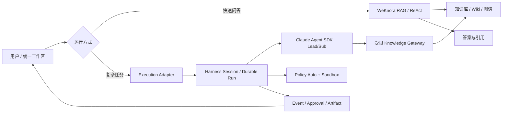

# 在 WeKnora 基础上加入复杂智能体编排的可行性分析

- 评估日期：2026-08-11
- WeKnora 基线：已发布版本 v0.7.2（tag `3d5d8bfc`）；同时核对 2026-08-11 的 upstream `main`（`5df788dc77763e15f44e2d34e3aa0b510434948a`）
- 评估对象：WeKnora 与当前 Claude Agent Harness / Agent Studio 的组合方式
- 决策性质：产品与架构方向建议，不是实施承诺
- 证据范围：WeKnora 发布说明、README 与关键运行时代码；当前 Harness 的设计、实现和验收文档
- 飞书评审版：[在 WeKnora 基础上加入复杂智能体编排的可行性分析](https://my.feishu.cn/docx/I62fdUsG5owTu2xJX87ceISBnHf)

## 1. 结论摘要

这是一个有条件成立的好主意。更准确地说：**以 WeKnora 作为知识产品底座是好主意；以 WeKnora 仓库作为复杂 Agent 唯一运行时、再把现有编排能力塞进其核心引擎，不是好主意。**

如果产品的核心路径是“接入资料—形成知识资产—检索与推理—产出可交付结果”，WeKnora 很适合作为知识工作台和知识数据平面。它已经补齐文档解析、混合检索、Wiki、知识图谱、多源同步、引用展示、工作区 RBAC、模型与存储适配、IM/Widget 发布等大量产品能力，直接复用比在 Harness 中重新建设更快、更成熟。

但不建议 fork WeKnora 后，把 Harness 的复杂智能体编排直接写进 WeKnora 的 ReAct 引擎。两套系统在 Agent Loop、会话、MCP、Skills、审批、沙箱、上下文和可观测性上高度重叠，直接合并会形成“双运行时、双状态机、双配置源”，短期看功能丰富，长期会被升级冲突、故障恢复和语义漂移拖住。

推荐方案是“双平面组合”：WeKnora 负责知识与用户工作台，Harness 负责复杂任务的执行与发布控制。两者通过带身份和知识范围的 API/MCP 契约连接；WeKnora 的普通问答继续走原生快速链路，只有复杂任务进入 Harness。按本文的加权评分，该方案为 8.6/10；“只接知识 MCP”为 7.5/10；“直接在 WeKnora 内扩写编排引擎”为 5.8/10；“整体迁移并废弃 Harness”为 4.5/10。

这项决策的关键不是技术栈，而是产品主线。如果未来产品要成为“知识工作空间中的 AI 生产力平台”，组合能显著缩短知识管理与内容检索的建设周期；如果产品主线仍是跨系统自动化、长任务和软件工程 Agent，WeKnora 应只是受控知识能力，不应成为产品母体。

## 2. WeKnora 已经具备什么

截至本次评估的 v0.7.2，WeKnora 已经从 RAG 框架演进为知识产品平台。它的优势主要集中在用户可感知的知识生产力，而不只是底层向量检索。

知识侧已经覆盖多格式文档解析、FAQ/文档/Wiki 三类知识库、文件夹树、分块编辑与版本回退、混合检索、父子分块、知识图谱、多知识库检索、飞书/Notion/语雀/RSS 等数据源、引用与检索过程展示。产品侧已经覆盖多工作区、四级 RBAC、审计、会话、网站嵌入、IM 接入、CLI 和 API Key。运行侧已经包含 ReAct Agent、内置工具、MCP、Skills、脚本沙箱、MCP 工具人工审批、并行工具调用、Langfuse 追踪、任务队列与 Worker 池治理。

上下文工程也不是空白。其 Agent 每轮都会先把当前轮工具结果限制在独立预算内；默认在上下文约 50% 时尝试 LLM 记忆归并，归并失败时生成有界原始归档；到约 80% 时再执行确定性历史裁剪。裁剪保留系统提示、当前轮以及工具调用/工具结果配对。这个实现对知识问答和单 Agent ReAct 已经相当实用。

因此，若重新在 Harness 中建设同等的知识接入、检索调试、Wiki、引用、数据源同步和知识管理 UI，会产生明显重复投入。WeKnora 最值得复用的不是一个向量库封装，而是完整的知识产品闭环。

## 3. Harness 仍然有不可替代的部分

当前 Harness 的定位不是知识库，而是复杂 Agent 从定义、验证、运行到发布的生产控制面。它的优势集中在 WeKnora 尚未形成强契约的部分。

Harness 使用 Draft 与不可变 Agent Version/Bundle 分离编辑态和运行态，Prompt、Skills、工具、子 Agent、策略和评测都进入可复现快照；Deployment 再把固定版本晋级到 test、canary 和 production，并保留快照与回滚依据。WeKnora 当前的 `custom_agents` 仍是按 ID 原地更新的可变配置，`updated_at` 能说明何时改过，但不能证明某次历史运行究竟使用了哪套完整资产。

Harness 把一次任务建模为耐久 Run，RunEvent、Approval、Artifact、Workspace Snapshot、幂等键、租约和 fencing token 都是服务端事实。Worker 崩溃、浏览器断线、审批等待和取消恢复不会依赖原 HTTP 请求存活。WeKnora 的 Agent Engine 以一次请求为边界重建上下文并执行 ReAct；MCP 审批虽然支持 Redis 跨实例通知，但 pending waiter 仍驻留在发起实例内存，适合对话内短暂停顿，不等价于可迁移、可重放的耐久任务状态机。

Harness 还具有固定版本 Lead/Sub Agent、一层深度和并发/用量上限、委派事件、评测断言、独立策略、Artifact 交付、真实 Preflight、离线 Eval、质量门禁以及 Claude Agent SDK 的原生 Session Resume。对“跨多个工具和专家、运行数分钟甚至更久、需要暂停恢复、最终生成文件”的复杂任务，这些是主能力而不是附属功能。

## 4. 能力对照与判断

| 维度 | WeKnora | Harness | 组合判断 |
| --- | --- | --- | --- |
| 知识接入与加工 | 强，多源、解析、分块、Wiki、图谱、版本历史 | 基础知识源治理，不以文档加工为中心 | 由 WeKnora 统一负责 |
| 检索与引用体验 | 强，检索策略丰富且 UI 完整 | 可通过 MCP 使用知识能力 | 不重复建设 |
| 普通问答 | 原生快速问答与 ReAct 已成熟 | 可以完成，但成本和时延更高 | 普通问答留在 WeKnora |
| 复杂多智能体 | 单 Agent ReAct 为主，尚无固定版本 Lead/Sub 发布契约 | 固定版本 Lead/Sub、委派上限与事件治理 | 复杂任务进入 Harness |
| Agent 版本与发布 | 可变 Agent 配置，缺少完整不可变发布链 | Draft、Bundle、Version、Deployment、回滚 | 由 Harness 负责 |
| 长任务与恢复 | 会话/消息完整，在线 Agent 更接近请求内执行 | 耐久 Run、队列、租约、取消、审批恢复 | 由 Harness 负责 |
| 上下文管理 | 对单 Agent 知识对话成熟 | 面向 SDK 会话、工作区、上下文摘要和恢复点 | 按运行模式只保留一个压缩所有者 |
| MCP/Skills/沙箱 | 已具备，适合知识 Agent 和数据分析 | 已具备，且与 Manifest、Policy、发布版本绑定 | 必须划清目录和执行归属 |
| 用户工作台 | 知识库、问答、Wiki、设置和多端入口成熟 | Studio、任务执行和制品交付更强 | 统一入口可放在 WeKnora，复杂运行嵌入 Harness 视图 |
| 评测与晋级 | 有检索/生成评估与 Langfuse | 有版本级 Eval、Quality Gate 和环境晋级 | 保留两类评测，统一结果摘要 |

从产品角度看，WeKnora 最值得吸收的不是“也有 Agent”，而是知识生产力闭环：资料导入有进度与错误反馈，检索结果可解释，引用能回到原文，Wiki 可持续编辑，知识库和空间权限是一等对象。Harness 最值得保留的也不是“也能调用工具”，而是可复现版本、耐久任务、可靠恢复、受控执行和制品交付。组合只有在这两组职责不混淆时才有价值。

## 5. 四种方案

### 5.1 方案 A：直接 fork WeKnora 并扩写其 Agent Engine

优点是前端、知识库、身份与对话可以最快形成一体化体验，最初的 Demo 也最顺滑。问题是需要在 Go ReAct Engine 内重新实现或移植不可变版本、耐久 Run、多智能体、发布、Artifact、工作区恢复与评测控制面；若同时保留 Claude Agent SDK，就会出现两个 Agent Loop。之后每次跟进 WeKnora 上游都要处理核心引擎和前端的大量冲突。

该方案只适合团队决定彻底放弃现有 Harness 运行时，并长期维护一个深度 fork。当前不推荐。

### 5.2 方案 B：Harness 仅把 WeKnora 当知识 MCP

这是最低风险的第一步。Harness 通过 WeKnora 官方 MCP 或受控 REST API 完成检索、文档读取和知识库查询，WeKnora 继续独立提供知识管理页面。它能立刻停止重复建设知识底座，但用户需要在两个入口之间切换，WeKnora 现成的对话、引用和工作区体验没有完全复用。

该方案适合作为两到三周内的技术验证和故障隔离基线，不应是最终产品形态。

### 5.3 方案 C：WeKnora 知识工作台 + Harness 执行控制面

这是推荐方案。用户从 WeKnora 的统一工作区进入，普通问答仍调用 WeKnora 原生链路；当用户选择“复杂任务”或某个编排型 Agent 时，WeKnora 创建一个外部执行会话，Harness 固定 Agent Version 后创建耐久 Run。Harness 使用带用户、工作区和知识范围的短期凭据调用 WeKnora 知识 API/MCP，并把事件流、审批、制品和终态回传给 WeKnora 页面。

该模式保留双方最成熟的部分，同时允许逐步融合 UI，不要求一次性迁移数据库或重写运行时。代价是需要维护 Go 与 Python 两套服务，以及清晰的身份、事件和资源契约；但这种复杂度是显式的服务边界，比隐藏在一个深度 fork 里的双运行时更可控。

### 5.4 方案 D：迁入 WeKnora 并废弃 Harness

该方案把 WeKnora 作为唯一代码母体，逐步用 Go 重做 Harness 已有的耐久 Run、不可变 Agent Version、发布晋级、Workspace、Artifact、审批恢复和质量门禁。最终部署拓扑可能更简单，但迁移期会同时维护旧实现与新实现，且需要重新验证大量已经稳定的运行语义。

只有在团队明确只保留知识问答类 Agent、放弃长任务和 Claude Agent SDK 原生能力时，这个选择才合理。对当前产品目标而言，它会用很高的迁移成本换取有限的用户价值，当前不推荐。

### 5.5 决策评分

以下评分以当前产品目标为前提：知识生产力、复杂任务可恢复、交互统一、尽快形成可发布产品。10 分为最好，综合分按权重折算。

| 评价维度 | 权重 | A：深度 fork | B：只接知识 MCP | C：双平面组合 | D：迁移后废弃 Harness |
| --- | ---: | ---: | ---: | ---: | ---: |
| 产品能力匹配 | 20% | 7 | 6 | 9 | 5 |
| 到达可用版本的速度 | 15% | 7 | 9 | 7 | 3 |
| 长任务可靠性 | 20% | 4 | 8 | 9 | 4 |
| 跟随 WeKnora 上游的难度 | 15% | 3 | 9 | 8 | 5 |
| 既有能力复用率 | 15% | 5 | 8 | 9 | 3 |
| 最终用户体验上限 | 15% | 9 | 5 | 9 | 7 |
| **综合分** | **100%** | **5.8** | **7.5** | **8.6** | **4.5** |

方案 B 是正确的技术起点，方案 C 是推荐的产品终态。它们不是互斥选择：先用 B 验证契约，再逐步演进到 C。

## 6. 推荐目标架构

产品入口分为两条运行路径。快速问答路径由 WeKnora 完成检索、生成和引用展示，追求低时延；复杂任务路径由 Harness 完成任务分解、工具与子 Agent 调度、长任务恢复和文件交付。两条路径共享同一个知识工作区，但不共享 Agent Loop。

核心调用关系如下：

权威数据必须按资源划分，禁止双写：

| 资源 | 权威系统 | 说明 |
| --- | --- | --- |
| 用户、组织、工作区成员、知识库、文档、分块、Wiki | WeKnora | Harness 只保存外部引用和运行时授权快照 |
| Agent Draft、Version、Bundle、Deployment、Eval | Harness | WeKnora 展示投影，不原地修改发布版本 |
| 普通问答消息 | WeKnora | 保持原有体验与历史 |
| 复杂任务 Run、Event、Approval、Workspace、Artifact | Harness | WeKnora 保存映射 ID 和展示摘要 |
| 对话映射 | 双方各存自己的 ID | 一对一映射，禁止把一个 ID 当成双方主键 |
| Embedding/Rerank 模型 | WeKnora | 属于知识加工与检索 |
| 编排执行模型与路由 | Harness | 包含 Claude 官方 Auto 权限语义和运行 Profile |
| 知识型 MCP | WeKnora | 由 WeKnora 管理知识范围和引用 |
| 外部操作型 MCP | Harness | 由 Manifest、Policy 和 Sandbox 共同限制 |

## 7. 最关键的接口契约

身份契约不能只传 `tenant_id`。WeKnora 应签发短时工作负载令牌，至少绑定调用主体、工作区、允许访问的知识库/文档、用途、过期时间和 Run ID。Harness 不保存用户的 WeKnora 长期密钥，也不能凭自身服务身份扩大用户原有知识范围。

知识结果必须返回稳定资源标识、标题、片段、来源位置、版本或内容哈希以及可展示引用。模型上下文可以使用短别名，但 Artifact 和最终引用必须能还原到 WeKnora 的真实资源。删除或重建索引后，历史运行仍应保留当时使用的引用快照。

事件适配只转换展示协议，不改变事实。Harness RunEvent 是复杂任务权威事件，WeKnora 侧将其投影为思考摘要、工具、子 Agent、审批、制品和终态。断线重连必须按 sequence 重放，而不是只依赖当前 SSE 连接。

取消和审批要双向闭环。WeKnora 的停止按钮调用 Harness cancel；Harness 的 Approval 创建 WeKnora 可操作卡片；审批结果写回 Harness 后继续原 Run。WeKnora 不应再创建第二份审批状态。

建议把第一版契约冻结为以下五类资源，而不是直接让双方访问彼此数据库：

| 契约 | 最小字段 | 关键语义 |
| --- | --- | --- |
| `ExecutionRequest` | workspace、actor、agent_version、input、knowledge_scope、idempotency_key | 重试只能得到同一个 Run |
| `KnowledgeGrant` | subject、workspace、KB/document scope、purpose、run_id、expiry | 短期、最小权限、不可转授 |
| `KnowledgeEvidence` | stable_id、content_hash、snippet、source_location、display_url | 历史 Run 的引用可还原 |
| `RunEventEnvelope` | run_id、sequence、type、occurred_at、payload_version | 可排序、可重放、向前兼容 |
| `ArtifactReference` | artifact_id、name、media_type、size、sha256、download_policy | 下载前重新校验用户权限 |

P0 不应使用 WeKnora 管理员 API Key 代表所有用户，也不应把 Harness 的数据库表映射为 WeKnora 前端模型。这两种捷径都会在多工作区上线后形成难以补救的越权和耦合。

## 8. 上下文压缩设计

组合后最容易犯的错误是双重压缩：WeKnora 先总结会话，Harness 再压缩一次，最终丢失工具因果、引用来源和用户约束。

建议按路径确定唯一所有者。普通问答由 WeKnora 管理上下文；复杂任务一旦进入 Harness，该 Run 的对话、工具、子 Agent 和恢复摘要都由 Harness 管理，WeKnora 只提供用户可见历史或明确选择的消息，不再替 Harness 生成摘要。WeKnora 仍负责检索结果的裁剪、重排和引用结构，Harness 负责把这些结果纳入整轮 Token 预算。

可以吸收 WeKnora 的三个实现优点：对当前轮工具结果设置独立预算；任何压缩都保持 tool call/tool result 配对；LLM 归并后仍有确定性的裁剪兜底。同时保留 Harness 的恢复点和脱敏事实摘要，禁止把原始超长 transcript、动态工具 ID 或敏感工具输出直接写入长期摘要。

复杂任务的预算建议分为四层，而不是只配置一个 `max_context_tokens`：系统与不可变 Agent 资产、用户约束与当前轮、知识证据、工具与子 Agent 结果。知识证据应按稳定引用去重，工具结果应优先保留结论、错误和可恢复指针，历史对话才是最后被摘要的部分。每次压缩都记录输入范围、输出摘要哈希、被移除事件序号和生成器版本，使恢复与评测可以解释“模型当时看到了什么”。

首版不要把 WeKnora 已压缩的普通问答历史直接续接为 Harness 的完整运行上下文。更稳妥的做法是显式传入用户选择的最近消息、原始用户目标和知识范围；Harness 从这个边界建立自己的 Run 上下文。这样既避免双重摘要，也避免普通对话中的隐含指令无审查地进入高权限执行链路。

## 9. 分阶段实施建议

第一阶段做知识桥接验证，不改 WeKnora 核心引擎。选择一个真实复杂任务，让 Harness 通过受限 WeKnora MCP/API 查询两类知识库，验证身份范围、引用还原、延迟、错误映射和上下文预算。验收重点不是“能搜到”，而是越权不可见、引用可追溯、索引变更后历史仍可解释。

第二阶段打通复杂任务入口和事件投影。在 WeKnora 增加外部执行适配器与“快速问答 / 复杂任务”明确选择，接入 Harness 的创建、重放、取消、审批和 Artifact 下载。此阶段不搬迁 Agent Studio，只让用户在一个工作区完成任务。

第三阶段把 Harness 的 Agent 目录、版本和发布状态以只读或受控编辑形式嵌入 WeKnora。编辑仍提交到 Harness Draft API，发布仍经过 Preflight、Eval 和 Deployment Gate；WeKnora 不复制一份 Agent 配置表。

第四阶段再根据使用数据决定是否统一导航、认证和运维面。只有当跨服务延迟、故障率或维护成本成为实证问题时，才考虑下沉某些适配器；不要预先把两个核心运行时合并。

### 9.1 建议的首个纵向切片

首个版本只做一个场景，例如“基于多个内部知识库生成带引用的调研报告”。建议范围如下：

- 用户仍在统一工作区输入任务，不需要进入第二套后台；系统可以自动建议“快速问答”或“复杂任务”，用户保留一次切换能力。
- WeKnora 负责知识库选择、权限校验、混合检索和引用资源；Harness 负责固定 Agent 版本、执行、恢复、取消和报告文件交付。
- 复杂任务页面只展示用户能采取行动的信息：当前阶段、关键工具、必要审批、失败恢复动作和制品。内部编排细节默认折叠。
- 页面刷新或换设备后，依靠 Run ID 和事件 sequence 恢复；不能把浏览器中的流式连接当作任务生命周期。
- 首版只读知识，不做由 Agent 自动修改知识库；不做可视化 Workflow Canvas；不做两边 Agent 配置双向同步。

### 9.2 P0 接口与验收范围

| 模块 | P0 交付 | 验收标准 |
| --- | --- | --- |
| 身份桥接 | Run 级短时知识令牌 | 用户、工作区、KB 范围、用途和 TTL 均可校验；越权为 0 |
| Knowledge Gateway | 搜索、读取、引用解析三个稳定接口 | 每个结果含稳定 ID、内容哈希和可展示来源 |
| 任务桥接 | 创建、查询、取消、事件重放 | 重试不重复创建 Run；断线按 sequence 补齐 |
| 结果交付 | 最终文本与 Artifact 映射 | 文件可下载，引用能回到 WeKnora 原资源 |
| 运行隔离 | 普通问答与复杂任务使用不同执行路径 | 复杂任务故障不拖慢普通问答链路 |
| 可观测性 | 贯穿两边的 correlation ID | 能从一次用户操作定位知识调用和 Run 事件 |

在不改造 WeKnora 核心 Agent Engine 的前提下，2—3 名熟悉两套代码的工程师完成技术验证通常需要约 2—3 周；形成包含统一入口、事件恢复、取消和制品交付的可用纵向切片，建议预留 4—6 周。该估算不含统一 SSO、生产级容量压测和历史数据迁移，应在接口探针完成后重新校准。

### 9.3 P0 明确不做

- 不 fork 并改写 WeKnora 的 ReAct 主循环；
- 不建设可视化 DAG/Workflow Canvas；
- 不做两套 Agent 配置的双向同步；
- 不让一个任务同时由 WeKnora 与 Harness 调度工具；
- 不把普通问答全部迁移到 Harness；
- 不开放 Agent 自动修改知识库，首版保持只读知识调用；
- 不为了“统一部署”而合并数据库或共享内部表结构。

### 9.4 产品交互原则

最终产品不应把“两个后端”暴露给用户。知识库、Agent 和任务都应处在同一工作区语境中；用户感知的是“快速得到答案”与“交付一个复杂成果”两种工作方式，而不是 WeKnora 与 Harness 两个品牌。

复杂任务进入运行态后，输入框、历史消息和交付物仍留在同一页面。任务卡承担进度与恢复，Studio 承担 Agent 的编辑、版本和发布，知识管理承担资料接入和检索调试。三者可以共享导航和设计系统，但不要把所有配置塞进同一个页面。

## 10. 成功指标与停止条件

技术验证至少满足：复杂任务首个可见事件不因知识桥接显著恶化；知识调用 P95 有可接受上限；断线后可无损重放；Harness Worker 重启后 Run 可继续或确定失败；知识引用 100% 可还原；用户越权知识 0 泄漏；同一任务不会被双重压缩；普通问答时延不受复杂运行平面影响。

产品验证至少满足：用户能明确理解何时使用快速问答、何时使用复杂任务；复杂任务能交付可下载制品，而不是只有长文本；任务进行中可以离开页面再回来；Agent 版本变化不影响已开始的会话；失败时能看到可执行的恢复动作。

若知识桥接使 P95 延迟增加超过业务可接受范围、身份范围无法稳定映射、上游升级需要持续修改 WeKnora 核心文件，或团队无法承担 Go/Python 双栈运维，则停止方案 C，退回“独立 WeKnora + Harness 通过 MCP 使用知识”的松耦合模式。

建议在立项前用一个真实场景做可否证实验，并预先设定阈值：普通问答路径不得经过 Harness；复杂任务知识检索 P95 增量目标不超过 300 ms（不含模型推理）；断开 SSE 后 100% 按 sequence 补齐；Worker 在审批前后重启均不丢 Run；同一幂等键并发请求只产生一个 Run；100 条越权知识探针全部拒绝；报告中的每条知识引用都能定位到稳定资源和内容版本。这里的 300 ms 是首轮工程目标，不是已经测得的事实，应以 174 环境实测重新定标。

## 11. 主要风险与应对

| 风险 | 概率/影响 | 早期信号 | 应对 |
| --- | --- | --- | --- |
| 双 Agent Loop 竞争控制权 | 高 / 高 | 同一轮出现两边工具事件或两个停止按钮 | 每个请求在入口固定一种运行模式 |
| 身份与知识范围漂移 | 中 / 高 | Harness 使用服务账号看到用户不可见 KB | Run 级短时 Grant，服务端二次鉴权 |
| 双重压缩造成事实丢失 | 高 / 高 | 引用存在但摘要找不到原始证据 | 复杂 Run 只允许 Harness 管上下文 |
| WeKnora 深度 fork 难以升级 | 高 / 中 | 每次上游升级都冲突 Agent Engine/前端核心 | 适配器和嵌入扩展，不改核心循环 |
| 两套目录与配置让用户困惑 | 中 / 中 | 同名 Agent/MCP 在两边状态不一致 | 权威系统唯一，另一边只做投影 |
| 跨服务时延拖慢普通问答 | 中 / 高 | 所有提问都创建 Harness Run | 快速问答保持 WeKnora 原生直通 |
| Go/Python 双栈运维成本 | 中 / 中 | 故障定位需要跨多套 trace 手工关联 | 统一 correlation ID、SLO 和发布矩阵 |

最高风险不是服务变多，而是控制权不清。只要一次执行只有一个 Agent Loop、一个状态事实源和一个上下文压缩所有者，双服务架构仍然可以保持清晰；反之，即使代码都放进同一仓库，也会成为分布式状态机。

## 12. 最终建议

采用 WeKnora，但把“基于 WeKnora”定义为复用其知识产品与数据平面，而不是以其仓库作为唯一代码母体。

近期最优动作不是迁移，而是做一个窄而完整的纵向切片：WeKnora 工作区中的用户发起复杂知识任务，Harness 固定版本 Agent 执行，受限调用 WeKnora 知识，页面可看到过程、取消、审批和制品，刷新后能够恢复。这个切片一旦成立，后续是产品整合问题；如果它不成立，也能在较低成本下保留两个系统各自独立演进。

因此，建议的立项表述应是“建设 WeKnora 与 Harness 的知识型复杂任务一体化体验”，而不是“在 WeKnora 内加入复杂编排”。前者保留清晰边界并可以渐进验证，后者很容易把团队带向深度 fork、重复运行时和长期维护债务。

## 13. 参考依据

- [WeKnora v0.7.2 发布说明](https://github.com/Tencent/WeKnora/releases/tag/v0.7.2)
- [WeKnora 项目说明与功能基线](https://github.com/Tencent/WeKnora/blob/5df788dc77763e15f44e2d34e3aa0b510434948a/README_CN.md)
- [WeKnora Agent Engine](https://github.com/Tencent/WeKnora/blob/5df788dc77763e15f44e2d34e3aa0b510434948a/internal/agent/engine.go)
- [WeKnora Agent 配置与并行工具字段](https://github.com/Tencent/WeKnora/blob/5df788dc77763e15f44e2d34e3aa0b510434948a/internal/types/agent.go)
- [WeKnora 上下文窗口管理](https://github.com/Tencent/WeKnora/blob/5df788dc77763e15f44e2d34e3aa0b510434948a/internal/agent/observe.go)
- [WeKnora LLM 记忆归并](https://github.com/Tencent/WeKnora/blob/5df788dc77763e15f44e2d34e3aa0b510434948a/internal/agent/memory/consolidator.go)
- [WeKnora 确定性上下文裁剪](https://github.com/Tencent/WeKnora/blob/5df788dc77763e15f44e2d34e3aa0b510434948a/internal/agent/token/compress.go)
- [WeKnora MCP 工具审批 Gate](https://github.com/Tencent/WeKnora/blob/5df788dc77763e15f44e2d34e3aa0b510434948a/internal/agent/approval/gate.go)
- [WeKnora 可变 Custom Agent 模型](https://github.com/Tencent/WeKnora/blob/5df788dc77763e15f44e2d34e3aa0b510434948a/internal/types/custom_agent.go)
- [WeKnora MIT License 与第三方组件说明](https://github.com/Tencent/WeKnora/blob/5df788dc77763e15f44e2d34e3aa0b510434948a/LICENSE)
- 当前项目 `README.md`、`docs/agent-production-platform-design.md`、`docs/plans/2026-07-16-agent-production-platform-g12-multi-agent-runtime-governance.md`
