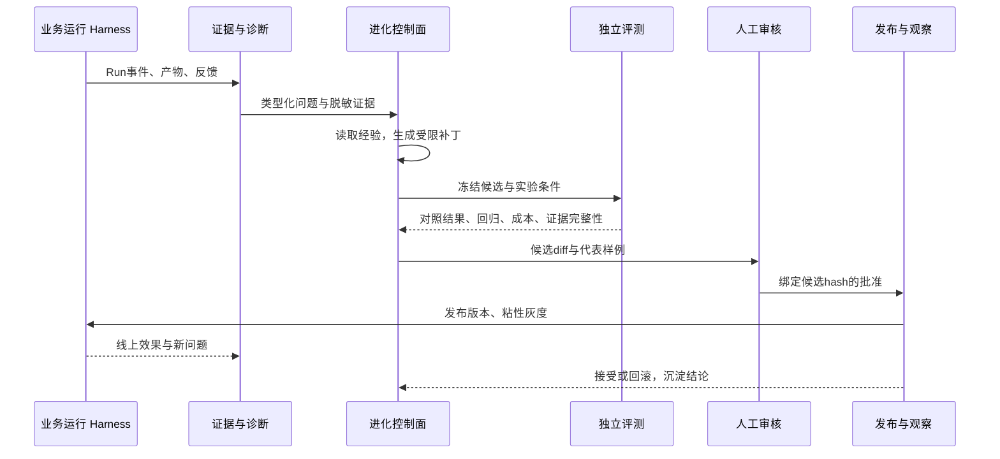

# Agent Studio 智能体自进化改造方案：从运行治理到可验证的持续改进

状态：设计建议，尚未实施。分析日期：2026-09-19。面向产品、架构与研发评审。

本方案基于指定分析稿、当前项目源码及开源项目的一手资料。建议在现有 Agent Studio 上增加独立进化控制面，先跑通一个业务场景的人工闭环，再逐步自动化候选生成、对照评测和灰度监测。首期保留现有 Claude SDK、Codex、DeepAgents 执行适配及 Draft → Version → Bundle → Deployment 发布体系。

## 1. 决策摘要与分析边界

**建议采用“现有平台 + 进化控制面 + 可替换优化器”的增量方案。** 当前项目已经有可复用的运行、评测、记忆和发布基础；真正需要建设的是从生产证据到改进候选，再到验证与生效的完整数据通路。核心产品交付应是每个智能体的“持续改进”工作区：看到问题、解释归因、比较补丁、审核证据、观察上线效果。

首期优化对象限定为智能体的任务说明、Prompt 中允许修改的业务段落、Skill 正文与经过治理的经验条目。模型权重、运行内核、权限策略、评估器、评测集真值及发布门槛不进入同一自修改回路。不是所有失败都要改 Prompt：网关故障交给运行治理，知识过期走知识更新，业务意图不清走任务契约澄清。

**本次核查基线。** 当前工作区为 `/Users/xiaokai/Documents/agent studio`，分支 `feature/deepagents-runtime`，HEAD 为 `4a43a4000a59c8646dda8b0931ba0126c1f8eaa4`。工作区存在未提交的本地化基础设施修改；本次只生成方案，未修改运行代码。源码存在不等于目标部署已经启用，文中“已有”均指源码能力，线上配置和运行效果需在实施第一阶段验证。

指定分析稿实际位于 `/Users/xiaokai/Documents/agent-studio-model-management/docs/plans/2026-09-19-self-evolving-agent-flywheel.md`，该工作树 HEAD 为 `9dccbc8d7ff2ebe865d41c9608470284e59b1fa5`。两个工作树不同，不能把原分析的所有缺口直接当作当前版本事实。文中统一使用 Agent Studio；原分析中的 AXENO 为其原有命名。

**原文核对范围。** [微信原文](https://mp.weixin.qq.com/s/5VDN-T9K8Wr-DaQ15-I6CA)直接访问未取得正文；通过搜索检索到[腾讯技术工程同题发布页](https://zhuanlan.zhihu.com/p/2075259023729993271)，并以注明原文链接的转载核对可访问正文。图片内的表格与流程未完整核验，不声称覆盖全部图内细节。原文的核心要求可落实为四项工程合同：评测产出诊断、经验有准入与淘汰、改动以候选验证、发布有人的控制点。本文后续数据模型、门禁和排期为针对本项目的设计建议，不是对原文的复述。

原稿及文章中的提升百分比、固定记忆衰减系数、人工占比和“几轮就提升”等数字不作为验收依据；跨任务、跨模型与不同预算的实验结果不能直接外推到本项目。

## 2. 对既有分析的修正与真实缺口

原稿“先修信号，再接闭环”的方向成立，但记忆、评测执行及差异展示需要按当前代码重新判断。以下均为静态代码核查，没有据此宣称生产验证通过。

| 原分析判断 | 当前代码证据与修正 | 本次改造重点 |
| --- | --- | --- |
| 没有任务结束后的记忆提取 | `memory_bank/processing.py:34` 已扫描成功 Run，跳过评测及 preview，从用户原始输入提取候选 | 保留个人事实提取；新增独立的成败轨迹经验提炼，不能将前者误认为已具备后者 |
| 只有关键词、没有向量召回 | `memory_bank/service.py:433` 已做词法与语义召回、加权 RRF；`pyproject.toml` 已有 pgvector | 评估命中是否有用、记录召回归因，增加精确实体约束和预算治理 |
| 检索没有进入运行时 | `worker/orchestrator.py:1192` 传入 prompt 查询；`MemoryBankService.projection()` 已调用 search | 从“接入检索”升级为“可复现的记忆快照与效果消融” |
| legacy 抢占全部注入预算、IMPORT 无生产者 | `application/memory.py:38` 已将 legacy 分片转为 IMPORT 待确认条目，并返回托管投影 | 验证迁移与撤销，不再重做相同迁移 |
| 无替代机制 | `MemoryEntry` 已有 conditions、supersedes、supersedes_version，状态含 SUPERSEDED | 补充跨来源语义冲突检测与团队经验审核；已有 CAS/替代不等于完整冲突治理 |
| 幂等键使所有评测都无法重采样 | CLI `evals/runner.py:287` 确有固定键；耐久控制器 `evals/controller.py:230` 的键包含 eval_run_id | 修 CLI；统一 experiment/trial/replicate 语义。耐久控制面新建 EvalRun 已可分开执行，不能概括为全平台无法重跑 |
| 完全没有差异展示 | `studio/service.py:1440` 已有 compare_builder_project，可比较 DeepAgents 项目生成前后 | 复用比较能力，补齐跨运行时、跨发布版本与评测证据关联的统一 diff |
| 相同版本不同包可能直接共享结论 | AgentRegistry 已拒绝同一身份版本的不同 hash；现有 eval gate 仍主要按版本匹配 | 保留不可变约束，补充模型、运行时、知识、记忆、评估器等证据指纹，避免环境变化后的旧结论复用 |

**仍然成立的高优先级缺口。** `EvalExpectation` 主要检查工具、子 Agent、终态、子串和时长；不能充分衡量业务正确性、工具参数及关键步骤的数据依赖。`EvalCaseResult.failures` 仍是自由文本，缺少稳定失败分类。没有完整的诊断 → 候选 → 实验 → 审核 → 线上观察状态机，也没有把失败归档为可治理的经验与评测种子。

**质量数据还有两个容易造成假好消息的问题。** `quality/service.py:55` 无 trace_id 时直接不产分；`observability/provider.py` 在 OTel 关闭时使用 NoOp provider。另有成本未知时 `cost_budget` 仍记为通过的逻辑。建议本地质量事实与外部遥测导出解耦，明确 unknown/insufficient_evidence 状态；关闭 Langfuse/OTel 导出不应关闭本地质量采集。`evals/service.py:346` 在关闭评测或缺少 required 数据集时也可能返回通过，这种兼容行为不能直接当进化候选的有效验证。

**发布基础可复用，但控制语义要加强。** 现有部署控制器已有灰度流量权重、健康版本与 CAS；工具审批也已成熟。候选审核应成为独立的发布证据，不能拿“用户批准了一次工具调用”替代“用户审过这个智能体版本”。现有 builder 的 review-before-apply 也不等于完整的上线证据审批。

## 3. 目标架构：业务执行与改进流程分离

在线执行继续由 Harness 管理。新增 `src/harness/evolution/` 作为应用层控制面，复用 PostgreSQL、现有队列/租约模式、对象存储、评测控制器和发布服务。首期无需引入独立工作流平台，也不要求重新实现 Agent Loop。

| 模块 | 责任 | 与现有能力的衔接 |
| --- | --- | --- |
| EvidenceCollector | 接收终态、用户反馈和业务验收，脱敏，保留来源 | 扩展 quality；RunEvent 为权威，Langfuse 为投影 |
| DiagnosisService | 规则分类先行，模型补充根因假设、置信度与证据 | 读取 eval case、工具错误、产物校验和人工纠正 |
| ExperienceService | 管理业务经验与改进经验，提供适用范围、版本、反证与撤销 | 与个人 memory_bank 分离，复用治理模式 |
| CandidateService | 创建基于冻结版本的补丁、保存来源和预期收益 | 调用现有 builder/编译器，输出隔离 Draft |
| ExperimentService | 基线与候选对照、消融、重采样、指标汇总 | 复用耐久 EvalRunController，不新建第二条执行链 |
| ReviewService | 人工审核、否决、修改后重审 | 复用身份与审计，新增审核记录与发布前置校验 |
| ObservationController | 监测灰度、限制暴露、回滚与结论回流 | 接入 DeploymentService 的 promote/rollback 与 CAS |

队列采用至少一次投递，业务状态写入和 outbox 事件在同一事务提交。消费方按稳定 event_id 去重；worker 使用 lease、心跳、fencing token 和预算预留。模型调用完成后崩溃的重试先读取候选记录，不能重复花费并覆盖前次结果。新增模块依赖 Repository/Queue 接口，避免把数据库实现写入诊断算法，也兼容项目正在进行的本地化基础设施演进。

同一 `tenant + owner/team + agent` 默认串行执行改进实验，候选可少量并行评测。业务新 Run 固定当次资产版本；长期会话的版本转换另开明确迁移点，不能在对话中途热替换 Skill。

## 4. 资产边界、核心数据模型与接口

**先分清四类资产。** 用户记忆保存某个人的偏好、事实和决定；业务经验保存某类任务中验证过的方法与陷阱；改进 Playbook 保存哪些修改有效、哪些修改导致回归；AgentVersion 保存最终可执行的 Prompt/Skill/工具绑定。四者的可见范围、审核和生命周期不同，不能全部塞进同一个向量库后统一注入。

个人记忆维持现有授权与撤销语义。团队经验新增 tenant/team/agent/task-family 范围，必须经过脱敏、业务认可和授权转换；用户同意个人记忆提取，不等于同意训练或团队共享。外部网页、工具返回和模型总结只能作为带来源的证据，不得自行升级为规则。

| 对象 | 必需字段（建议） | 关键约束 |
| --- | --- | --- |
| EvidenceRecord | tenant、scope、source_run/event/artifact、outcome、feedback_revision、sensitivity、redaction_version、content_hash | 真值、运行成功、用户满意分别存储；成本未知不能当作零 |
| Diagnosis | evidence_ids、failure_code、affected_dimension、severity、root_cause_hypothesis、confidence、reproducer | 假设与确定性错误分开；支持 infra/tool/knowledge/prompt/skill/memory/policy/input 分流 |
| ExperienceEntry | kind=task_lesson/anti_pattern/evolution_lesson、scope、conditions、evidence_refs、support/conflict、version、expires_at、supersedes | observed → reviewed → validated → deprecated；不是一条成功轨迹就能成为规则 |
| EvolutionJob | agent、objective_revision、baseline_fingerprint、allowed_targets、budget、stop_policy、state、fencing_token | 目标与预算创建后冻结；停止、失败、重试都有终态 |
| CandidatePatch | base_hash、target、operation、old_hash、new_content、reason、evidence_ids、candidate_hash | 受限结构化 patch；命中旧内容 hash 才应用，不能 fuzzy patch 到另一版本 |
| Experiment | baseline/candidate fingerprints、dataset/split versions、evaluator_version、trial/replicate、limits、result、decision | 保存全部尝试与失败，不能只保留最好一次 |
| ReviewDecision | candidate_hash、experiment_report_hash、policy_revision、reviewer、decision、reason、timestamp | 任一绑定内容改变即失效；生成服务身份无批准权限 |
| ReleaseObservation | deployment_snapshot、exposure_group、window、sample_count、business/latency/cost metrics、decision | 记录实际暴露版本；回滚与关闭实验幂等 |

建议所有对象的主键、查询、唯一索引和授权都携带 tenant 与明确 scope。大轨迹、diff、报告入现有对象存储；数据库记录索引、hash、状态及审计，不复制敏感长文本到每张表。

**冻结的是完整运行条件，而不只是版本号。** 定义 `ExecutionFingerprint`，至少包含 agent/package hash、子 Agent 版本、runtime 与依赖锁摘要、模型路由/实际模型标识、采样参数、工具 schema/fixture、知识快照、记忆快照、环境策略和评估器版本。模型网关若不能保证模型修订不变，应记录这一限制，并在同一时间窗交错跑基线与候选。复用证据前逐项校验指纹及有效期。

建议新增 `/v1/evolution/jobs`（创建、列表、取消）、`/jobs/{id}/candidates`、`/candidates/{id}/diff`、`/candidates/{id}/experiments`、`/candidates/{id}/reviews`、`/candidates/{id}/release`、`/experiences`。这些均为待实现 API。发布入口调用已有 Studio/Deployment 服务，所有入口最终经过同一审核证据校验，避免旧 publish 或 bundle 导入路径绕过门禁。

候选状态建议为 proposed → patched → evaluating → review_pending → approved → canary → accepted；旁路终态包括 rejected、cancelled、failed、superseded、rolled_back。evidence_insufficient 表示尚无充分结论，可申请新实验，不能自动转成 approved。人工编辑候选后生成新 hash，旧实验与批准不继承。

## 5. 评测改造：业务结果、路径与预算同时可信

先扩展现有 `evals`，保持旧 `suite.yaml` 可读。新增结构化 `failureDetails` 并暂留旧 failures 展示字段；增加 artifact schema/业务字段、工具参数与顺序、成本/Token/调用数、样本分组及重复采样。Schema 当前使用 extra=forbid，需显式升级格式或支持受控新版本，不能直接往旧 YAML 塞字段。

**判定分三层。** 第一层是确定性检查：格式、引用存在性、数据匹配、权限、产物校验和关键工具前置条件。第二层是独立 LLM Judge，适用于语义质量和开放文本，固定 rubric、模型与版本，输出证据片段，先用业务专家标注集校准。第三层是人工裁定歧义、高风险及冲突项。模型可以参与打分与诊断，但不能自行决定放宽标准或批准发布；现有“LLM Judge 不单独阻断晋升”约束保留并扩展为不单独批准晋升。

| 评测维度 | 建议实现 | 不应混淆的概念 |
| --- | --- | --- |
| 业务正确性 | 结构化产物与专家标注匹配，必要时独立复核引用依据 | succeeded 只是执行终态，不是结果正确 |
| Skill 作用 | 带 Skill/不带 Skill对照；记录加载、关键工具事件与产物验证 | 读取 SKILL.md 或出现工具名，不证明执行了流程 |
| 路径约束 | happens-before、参数 predicate、tool result 引用、关键校验产物 | 尽量避免要求所有任务遵循唯一固定调用序列 |
| 预算公平 | token、成本、wall time、tool calls、retry 分开记录；同一配置限额 | 更强模型或无限重试带来的收益不是补丁本身收益 |
| 记忆收益 | 冻结快照；有/无记忆与有/无经验对照；记录注入条目 ID/版本 | 召回相似度或点击频次不等于任务收益 |
| 稳定性 | case family 分组；trial × replicate；保存所有结果 | 同一 case 重跑三次不是新增三个独立业务样本 |

**训练、选择与最终验收三套数据。** train 可给优化器用于诊断；validation 由实验服务做候选选择，可返回受控聚合指标，因此多轮使用后也会被间接适配；holdout 由独立权限控制，候选生成端不能读取样例、真值或细粒度失败。按来源文档、业务事件、模板族分组去重后再切分，不能仅按行随机切。线上回流先入种子隔离区，经脱敏标注后在下一数据版本中纳入；不能把刚曝光的 holdout 失败立即反馈给当前优化器再声称是留出验证。

**门禁必须有“证据不足”。** 静态校验与安全用例全通过；关键业务分层不得出现预定义严重回归；主要指标比较候选与基线的配对差值和区间，而不是比较两边各自的置信下界。可按 case family 做 cluster bootstrap，二元配对指标可选精确检验；多候选先在 validation 选择，再对锁定候选做独立确认，控制反复试验造成的选择偏差。样本规模应根据基线成功率、最小实际收益和允许误差估算，不能用“8 个会话”作为通用统计保证。

最小可执行门禁按顺序为：证据完整性 → 合法 patch/编译 → 核心安全与业务回归 → 质量/成本配对比较 → 人工审核。收益证据不足时可保留研究候选；若业务专家认为修复必要，可走明确记录的人工例外发布，并标注“人工修复、未证实总体收益”，不得记为自动进化成功。

**先修质量采集，再画仪表盘。** 质量记录以 run_id 为必需关联，trace_id 可选；外部 exporter 失败进入同步重试。通过终态扫描补齐漏采，按预期指标计算 coverage。成本/usage 缺失、评测集为空、评估器不健康均返回 unknown，进化发布门禁 fail closed。基础设施失败计入可靠性报表；预先规定的有效样本分析可单列，但必须同时报告全量失败，不能事后删除难例提高分数。

## 6. 经验治理与候选生成

**保留记忆 v2，新增独立经验链。** 成功 Run 的用户事实提取继续运行；新增受控提炼器消费脱敏的工具轨迹、产物、验证结果和人工纠正，从成功与失败中提出 task_lesson 或 anti_pattern。评测产生的经验只进入实验范围，批准后才能提升到团队经验；沿用当前“eval/preview 不写个人记忆”的隔离原则。

经验条目必须描述适用条件、建议动作、证据与已知例外。例如“扫描件缺少正文时先补充 OCR/请求材料，不以文件名推断保管期限”，比“以后都用某方法”更适合治理。自动系统可以产生 observed 候选，validated 需要独立任务上的复验或业务审核。规则化经验要编译为受审 Skill/Prompt 版本，不能借 memory 注入绕过版本发布。

每次使用记录 entry_id/version、适用条件、注入 Token、任务结果和反证。有害证据优先隔离，正面证据缓慢累积，但不照搬固定加减分系数。新条目与旧条目按 subject/predicate/scope/conditions 做候选冲突检测，由版本 CAS 执行替代；“更新”不自动等于“正确”。依赖法规、制度或工具版本的经验设有效期，来源变更触发复验。罕见安全经验不能仅因使用频率低而淘汰。

运行上下文按层加载：固定任务契约和规则资产；按需查询个人事实与经验证经验；需要时读取来源证据。首轮可给个人记忆约 600–1000 Token、任务经验约 1000–1500 Token 的实验预算，使用对应模型 tokenizer 或保守估算并记录实际 usage；这些是待校准参数。当前按字符预算的实现可以兼容保留，但验收应关注实际 Token、关键事实覆盖和任务收益。可提供受限只读文件投影方便 Agent 检索，数据库仍是权限、版本和撤销的权威。

**候选生成采用小批量、单一假设。** 一轮默认最多三个候选，每个说明“针对哪类失败、改哪里、预期改变什么、可能损伤什么”。优化器只得到 train 诊断、允许修改的资产片段和已批准 Playbook。对权限、工具实现、评测文件、系统安全规则的修改直接拒绝；模型不持有生产发布凭据。首期不让一个候选同时换模型、改 Prompt、改工具和改记忆策略，否则收益无法归因。

Patch 采用结构化操作：asset_id、section_id、base_content_hash、replacement、rationale。平台解析、校验允许路径和旧内容 hash，应用到隔离 Draft 后重新编译、打包、记录 diff。先限制 Prompt 业务段落与 Skill 正文；涉及多 Skill 接口时追加 schema/contract 测试，单靠 AST 无法证明自然语言协议兼容。共享 Skill 必须产生新不可变版本；依赖该 Skill 的父/子 Agent 生成依赖锁更新并按影响面复验。

优化器接口建议为 `propose(context, budget) -> CandidatePatch[]`，默认用现有 builder 的受控生成实现。后续 GEPA adapter 只负责搜索和提出候选；平台统一掌握执行、计费、数据隔离、评分事实和接受决定。每轮设置总预算、最大评测数、最长耗时、最大候选数、连续无改善停止条件；达到限制即结束为 no_improvement 或 budget_exhausted，不能无限自反思。

## 7. 审核、灰度、回滚与产品界面

**人审要审具体对象。** 展示来源问题、补丁、基线与候选逐样例对比、负面变化、样本数、预算和不确定性。支持批量查看，批准仍逐候选留痕。首期所有 Prompt/Skill 生效和团队规则写入均需人审；个人项目可由同一人承担作者与审核者，但模型服务身份不能批准自己。团队高风险场景可要求不同自然人复核，避免把“双人制”强加于全部个人工作流。

发布前验证 candidate_hash、report_hash、policy_revision 与 ReviewDecision 完全一致；随后经既有不可变版本和 Deployment Snapshot 生效。权限策略和评估器的修改走平台研发变更流程，不接受进化优化器提交。紧急人工修复仍可执行，但必须注明例外依据并补齐事后验证。

**灰度先影子，再小流量。** 影子执行仅用于无外部写副作用的任务，写工具替换为 fixture/dry-run；不能在同一真实系统双跑发送、删除、支付或归档写入。之后可按 5% → 20% → 扩大范围的建议梯度执行会话粘性灰度，每一步由样本量、业务周期和预先冻结规则决定，不按日历自动升级。沿用 healthy_snapshot_id，记录 treatment/control 实际暴露及任务构成。

首次灰度必须有稳定基线。发生越权、敏感信息泄露、核心产物损坏等硬事件，停止候选新流量并回滚路由；一般成功率、成本或延迟退化按预注册窗口、样本量和阈值处理，避免持续窥视指标造成误判。回滚使用 CAS 和幂等事件；旧会话继续其已固定版本还是终止/迁移，按风险预先定义。路由回滚不撤销已发生的外部写入，需要单独业务补偿；新版本写出的共享经验可按来源隔离，原始审计保留。

自主度第一版只做 A0“采集与人工改进”、A1“自动提案与评测、人审生效”、A2“在批准范围内自动进入测试/受控灰度”。正式生产默认仍保留人审。扩大授权需人工批准范围、预算和有效期，出现严重回归自动降级。不能仅因总体通过率超过某个数字就永久放权。

| Studio 页面 | 用户要解决的问题 | 主要内容 |
| --- | --- | --- |
| 智能体概览 → 持续改进 | 最近哪里表现不好，是否值得改 | 失败簇、业务影响、证据覆盖、处理状态 |
| 候选比较 | 这次究竟改了什么，收益是否可信 | diff、逐 case 对照、回归、成本、样本与区间 |
| 经验库 | 哪些经验可用，能否撤销 | 来源、范围、条件、反证、版本、有效期 |
| 发布观察 | 当前哪些会话用了哪个版本 | 灰度暴露、基线对照、回滚入口和审核记录 |

界面沿用 `web/harness-console` 现有构建工作台，通过实际路由确认最终前端落点，不同时改多套历史 Web。普通用户看到业务问题与效果；hash、fencing、原始事件放到技术详情。首页不展示缺乏依据的“智能提升 30%”，而展示“修复了哪些失败、哪些指标仍待验证”。

## 8. 开源借鉴与集成决策

以下资料于分析时查询官方仓库或研究发布页。许可证按仓库声明，锁定依赖前复核具体版本、子目录和传递依赖。适配成本是本项目工程判断，并非上游承诺；本次没有运行这些项目或复现实验。

| 项目 | 已核验能力与许可 | 本项目建议 | 接入代价与边界 |
| --- | --- | --- | --- |
| [GEPA](https://github.com/gepa-ai/gepa) | 反射式文本参数优化，利用执行反馈和候选搜索；提供 adapter；MIT | 第一优先级算法 PoC：作为 Candidate Optimizer 插件 | 中；需要把完整 Harness 评测映射到 adapter，保留平台独立门禁，不能直接接受优化器最佳分数 |
| [DSPy](https://github.com/stanfordnlp/dspy) | LM 程序与优化器框架；MIT | 如某个局部抽取/分类模块已适合 DSPy 可使用；整 Agent 首期先试独立 GEPA | 中；避免为用优化器而把三种 runtime 重写为 DSPy 程序 |
| [ACE](https://github.com/ace-agent/ace) | 上下文作为增量 Playbook，生成、反思与策展；Apache-2.0 | 借鉴经验条目 ID、增量更新及有益/有害反馈设计 | 中；平台自行补 tenant、权限、TTL、人工审核；上游反思结果不能直接成为规则 |
| [ReasoningBank](https://research.google/blog/reasoningbank-enabling-agents-to-learn-from-experience/) | 从成功和失败提炼可复用策略的研究机制 | 参考失败经验与适用条件设计 | 属研究依据，不将论文当作已验证可直接部署的产品或作性能承诺 |
| [AgentDescent](https://github.com/Birfy/agentdescent) | 并行补丁、冲突处理、统计接受与版本账本；MIT | 借鉴 patch+evidence、过期候选处理、不可自改评估器 | 架构参考为主；首期串行候选已够用，不引入第二套 Git 发布权威 |
| [hmharness](https://github.com/swsgbl/hmharness) | 自进化闭环、训练/保留门和审计；MIT | 参考 rejected/no-improvement 记录和晋升后复验 | 领域及工具链偏鸿蒙、Windows；不替换现有 Python Harness |
| [Hermes Agent Self-Evolution](https://github.com/zuquanzhi/hermes-agent-self-evolution) | DSPy+GEPA 的 Skill 优化示例；README 将后续 tool/system/code/continuous 标为规划；许可证待核验 | 参考离线产候选、审核后生效的样例 | 原型级参考，不把规划功能视为已交付 |
| [Langfuse](https://github.com/langfuse/langfuse) | Trace、Score、Dataset/Experiment 等；核心 MIT，ee 目录除外 | 优先复用项目已有 OTel 与 quality 同步，补实验投影 | 低至中；本地数据库为事实源，外部服务故障不能关闭门禁 |
| [promptfoo](https://github.com/promptfoo/promptfoo) | 声明式评测、CI 对照和红队测试；MIT | 借鉴断言、报告，必要时作为独立安全测试作业 | 中；通过 Harness adapter 调用，不能绕开真实工具政策测试一个简化 Prompt |
| [EvoAgentX](https://github.com/ANative-Lab/EvoAgentX) | Prompt 与多 Agent workflow 优化均有实现；MIT | 可借鉴算法和工作流实验，暂不作为平台主内核 | 高；整体接入会增加定义、状态与运行边界。原稿将其概括为“只做拓扑、天然冲突”过于绝对 |
| [Agent Lightning](https://github.com/microsoft/agent-lightning) | 基于真实 Harness 的 Agent RL 训练；v1.0 重构，MIT | 有可训练模型与稳定奖励后再做专项探索 | 高；涉及训练与算力，不是本期闭环的前置依赖；查资料必须区分 v1.0 与旧版 |

**推荐组合：平台自建控制面 + 独立 GEPA PoC + ACE/ReasoningBank 经验机制 + 现有 Langfuse。** AgentDescent 和 hmharness 的价值主要是工程设计参考。hmharness README 自述首月没有统计可靠晋升，这说明“门有效”与“能力提高”应分开验收，但单项目自述不能作为所有项目的收益预测，也不能照搬其会话数和差异阈值。

PoC 比较三条路线：人工修复、现有 builder 单次生成、GEPA 受限搜索。使用同一任务族、相同执行预算上限和同一个独立验收集，同时报告候选生成成本与验证成本。若 GEPA 没有产生额外业务收益，就保留更简单的 builder 路线，不因框架名气引入依赖。

## 9. 试点、分阶段交付与验收

**建议从档案助手中的“材料分类”能力切入。** `archive-file-classifier-agent` 是 `archive-assistant-agent` 的内部只读固定版本依赖，适合先测分类结果、依据、缺失材料处理和越权行为，再以父 Agent 验证端到端。当前子 Agent 的 suite 仅有三条概括性场景及工具/终态断言，不能直接用来证明业务分类质量。必须先取得脱敏材料、业务分类规范和专家标注；缺少这些时先验基础设施，不能用模型自产答案当真值。

试点流程示例：业务反馈“缺材料却给出确定保管期限” → 人工复核证据并标记 insufficient_evidence → 归因为 Skill 缺少证据门槛 → 生成只改相关业务段落的候选 → 对照测正常材料、缺失材料、矛盾材料与诱导写入 → 复验父 Agent 的依赖版本更新 → 人审、灰度 → 记录是否减少错误且没有大量无谓追问。分类制度变化归为知识更新，不能只靠 Prompt 覆盖。

种子集可从 100 个独立材料/任务组起步，例如 train 50、validation 25、holdout 25，按 happy/ambiguous/safety 与业务类别分层。每组可按需要重跑三次观察稳定性，但 25 个 holdout 不足以证明细小提升；样本不足的结论应保留为不确定，后续扩大真实任务组。子能力评测之外保留父 Agent 的任务分配、结果合并与关键副作用保护用例。

排期假设：2 名后端、1 名全栈/前端，加业务专家和测试的持续参与；下列为依赖驱动的粗估，不是承诺工期。基础设施本地化改造需先确认接口稳定。

| 阶段 | 粗估 | 主要交付 | 退出标准 |
| --- | --- | --- | --- |
| P0 基线与业务真值 | 第 1 周 | 部署能力核对、数据来源授权、任务契约、质量 coverage、试点数据集 | 能区分业务失败/基础设施失败/缺证据；关闭外部遥测仍可记录本地质量 |
| P1 可信实验与人工闭环 | 第 2–3 周 | trial/replicate、typed failure、成本与 usage、split 隔离、基线比较、真实产物断言 | 人工修复一个问题并完成冻结版本对照；同实验重试不重复计费，新 replicate 真正执行；holdout 不可读 |
| P2 候选与审核 | 第 4–6 周 | EvolutionJob、受限 patch、经验候选、隔离评测、审核界面、发布证据绑定 | 自动产生候选并到达可审核状态；不合法 patch、过期批准、证据缺失都不能发布；至少一次主动拒绝回归候选 |
| P3 灰度与回流 | 第 7–8 周及观察期 | 灰度观察、自动停止/回滚、失败种子池、经验撤销 | 一次可重复演练：注入退化 → 阻断新流量 → 回到健康快照 → 审计可追溯；实际业务收益单独判定 |
| P4 扩展 | 数据成熟后 | GEPA 对照、开放文本评估、更多任务族、周期性经验整理 | 相比人工/builder 路线有证据支持净收益后再扩大范围 |

**两周最小版可再缩小。** 只做质量缺失修复、30–50 条高价值金标、人工 patch、冻结条件下双版本报告和手工审核发布。暂不做 GEPA、共享经验自动晋升、自动 production 发布或复杂多 Agent 搜索。其价值是证明一条改进能被发现、验证并安全生效，而不是演示自动生成很多 Skill。

| 工程包 | 主要落点 | 必需验证 |
| --- | --- | --- |
| Q1 质量事实独立 | quality/models、service、worker/orchestrator、observability | OTel 关闭、trace 缺失、usage 缺失、终态漏采与重放 |
| Q2 实验语义与数据集 | evals/models、suite、controller、runner、storage/eval_repository | 幂等与重采样、数据分组去重、保留集权限、候选隔离 |
| E1 候选控制面 | 新 evolution 包与 migration，复用 studio compiler/builder | 路径限制、hash 冲突、预算耗尽、worker 崩溃、跨租户拒绝 |
| M1 经验治理 | 新 ExperienceRepository，连接 memory_bank 读取适配 | 个人到团队范围提升、冲突、撤销、过期、评测数据污染 |
| R1 证据审核发布 | studio/service、deployments/service/controller、auth/audit | 所有发布入口强制校验、审批过期、基线变更、回滚 CAS |
| U1 改进工作区 | web/harness-console 对应构建页面 | 样例/diff 可读，拒绝与证据不足显示正确，敏感数据不可见 |

建议复用现有 `tests/unit/quality/test_quality_control_plane.py`、`tests/unit/memory_bank/test_memory_v2.py`、`tests/integration/storage/test_eval_postgres.py`、`test_deployments.py` 等测试基础。涉及新增数据结构的迁移按“先兼容读取与双写 → 回填 → 打开门禁 → 清理旧字段”推进；旧证据缺少指纹时标为 legacy/unknown，不能伪补 hash 后自动通过。

最终验收分两张成绩单：工程闭环是否可靠，以及业务能力是否改善。前者包括授权隔离、回滚、证据完整、幂等、预算约束；后者包括真实任务通过率、重复失败率、必要/无谓追问、人工修正时间及每个成功任务总成本。总成本包含采集、生成、评测和审核耗时。允许出现“闭环可用，但尚无候选证实改善”的诚实结论；长期没有业务收益则调整问题选择或停止扩张。

## 10. 本轮建议确定的设计决议

建议评审通过五项决议：以当前 Harness 为唯一执行与发布权威；新增进化控制面并以可替换 adapter 接优化器；个人记忆、任务经验和改进 Playbook 分离；所有自动生成的行为资产先经独立验证与人审；先以档案分类能力及父 Agent 跑通闭环，再扩展公文写作等开放任务。

实施前需要确认的是试点业务专家与金标材料、目标部署启用的 runtime/记忆/遥测配置、每轮实验预算及团队审核角色。这些不影响本方案形成，但决定验收口径和上线范围。首个开发里程碑应是“能解释并复验一次改进”，随后才是“能自动提出改进”。

**证据索引。** 本地分析稿见第 1 节路径；代码引用均相对当前仓库 `src/harness/`，关键锚点包括 `evals/suite.py:20`、`evals/controller.py:230`、`evals/runner.py:150`、`quality/service.py:55`、`memory_bank/processing.py:34`、`memory_bank/service.py:433`、`application/memory.py:38`、`studio/service.py:1440`、`deployments/controller.py:68`。开源技术判断对应第 8 节官方链接。原文转述仅用于方法论对齐；原稿未核实的统计收益、论文会议归属和未来功能未作为本方案依据。
