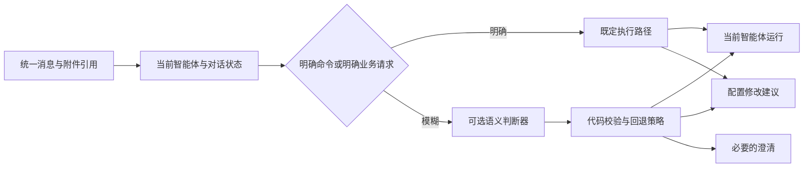

# Jev 对 Agent Studio 统一对话路由的适配评估

评估日期：2026-09-21。范围：当前智能体内的业务对话与配置修改分流，以及后续技能推荐。本文是接入建议，未调用 Jev 进行本项目实测，也未将其接入 173。

## 结论

值得做小规模旁路评测，但不建议现在把所有聊天都交给 Jev 判断。当前页面已经选定智能体，普通消息应默认进入这个智能体；只有明确的配置修改才进入构建助手。Jev 最可能带来的增益是识别模糊的修改意图和作用范围，而不是重新选择当前智能体。

中文实际效果、173 出网端到端延迟和错误率尚未验证。因此建议顺序是：先修复确定性问题，再建立中文回归集，对比现有规则、现有生成模型分类与 Jev，最后决定是否灰度接入。

## 当前两个问题与 Jev 的关系

| 问题 | 已确认原因 | 正确处理 | Jev 的价值 |
| --- | --- | --- | --- |
| 智能体内说“你好”出现构建助手回答 | 可编辑智能体的所有消息都经过 builder auto；普通问候被 builder 当作自身对话 | 正常聊天默认创建当前草稿的运行，明确编辑才进入 builder | 这类明确场景不需要模型判断 |
| 主对话提问失败 | 前端默认引用 lead-agent@1.0.0，173 当前用户的实际发布版本是平台修订，服务返回 404 | 在当前用户可用的同名发布版本中解析默认版本 | 版本存在性和权限必须由代码处理 |
| “这次简短一点”与“以后都简短一点” | 临时执行要求与持久配置变更存在语义边界 | 判断作用范围；不确定时澄清 | 适合做有限选项的语义判断 |
| 实际处理步骤没有显示 | 普通消息没有进入运行链路 | 使用原运行消息流及已有活动展示 | Jev 不负责生成回答或处理过程 |

对应代码：`web/harness-console/src/components/agent-studio/agent-builder-overlays.tsx` 的 `sendUnified`，`web/harness-console/src/lib/agent-conversation-intent.ts` 和 `web/harness-console/src/lib/task-agent-catalog.ts`。修复提交：`2299d107`。

现有轻量规则解决了默认路径错误，但仍会遗漏隐含编辑、混合意图、指代和否定。例如“不要修改系统提示词，只审查下面内容”不能仅靠“修改 + 系统提示词”关键词准确判断。这是下一阶段评测要覆盖的边界，不能把规则修复等同于意图理解已经完善。

## Jev 的实际定位

Jev 返回限定选项的结构化决策，适合分类和路由。它不承担自由文本生成。OpenRouter 当前列出 `typesafe/jev-1.13`，输入价格为每百万 token 0.042 美元、输出免费；页面延迟是平台统计，不代表 173 的网络实测。[OpenRouter 模型页](https://openrouter.ai/typesafe/jev-1.13)

Choice/Score 带概率分布与 confidence；confidence 是根据分布集中程度计算的统计量，不是对业务正确率的保证。阈值需要用本项目数据校准，不能直接将 0.9 理解为“90% 正确”。[官方 confidence 说明](https://docs.typesafe.ai/confidence)

官方说明英文是主要训练语言、表现最好，中文等 CJK 语言效果不同；这使中文回归评测成为是否接入的关键门槛。`latest` 会随发布漂移，调过阈值后应固定模型版本并记录实际返回版本。TypeSafe 直连模型 ID 为 `jev-1.13.0`，不要与 OpenRouter 的模型 ID 混用。[官方模型文档](https://docs.typesafe.ai/models)

官方也列出字面理解、多层间接推理、无关长上下文和对抗输入等弱点。因此不能将全部聊天、全部文件和全部技能目录原样传入，然后期待它同时解决权限、意图和执行计划。[官方已知限制](https://docs.typesafe.ai/model-jaggedness/jev-1.13)

## 建议的产品行为

| 用户输入/状态 | 应有结果 |
| --- | --- |
| 审查助手内：“你好”“帮我审查这个合同” | 当前审查助手回复/执行，沿用当前对话与附件 |
| “这次回答简短一点” | 当前会话执行要求，不修改智能体定义 |
| “修改系统提示词，以后回答都简短一些” | 构建助手提出修改，保留预览与应用环节 |
| “修改合同第三条” | 业务文件修改，不能因含“修改”而修改智能体 |
| “不要修改提示词，只解释它” | 当前智能体解释，不进入配置应用 |
| “以后都这样”但缺乏可识别的前文 | 简短澄清，不猜测持久变更 |
| “调整规则，然后用刚才的合同再试一次” | 编辑并预览；应用成功后才使用对应修订试跑 |
| 有待确认修改时：“你好” | 不把问候强制解释为继续修改；可回答，待确认状态独立保存 |

最后两项属于后续状态管理设计，不能仅增加分类器就自动完成。当前实现仍会将 pending proposal / feedback 状态作为编辑上下文，后续需要同时改造状态转移及其回归用例。

## 推荐接入结构

1. **界面不增加模式栏。** 一个窗口和输入框保持现状；普通业务聊天继续展示原回答、活动和工具执行过程。路由记录进入内部 trace，仅异常或需要澄清时影响用户界面。
2. **增加独立后端 DecisionProvider。** 不把 Jev 塞进普通聊天模型列表，也不替换 `ModelConfiguration.complete_text` 的生成职责。OpenRouter 官方示例使用 `alpha.decisions.create` 与 `state/questions`，需要独立适配响应、超时、计量和错误处理。[官方示例](https://openrouter.ai/labs/jev/compile)
3. **限定候选动作。** 第一阶段只判断 `agent_chat / edit_agent / edit_then_run / clarify`。当前智能体页面不因一句问候跳到其他 agent；全局入口的智能体选择另做评测。
4. **传最小相关状态。** 当前消息、当前 agent 的标识与简短职责、最近相关上下文、是否存在待应用修改；附件首先传元数据，确有需要再读取相关文本。不要因分类而多传整份合同、全部历史或完整技能库。
5. **代码拥有执行权。** 决策返回后重新验证当前用户权限、草稿修订、候选动作和待应用状态。模型判定不能授予权限，也不能直接应用、发布或回滚。
6. **可用性回退。** 普通聊天不依赖外部分类服务存活。超时、非法响应或低置信度时走明确规则；涉及模糊配置变更时澄清，不能默默改配置。基于实测配置短超时预算，避免串行重试拖慢首字时间。

## 可借鉴的开源实现

[GodsBoy/jev-agent-skill-router](https://github.com/GodsBoy/jev-agent-skill-router) 最值得参考的是：将“是否需要技能”“是否模糊”“候选是否适配”分开判断，允许 no-skill/review，并保留版本、分布和延迟证据。它不执行技能，符合判断层与执行层分离的思路。

其仓库报告最终 72 个合成案例中 68 个正确，端到端中位延迟约 1.29 秒；作者明确披露数据为英文、调参后复用了评测数据，不能据此推断本项目生产正确率。不要直接搬入其大目录分批淘汰机制：当前业务/构建分流只有少量动作，不需要额外多轮网络调用。

## 可执行的评测与灰度计划

| 阶段 | 工作 | 通过条件 |
| --- | --- | --- |
| P0，已实现基础修复 | 正常消息进入当前 agent，主对话解析有效发布版本 | 两条真实聊天链路成功；页面有实际回复及运行活动 |
| P1，中文离线数据与规则基线 | 建立约 200–300 条独立标注样本；包含问候、审查、文件编辑、持久配置、否定、多轮指代、混合要求、附件与注入文本 | 保留独立测试集；分别报告业务误入构建、修改误入业务和澄清比例 |
| P2，Jev 旁路评测 | 接入适配器，比较规则、现有生成模型分类、Jev；决策不改变用户执行路径 | 统计 173 的 p50/p95 额外延迟、失败率、真实费用和分类错误；确认收益足以覆盖依赖成本 |
| P3，小范围灰度 | 仅对模糊输入生效，可随时回退；逐步修复待应用状态与普通聊天互相影响的问题 | 核心业务回归集零误入构建；配置变更不绕过预览；超时不阻断普通对话 |
| P4，扩大判断用途 | 再评估全局技能推荐、运行反馈分类、失败样本筛选 | 每个用途单独评测，不共用未经校准的阈值 |

这些是建议验收门槛，不是 Jev 已达到的测量结果。若中文测试和延迟收益不成立，保留接口与评测集，继续使用规则及现有模型即可。

## 对飞轮方向的价值

优先建立小闭环：收集路由纠正 → 人工标注 → 回归集 → 改善规则/criteria/阈值 → 固定版本评测 → 灰度验证。Jev 可以辅助筛选“可能误路由”“需要澄清”的样本，但不能同时作为被测分类器和唯一裁判，否则容易自我强化错误。

这个闭环先放在后台 trace 与测试中，不恢复复杂的质量、运营页面。后续真正有稳定的数据和人工处理需求，再决定是否做可见管理入口。
