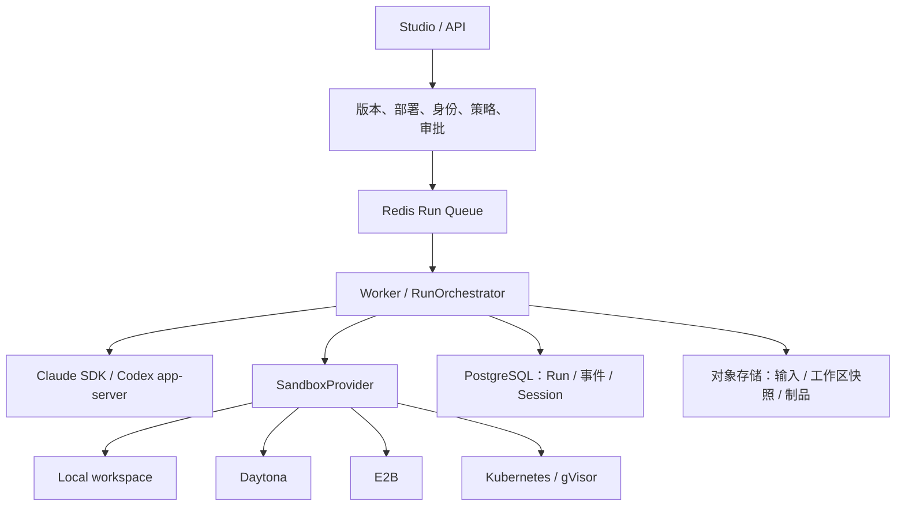

# OpenSandbox、CubeSandbox、Daytona 与本项目沙箱演进分析

日期：2026-09-15。代码基线：`7a637d1` 加本地已有未提交改动。

范围：当前 `agent studio` 工作区的源码、部署模板、测试和既有运行记录，以及当日核对的官方资料。未连接线上环境核验实际配置，未部署或压测新沙箱服务。下文区分源码事实、官方声明与工程判断；已有未提交改动未被修改。

## 1. 建议摘要

**保留 Daytona 现有接入；先补统一执行契约，再按私有化条件选择一个主后端。**

- 有 Kubernetes 运维基础、希望统一文档处理、浏览器与代码执行：优先验证 **OpenSandbox + gVisor/Kata**。
- 重点是自建高密度微虚拟机、批量评测与状态分叉，而且能提供独立计算节点：优先验证 **CubeSandbox**。利用已有 E2B 接口做兼容性 PoC，但按独立 Provider 管理。
- 当前主要目标是交付业务能力、可以使用托管服务：继续使用 **Daytona**，以它作为回归基线。
- 已有 Kubernetes/gVisor 的功能足够、没有预热池与统一沙箱 API 的需求：继续维护当前后端也合理，不必立即引入另一套控制器。

选型前提是本项目继续掌握 Agent 定义、运行状态、审批、租户身份、记忆、制品与审计；第三方沙箱负责计算资源和环境生命周期。更换沙箱不要求更换 Claude/Codex 的 Agent Loop。

### 一个必须更新的事实

Daytona 官方公开仓库已声明：2026 年 6 月起，核心开发迁往私有代码库，公开仓库停止更新、修复和发布。因此“使用当前 Daytona 服务”和“以持续维护的开源 Daytona 自建底座”必须分开评估。旧版本可用并不证明能获得当前服务的能力和维护。项目现有文档中“内网部署推荐自托管 Daytona”的表述应重新核对交付渠道。[Daytona 官方仓库说明](https://github.com/daytonaio/daytona)

## 2. 三者解决的主要问题

| 维度 | OpenSandbox | CubeSandbox | Daytona |
| --- | --- | --- | --- |
| 主要定位 | 通用沙箱 API、执行服务与 Docker/K8s 后端 | 微虚拟机运行基础设施、快照和高密度调度 | 托管沙箱与开发工具服务 |
| 对本项目的主要价值 | 收拢自建 Pod、预热、执行、文件和网络适配 | 复用 E2B 客户端路径，扩展微虚拟机、克隆和恢复 | 复用已有最完整的远程 CLI 集成 |
| 主要新增工作 | 新 Provider、双向进程传输、集群部署 | E2B 兼容验证、节点/存储运维、平台能力补齐 | 统一现有契约、降低供应商与网络依赖 |
| 更适合的方向 | 企业私有化、多类型执行环境 | 高并发执行、评测、多分支试验 | 快速交付、交互工作区、托管计算 |
| 核心约束 | 不同后端的隔离和暂停语义不同 | API 兼容与故障恢复仍在迭代 | 当前核心代码的开放维护状态已变化 |

上述“适合”是针对本项目的工程判断，不是通用排名。

### 2.1 OpenSandbox：比较适合成为本项目的通用私有化接入层

官方架构包含生命周期服务、Docker/Kubernetes 后端、沙箱内 `execd`；K8s 可使用 BatchSandbox 或 `kubernetes-sigs/agent-sandbox`，有预热 Pool。`execd` 提供命令、文件、SSE 输出与 PTY WebSocket。这与本项目的 Provider 层职责比较接近。[官方架构](https://github.com/opensandbox-group/OpenSandbox/blob/main/docs/architecture/index.md)

隔离强度取决于实际运行时：默认容器、gVisor、Kata/Firecracker 路径不能混为一谈。生产 Profile 必须固定和验证 RuntimeClass/运行时，而不只填写 `provider=opensandbox`。[安全容器指南](https://github.com/opensandbox-group/OpenSandbox/blob/main/docs/guides/secure-container.md)

**接入重点：**先覆盖 `provision/prepare/execute/collect/destroy`，再接完整 Agent CLI。当前平台要求持续 stdin、独立输出处理、EOF、取消与恢复；“能跑一次 shell 命令”还不等于满足此契约。

**状态语义：**官方当前 Docker pause 是冻结容器；K8s BatchSandbox pause/resume 基于 rootfs 镜像重建，不能据此承诺恢复内存中的 Python 变量、浏览器状态或正在执行的进程。公开 Snapshot API 和 K8s 内部 Snapshot 流程也有实现差异。[后端与暂停机制](https://github.com/opensandbox-group/OpenSandbox/blob/main/docs/architecture/index.md)

### 2.2 CubeSandbox：值得用已有 E2B 路径做验证

CubeSandbox 采用微虚拟机、CoW 快照、独立调度与网络组件，公开仓库采用 Apache-2.0。它宣称兼容 E2B，但当前路线图仍列有补齐 E2B API、故障恢复、调度运维等工作。[官方仓库](https://github.com/TencentCloud/CubeSandbox)、[当前路线图](https://github.com/TencentCloud/CubeSandbox/blob/master/docs/guide/roadmap.md)

2026-08-28 的 v0.7.0 已加入 S3 支撑的跨节点 pause/resume 与从快照创建，发布说明明确标为 preview。不能沿用“跨节点恢复尚未实现”的旧结论，也不能把预览能力直接作为生产承诺。[v0.7.0 发布说明](https://github.com/TencentCloud/CubeSandbox/blob/master/docs/changelog/v0.7.0.md)

常规部署需要 Linux/KVM 等基础条件；没有硬件嵌套虚拟化的云主机也有 PVM 路线，但需要安装宿主机内核并重启。它不是在现有 Compose 中加一个普通容器就完成的替换。[PVM 部署指南](https://github.com/TencentCloud/CubeSandbox/blob/master/docs/guide/pvm-deploy.md)

**对本项目的判断：**API PoC 可能较小，生产运维投入可能较大。建议独立节点验证，尤其不要基于过去 173 同机承载 Milvus 的记录，直接在业务混部节点上试验内核和存储栈变更。

官方启动时延来自特定硬件与并发条件的基准。本项目必须另测从接收 Run 到工具可用的完整时延；微虚拟机创建时间不包含资产上传、CLI 初始化、MCP 连接和模型响应。[官方基准说明](https://github.com/TencentCloud/CubeSandbox/blob/master/README.md#benchmarks)

### 2.3 Daytona：目前最值得保留的回归基线

当前服务覆盖进程会话、文件/Git、终端、预览和计算机操作，基础设施侧有 API、Runner、Proxy、Snapshot/Volume 等组件。[官方架构](https://www.daytona.io/docs/en/architecture/)

官方文档区分默认容器与 VM 等沙箱形态，VM 才有相应的内存快照、分叉等能力。不能将“Daytona 支持 VM”解读为本项目已经在使用 VM，也不能将服务新能力视为项目已接入能力。[沙箱类型](https://www.daytona.io/docs/en/sandboxes/)

本项目锁文件为 Daytona `0.196.0`、E2B `2.33.0`。评估新服务能力应固定服务/SDK/镜像版本，独立验证；无需为本次分析直接升级依赖。

### 2.4 其他值得保留视野的选项

- **E2B：**本项目已接入，可作为现有云端替代路线和 Cube 兼容测试的参照。服务具备生命周期接口，不代表当前适配器实现了所有生命周期能力。[E2B 生命周期](https://docs.e2b.dev/sandbox)
- **Kubernetes agent-sandbox：**如果主要需要在现有 K8s 上管理有状态沙箱与预热，可以评估该控制器；若已采用 OpenSandbox 的对应后端，就不应再由 Harness 同时直接管理同一批实例。[官方项目](https://github.com/kubernetes-sigs/agent-sandbox)
- gVisor/Kata/Firecracker 属于隔离/运行时选择，与沙箱 API 平台处于不同层级，不应平铺成同一种产品比较。

## 3. 项目当前形态：以源码为准

### 3.1 已有稳定的分层接缝



`SandboxProvider` 已定义 `provision → prepare → execute → collect → destroy`。`SandboxHandle` 携带本地暂存目录、远端目录与 transport factory。因此新沙箱优先接这一层；无需改 AG-UI、审批状态机和业务 Agent 定义。

| 当前路径 | 源码已经实现 | 当前边界 |
| --- | --- | --- |
| Local | 每 Run 临时目录、本地子进程 | 不会为每个 Run 创建容器或 VM |
| Daytona | 生命周期、文件同步、Claude/Codex 远程工厂、会话复用、空闲回收、失败目录保留 | 租约和 warm pool 主要在进程内；需要跨 Worker 验收 |
| E2B | 每 Run 创建、Claude 交互进程、上传下载与销毁 | 未见等价 Codex 工厂分支、会话复用及自定义服务端地址配置 |
| Kubernetes/gVisor | 每 Run Pod、资源限制、只读根、NetworkPolicy、TTL 回收、Claude 传输 | 直接调用 kubectl；未接预热控制器与等价 Codex 工厂分支 |
| Deferred 包装器 | CLI 在 Worker，首次受代理工具调用时创建远端沙箱 | 当前内置工具代理明确在 Claude SDK 路径实现，不能推定 Codex 对齐 |

源码定位：

- [基础契约](</Users/xiaokai/Documents/agent studio/src/harness/sandbox/base.py:15>)
- [组合根与 Provider 选择](</Users/xiaokai/Documents/agent studio/src/harness/composition.py:271>)
- [Daytona 会话和传输](</Users/xiaokai/Documents/agent studio/src/harness/sandbox/daytona.py:453>)
- [E2B 接入](</Users/xiaokai/Documents/agent studio/src/harness/sandbox/e2b.py:219>)
- [Kubernetes 资源](</Users/xiaokai/Documents/agent studio/src/harness/sandbox/kubernetes.py:69>)
- [延迟分配](</Users/xiaokai/Documents/agent studio/src/harness/sandbox/deferred.py:29>)

### 3.2 有两种执行模式，需要显式区分

**remote_cli：**整个 Claude/Codex 进程在沙箱内，Worker 通过协议控制。适合有代码执行、第三方依赖和复杂工具的任务。

**worker_cli_deferred：**CLI 在 Worker，Claude 的 Read/Write/Edit/Bash/Glob/Grep 等经代理进入按需创建的沙箱。纯模型任务可以不创建远端实例，但 Worker 仍承担 CLI、协议和部分工具逻辑。

配置默认值并不统一：`Settings` 默认 `local + remote_cli`；Compose 的 provider 默认 Daytona；`.env.docker.example` 则选择 Daytona + deferred。部署实例还可能覆盖这些值，因此模板不能充当线上现状证据。

### 3.3 现有“默认隔离”有命名与能力差异

当前 Studio `isolated-default` 标为“Docker 容器工作区”、允许生产，实际 `sandboxProvider=local`。`LocalSandboxProvider` 创建的是临时目录；隔离边界可能是整个 Worker 容器，不是独立 Run 容器。

这在受信部署中可以是明确取舍，但 UI/发布门禁必须讲清楚其边界。不能因为 Profile 名称含 isolated 就当作按 Run 强隔离。[Profile 定义](</Users/xiaokai/Documents/agent studio/src/harness/studio/catalog.py:211>)、[Local 实现](</Users/xiaokai/Documents/agent studio/src/harness/sandbox/local.py:14>)

### 3.4 多 Provider 已实现，多 Provider 路由尚不完整

当前组合根按全局配置创建一个实际 backend；Deployment Profile 校验与此 backend 是否匹配。尚不是每个 Run 根据 Profile 在多个在线 backend 中动态调度。

因此增加新 Provider 还需同步：配置枚举、Studio 模型与目录、部署快照、发布前能力校验、Worker 能力宣告和队列路由。只在 `.env` 增加一个字符串不构成完整接入。[Profile 模型](</Users/xiaokai/Documents/agent studio/src/harness/studio/models.py:811>)、[实际后端匹配](</Users/xiaokai/Documents/agent studio/src/harness/composition.py:1043>)

## 4. 优先补齐的五个接口问题

### P0-A：把隔离、运行位置和能力拆开

当前隔离枚举只有 `workspace/container`，不同远端后端均归为 container；Deferred 甚至在实例创建前就返回 container。它不足以描述“哪个进程在哪、是否有独立内核、网络是否可控”。

建议新增结构化能力，而不是简单把枚举排成强弱顺序：

```text
ExecutionProfile
  provider_ref + runtime_kind + execution_mode
  image_digest / template_revision
  isolation: boundary, runtime_class, verified
  resources: cpu, memory, disk, pid_limit, ttl
  network_policy_ref + credential_policy_ref
  capabilities:
    interactive_stdin, streaming_output, cancel_process_tree
    filesystem_checkpoint, memory_checkpoint, resume, fork
```

发布前验证 Runtime × Provider × Mode × 工具组合。当前尤其需要明确限制 Codex + deferred，以及 Codex + E2B/K8s 的未对齐组合；不能等第一次用户任务才遇到 transport 类型错误。

### P0-B：将远程进程传输从厂商命名中提取

现有 `RemoteClaudeSession` 实际是通用交互进程接口；`DaytonaClaudeTransport` 已被 E2B 和 K8s 复用。建议提取：

```text
RemoteProcessSession：start / write / end_input / stdout / stderr / wait / terminate
ClaudeTransport：解释 Claude 协议和 SessionStore
CodexProcess：解释 app-server JSONL 协议
Provider：提供远程进程会话、文件与生命周期
```

保留现有协议解析与测试。OpenSandbox SSE 是输出通道，不能单独代替持续 stdin；若用 PTY WebSocket，需要验证终端回显、换行、控制字符和输出混流，避免污染 JSONL。优先验证无终端语义的字节流；确有缺口再在受控镜像内增加轻量进程桥接服务。

### P0-C：建立耐久 Sandbox Lease

当前 Daytona 有确定性名称、冲突后 reconnect、进程内 session lock；Worker 自身也有 session lock，Run 有 fencing。它们已提供部分恢复保障，但不能由此推导出“同一沙箱跨 Worker 的独占租约已完整验证”。

建议持久化 `tenant/session/run/attempt/provider/sandbox_id/owner/epoch/expires_at`。同一 Session 的 acquire/release 原子化，并把 epoch 校验与执行授权绑定。仅在数据库记录 fencing token，不能阻止已经失去所有权的远程进程继续写文件或调用外部服务。

Warm pool 容量、恢复保留窗口、实例发现和回收应有全局视图；重启后不能只靠进程内字典发现遗留实例。现有 Run fencing、前序 Run 机制与新 Lease 需要一致设计，不应再造另一套 Run 状态机。

### P1-D：统一文件同步，保留三种状态的区别

- 业务事实：Run、审批、事件、记忆，权威在数据库。
- 可移植文件：输入、workspace、产物，权威在受检验的对象存储快照。
- 加速状态：VM 内存、进程、浏览器与 provider snapshot，默认是可丢弃缓存。

Daytona 当前上传仍逐文件串行；收集已用归档。E2B 也有逐文件操作。新后端优先复用安全归档契约，后续再做内容哈希与增量同步。仍需拒绝路径穿越、symlink、特殊文件和超限归档。

VM rollback 无法撤销已经发出的消息、写入的数据库记录或支付等外部副作用。恢复须从平台检查点核对已完成工具调用，并对有副作用操作使用幂等键。

### P1-E：网络、凭据与资源配置真正落到实例

新 Profile 的 CPU/内存/TTL/网络配置应转换为实际创建参数，并回读验证。当前 K8s 已有明确 Pod 限额；不能仅因为 Studio 元数据包含资源数值，就推定 Daytona/E2B 接口也执行了同样配额。

同样，工具白名单、出口域名规则和租户鉴权解决不同问题。平台继续签发绑定 Run 的短期业务令牌；Provider 管理密钥不进入沙箱。出口代理或凭据注入能力须与实际网络阻断一起验收，不能只配置 `HTTP_PROXY` 环境变量。

## 5. 两条具体接入路径

### 5.1 OpenSandbox

1. 新增 `OpenSandboxSandboxProvider` 与服务端配置，完成五个生命周期方法。
2. 固定受控 OCI 镜像：Python/Node、文档工具、浏览器依赖，以及明确版本的 CLI。
3. 先用工具执行验证文件、超时、取消与制品；随后实现 `RemoteProcessSession` 并跑 Claude/Codex 完整协议。
4. Docker 用于开发验证；生产按实际条件选择 gVisor/Kata。沿用现有 K8s 限额、网络与路径安全要求。
5. 显式建立 `opensandbox-private` Profile，发布到指定 Worker 池，保持已有 Daytona 部署可回归。
6. 只有在基础链路达标后再接 Pool、快照、浏览器端口和预览。

不要同时让 Harness 的 kubectl Provider 与 OpenSandbox 控制器拥有同一实例的生命周期；新旧后端应在 Profile 层选择。

### 5.2 CubeSandbox

1. 给现有 E2B 客户端增加可配置 endpoint/domain、认证、连接参数；具体参数以锁定 SDK 为准。
2. 创建独立 Cube Provider 或明确的兼容后端身份，共享 E2B 传输代码，但独立记录 provider、template、region 与能力。
3. 逐项验证本项目用到的 `secure=True`、网络参数、stdin、后台进程、输出流、终止、二进制文件与中文路径。
4. 验证任务完成、超时、取消、Worker 被杀、连接中断后的收集和清理。
5. 基础 E2B 兼容通过后，再接 Cube 原生 pause/resume/clone；Codex 路径另外验收。
6. 在可控独立节点验证 KVM/PVM、磁盘和网络条件。跨节点恢复 preview 暂不作为首期必需项。

这条路线复用的是已有接入代码，不是获得 E2B 云服务与 Cube 全部语义等价的保证。

## 6. 迭代顺序与验收

| 阶段 | 交付 | 验收门槛 |
| --- | --- | --- |
| 0：统一事实与契约 | 运行能力矩阵、Profile 名实对齐、时延基线、版本清单 | 发布前拒绝不支持组合；界面能显示实际执行边界 |
| 1：单一新后端 PoC | OpenSandbox 或 Cube 的基础适配 | 文件、完整 CLI 协议、审批、取消、恢复、制品与隔离用例通过 |
| 2：生产治理 | 耐久 Lease、资源限额、出口规则、全局回收、Worker 路由 | 多 Worker 故障注入与持续运行，无越权复用、重复副作用和不可解释遗留 |
| 3：降低成本和时延 | 镜像预装、归档/增量同步、会话复用、预热池 | P95 与每成功 Run 成本优于基线，可靠性无回退 |
| 4：新增产品能力 | 浏览器工作区、预览、评测分叉、长期计算环境 | 有具体业务场景，再增加端口鉴权、快照配额和生命周期策略 |

工程投入判断：沿 E2B 复用的 Cube API 验证通常较小；OpenSandbox 新传输为中等；两者的生产化都明显大于最小 PoC。当前没有节点规格、并发量、流量与月账单，无法给出可信节省比例或总交付工期。

### 共用测试集

固定相同业务、模型路由、依赖和文件输入，至少覆盖：

1. 无工具问答：区分 remote CLI 和 deferred 的分配开销。
2. 文档/Excel/PDF 任务：二进制与中文路径、上传、解析、制品下载哈希。
3. 多工具与多轮会话：完整输出、审批后恢复、跨实例 SessionStore 恢复。
4. 运行中取消、超时、Worker 崩溃、沙箱消失、对象存储暂不可用。
5. 两租户并行、同会话多 Worker、过期租约、网络白名单绕过尝试。
6. 1/10/50 并发；分别记录冷镜像、热镜像、复用实例及文件量分档。

建议分别记录 `queue_wait / provision / stage_files / cli_ready / mcp_ready / first_model_delta / first_tool / collect / destroy` 的 P50/P95/P99，以及成功率、遗留实例数、传输字节和成本。不要用模型首字慢推断沙箱创建慢。

成本比较口径：

```text
每成功 Run 成本 =
  (运行计算 + 空闲池 + 快照/存储 + 网络 + 运维摊销 + 失败重试) / 成功 Run 数
```

仓库 9 月 10 日的记录曾观察到用户到 173/174 的约 70–90ms 数据面开销和同机负载波动；这只能提示应分段测量，不能证明今天的情况，也不能当作 Worker 到新 Provider 的 RTT。[既有时延记录](</Users/xiaokai/Documents/agent studio/docs/results/latency-baseline-173-174-20260910.md>)

## 7. 本次验证与最终决策

本次运行现有单元测试：

```text
.venv/bin/python -m pytest tests/unit/sandbox \
  tests/unit/runtime/test_daytona_transport.py \
  tests/unit/runtime/test_sandbox_tools.py \
  tests/unit/runtime/test_codex_app_server.py -q

62 passed in 3.72s
```

它验证的是现有适配器与协议的本地测试行为，不证明任何新 Provider 已部署、跨 Worker 已安全串行，或公开服务已完成兼容测试。

**推荐决策：近期投入以契约、隔离、恢复和可测量性为主；将 OpenSandbox 作为通用私有化首选候选，将 CubeSandbox 作为微虚拟机与规模化场景的候选，保留 Daytona 为当前交付和回归基线。首轮只推动一个生产候选，避免同时承担三套新增运维面。**
